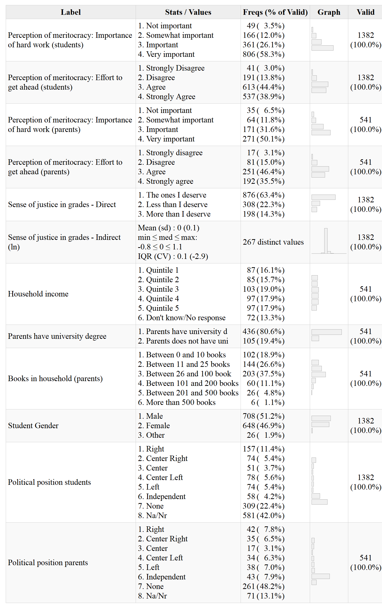

```{r setup, include=FALSE}
knitr::opts_chunk$set(warning = FALSE, message = FALSE, cache = TRUE)

if (!require("pacman")) install.packages("pacman")  #si falta pacman, instalar
if (!require("tinytex")) install.packages("tinytex")#si falta tinytex, instalar
pacman::p_load(knitr, kableExtra, dplyr, lavaan, summarytools, haven, sjPlot, htmlwidgets, ggplot2, sjmisc, texreg, webshot, utils, sjlabelled, rvest, fastDummies) # librerias
knitr::opts_chunk$set(warning = FALSE,  # mensaje de warning
                      message = FALSE,  # mensajes/avisos de librerias
                      cache = FALSE,    # cache de los chunks,usar analisis pesados
                      out.width = '85%',# largo de imagen en %
                      fig.pos= "H",     # posicion figuras H = HERE
                      echo = FALSE,      # incluir chunk en output
                      fig.width = 10,
                      fig.height = 7,
                      fig.align = 'center'
                      )

# Otras configuraciones
options(scipen=999) # notacion cientifica
rm(list=ls())       # limpiar workspace
options(knitr.kable.NA = '') # NA en kable = ''

# Funciones para renderizar tablas tanto en HTML como en pdf.
table_format = if(is_html_output()) { # Usar en argumento "format=" de kable
  "html"
} else if(is_latex_output()) {
  "latex"
}

fwidth = if(is_html_output()) { #Usar en argumento "full_width" de kableExtra
  T
} else if(is_latex_output()) {
  F
}

format_size = if(is_html_output()) { # Usar en argumento "format=" de kable
 20
} else if(is_latex_output()) {
  10
}

stars.pval2=function (p.value) # Usar en correlaciones policloricas
 {
    unclass(symnum(p.value, corr = FALSE, na = FALSE, cutpoints = c(0,
        0.001, 0.01, 0.05, 1), symbols = c("***",
        "**", "*", " ")))
}

graph.magnif_table = if(is_html_output()) { # Usar en argumento "graph.magnif=" de summarytools
  1.2
} else if(is_latex_output()) {
  0.75
}

width_table = if(is_html_output()) {
  800
} else if(is_latex_output()) { # Usar en "width=" dentro del argumento "image=" en kable
  500
}

```

# Introduction

Meritocracy is an ideal that aspires to the distribution of resources in a society according to personal effort and talent [@young_rise_2006]. This ideal is widely found in modern societies, where it is raised as a legitimate way to progress individually based on personal achievements, and therefore contrasts with the use of family privileges and personal contacts to get ahead [@hadjar_meritokratie_2008]. While obtaining rewards through effort and talent seems to be a credible representation of justice through equity, the implementation of meritocratic systems is far from being unproblematic. On the one hand, it has been argued that meritocracy allows the legitimization of inequalities by attributing success to personal achievement, thus underestimating the conditions of origin or the "starting point" [@hadjar_meritokratie_2008; @bay-cheng_agency_2015]. This implies great psychological and social pressure on young people, who regardless of the inequalities of their contexts, grow up surrounded by meritocratic discourses that constantly contrast with reality [@allen_top_2016]. On the other hand, the emphasis on individual capacities would lead to making people responsible for their situation and therefore less supportive of social policies that compensate for disadvantages: "For why do the successful owe anything to the less advantaged members of society?" [@sandel_tirania_2021 p.292]. In this way, the belief in meritocracy can diminish concern for the common good and solidarity.

Recently, interest in the study of meritocracy in the social sciences has increased. From the field of sociology, a research agenda has been developed that highlights the subjective aspects of meritocracy [@mijs_how_2020; @mijs_inequality_2018; @castillo_meritocracia_2019 ], where a central distinction is the one between meritocratic perceptions (how meritocratic society is) and meritocratic preferences (how meritocratic society should be)  [@reynolds_perceptions_2014; @castillo_meritocracia_2019]. Until now, research in this area has focused on the adult population, neglecting the role that different socialization agents could have in the formation of perceptions, attitudes and beliefs during the school-age period [@gidengil_political_2016; @torney-purta_school_2002]. 

In this paper, our objective is to study the extent to which parental and school socialization is associated with meritocratic perceptions of secondary school students.  Based on research about justice preceptions in schools and family political socialization, we seek to answer two main questions: Is there an association between the meritocratic perceptions of parents with those of their offsprings? To what extent is school experience in terms of distributive justice (in relation to grades) linked to the meritocratic perceptions of students?

Through our first question, we focus on the extent to which the meritocratic perceptions of parents are associated with those of their children. For this, we rely on studies on the intergenerational reproduction of political attitudes [@astill_multilevel_2002; @miranda_desigualdad_2018], through which the transmission of opinions and intentions of political participation [@boonen_adolescent_2013; @quintelier_intergenerational_2015a], political beliefs about democracy [@greenstein_personality_2016] and political orientations [@jennings_politics_2009] have been approached. However, these investigations generally do not incorporate aspects related to distributive justice, which can be fundamental if we consider that people's ideas about inequality and the distribution of resources can generate political apathy [@easterbrook_social_2021], as well as  to tolerance towards authoritarian ideas [@madeira_primes_2019a; @azevedo_neoliberal_2019].

The second topic of interest in this work is the role of the school in the meritocratic perceptions of students. In this regard, the literature on justice in schools has succeeded in highlighting the importance of distributive experiences in shaping the world view of young people. Works such as Resh and Sabbagh [-@resh_sense_2014; -@resh_sense_2017] have shown that the sense of justice that students have regarding the distribution of grades has an impact on their democratic attitudes and behaviors, as well as on institutional and social trust [@resh_sense_2018]. This evidence calls for a deeper understanding of the effect of the sense of justice on other aspects of young people's worldview, such as perceptions of meritocracy.

# Conceptual and empirical background

## Perception of meritocracy

Much of the research on meritocratic perceptions has focused on the extent to which objective conditions of social inequality affect the way people perceive the distribution of goods and rewards. In general, these investigations show that subjects have biased estimates of both the levels of inequality and the actual functioning of meritocracy [@gimpelson_misperceiving_2018]. However, @mccall_exposure_2017 shows that exposing US citizens to the real levels of inequality encourages them to believe less in opportunities to get ahead based on their own effort. In the same vein, @mijs_how_2020 points out that exposing Indonesian, Australian and Mexican citizens to real levels of inequality and social mobility diminishes their perception of meritocracy. These distorted perceptions of inequality and meritocracy also vary consistently according to socioeconomic level, as socioeconomically advantaged people tend to perceive higher levels of meritocracy than people at the lower end of the socioeconomic scale [@reynolds_perceptions_2014].

Adherence to meritocratic beliefs is often interpreted from a rational interest perspective, considering that those with greater economic resources and status have better reasons to perceive and prefer meritocracy [@kunovich_systems_2007]. In addition, it has been shown that these differences in perception according to socioeconomic level are affected by the level of economic inequality in society, which is addressed by different theories. On the one hand, the theory of conflict assumes that higher levels of inequality generate less perception of meritocracy and less tolerance of inequality, while there is greater dissent on these issues between different social strata [@newman_false_2015]. On the other hand, the theory of relative power [@solt_economic_2016] maintains that greater economic inequality brings with it a greater concentration of wealth and power, which has the consequence that the visions of the most advantaged groups permeate the visions of those most disadvantaged, in which case with greater inequality there is also greater consensus among social groups on the perception of meritocracy.

Another characteristic of the relevant socioeconomic status in the study of meritocratic perceptions and preferences has been the possession of educational credentials that give way to higher-skilled occupations in the labor market [@goldthorpe_myth_2003a]. Two hypotheses have been used to explain the relationship between meritocratic beliefs and years of education. On the one hand, there is the *reproductionist* approach [@bourdieu_reproduccion_1998; @bernstein_poder_1988], from which it is argued that the role of the school contributes to reinforcing the meritocratic principles of individuals; therefore, greater educational achievement translates into greater attachment to meritocracy as a distributive principle [@reynolds_perceptions_2014; @xian_bootstraps_2017; @lampert_meritocratic_2013]. On the other hand, there is the hypothesis of *instruction*, which maintains that more educated individuals have greater critical capacity regarding the role that structural and individual factors play in the acquisition of rewards in society, which translates into a weakening around the meritocratic ideal [@duru-bellat_who_2012; @castillo_meritocracia_2019].

## Meritocracy in the school-age period

Research on meritocracy in younger populations has been scarcely addressed, but it is possible to find some studies on attitudes towards inequality and justice that can be linked to this topic. In terms of attitudes towards inequality, research shows that children are able to form notions about justice and inequality at a very young age [@imhoff_nociones_2015]. Although younger children have trouble understanding the terms "rich" and "poor" [@danziger_child_1957a], between the ages of 3 and 6, this distinction can be grasped. However, it is not until  children are around 10 years of age that they can explain the differences [@sigelman_age_2013]. At this age, children tend to greatly highlight individual meritocratic attributions as causes of inequality [@sigelman_rich_2012], while presenting incipient explanations based on inequality of opportunity, especially as a consequence of discrimination [@imhoff_nociones_2015]. Nonetheless, some authors point out that the multifaceted attributions of inequality can be found at younger ages. For example, a study with children aged 5 to 8 found that at this stage children were able to explain poverty from factors such as individual effort and situational elements, alluding to wage inequalities and discrimination [@mistry_children_2016]. According to these authors, the results are consistent with the theory of cognitive development [@leahy_parental_1981] and social constructionism [@emler_children_1985], which suggest greater cognitive development will allow a more complete understanding of inequality.

In addition to children's understanding and explanations of inequality, there are some in-depth studies on the use of distributive justice criteria by children. Along these lines, @kanngiesser_young_2012 point out that despite their egotistical tendencies, children between 3 and 5 years of age are already able to use meritocratic criteria to distribute resources, considering the efforts invested by other children even when this could affect their own interest. In sum, children at an early age are able to understand concepts related to inequality and can use different distribution criteria to explain these differences or allocate resources.

In relation to studies on meritocracy in the adolescent population, @hjort_individualized_2014 has found evidence of a widespread adherence to the discourses of individualism and meritocracy by young people in the city of Oslo. However, although young people point to merit as central, this does not prevent them from recognizing differences in starting points related to the transmission of family resources. Along these lines, the work of @irwin_family_2009a has demonstrated the importance that young people place on individual factors to “get ahead,” although they also suggest  the importance of emotional support that can be provided by the family. Additionally, research on high school youth in the United States suggests that adolescents' visions of rewards for effort find greater support in second-generation migrant students who hold higher expectations of upward social mobility [@peguero_schools_2015, p. 33]. Finally, @sun_value_2010 have studied whether there is a value gap between the younger and older generations in China, finding that younger people tend to be more individualistic in their ways of life. These studies show that, from an early age, children and young people form judgments and opinions about inequality, which probably also apply to their views on meritocracy.

## The present study: The socialization of meritocracy by the family and the school

The family is a first agent of socialization that provides values, expectations and rules [@martinez_escuela_2015a]. Although an adult-centered bias in studies of political socialization studies has been criticized for focusing on the study of value transfer [@andersson_situational_2015], there is strong evidence to suggest the importance of family socialization, in which parental beliefs influence children's beliefs, attitudes, and behaviors [@olivos_motivation_2021; @bandura_selfefficacy_2001; @wigfield_development_2006]. Moreover, parents raise their children based on class cultures,  transmitting stratified beliefs and attitudes [@calarco_coached_2014]. Consistently, it has been shown that parents transmit civic attitudes, intentions of participation, and political positions to their children, among other characteristics [@muddiman_young_2019; @nesbit_influence_2013a]. Along these lines, the evidence around the socialization of different subjective characteristics allows us to assume that intergenerational transmission would also be expressed around meritocratic perceptions, in such a way that

  > Hypothesis 1: There is a positive association between the level of perception of meritocracy of parents and their children.

A second relevant agent of socialization is school. Beyond its educational role, the school contributes to shaping the behavior and worldviews of young students [@nishiyama_enabling_2019]. In this context, the students' experience of justice or fairness plays a fundamental role [@resh_sense_2014; @resh_sense_2018] as it encourages the inference of ideas regarding inequality [@mijs_inequality_2018]. Among the different types of justice in the school experience [@resh_justice_2016], the role that the feeling of fairness plays in student grades stands out. Grades reflect students' experiences of fairness or unfairness, affecting both self-image formation, classroom hierarchy building, and their worldview on various topics [@jasso_exploring_2002]. Studies in this area have shown that the sense of justice in grades promotes liberal-democratic orientations [@resh_sense_2014], builds trust in institutions [@resh_sense_2018], and contributes to stronger student support for the meritocratic assignment of grades [@resh_justice_2009]. In view of the above, this research proposes that the sense of justice in terms of student grading also encourages a greater perception of meritocracy on the part of the students, which is consistent with the evidence indicated by @olivos_motivation_2021. Based on this, our second hypotehsis is the following: 

  > Hypothesis 2: Students with a greater sense of fairness in their grades will perceive greater meritocracy.

Family and school socialization of meritocratic perception occur together and probably affect each other. Therefore, we propose that the association of the meritocratic perception of parents with that of their children will be enhanced if the student feels that their grades are fair. Conversely, even if the student is socialized into meritocratic beliefs, if students experience injustice in their grades the effect of  parental beliefs will be weaker. Therefore, we propose 

  > Hypothesis 3: The relationship between meritocratic perception of parents and children (H1) will be more positive for those who experience a greater sense of justice in school (H2).

Evidence around meritocratic beliefs highlights the role that factors associated with social standing play. @reynolds_perceptions_2014 points out that people with higher social status in the United States have a higher perception of meritocracy than those with lower social status. In the same vein, @kunovich_systems_2007 provide evidence consistent with a rational interest approach such that the higher the income and education of subjects, the greater the preference for meritocratic payment they will have. Despite their differences, the results of @solt_economic_2016 and @newman_false_2015  provide empirical support for the positive relationship between income and meritocratic beliefs. Based on this evidence, it is possible to argue that parents with a higher socioeconomic level will manifest a higher level of meritocratic beliefs. In the same vein, we propose that students from schools with a higher socioeconomic level will tend to perceive greater meritocracy.

  > Hypothesis 4: The socioeconomic status of the family has a positive effect on  student meritocratic perceptions.

  > Hypothesis 5: The socioeconomic status of the school has a positive effect on  student meritocratic perceptions.

Figure \@ref(fig:modelo) summarizes the study hypotheses:

```{r modelo, echo=FALSE, fig.cap='Hypothesis summary model'}
knitr::include_graphics(path = "input/images/model-hip-eng.PNG")
```

# Methodology

## Data 

```{r n-datos, include=FALSE}
if (!require("pacman")) install.packages("pacman")  #si falta pacman, instalar
if (!require("tinytex")) install.packages("tinytex")#si falta tinytex, instalar
pacman::p_load(dplyr) # librerias
load(file = "input/data/ap_est.RData")
df_reducida <- ap_est %>% select(perc_trabajo_duro_factor_est,
                             perc_esfuerzo_factor_est,
                             perc_trabajo_duro_est,
                             perc_esfuerzo_est,
                             perc_trabajo_duro_factor_ap,
                             perc_esfuerzo_factor_ap,
                             perc_tduro_bi_est,
                             perc_tduro_bi2_est,
                             perc_tduro_bi3_est,
                             perc_esfuerzo_bi_est,
                             perc_tduro_bi_ap,
                             perc_tduro_bi2_ap,
                             perc_tduro_bi3_ap,
                             perc_esfuerzo_bi_ap,
                             prom_percmer_est,
                             prom_percmer_ap,
                             sj_direct_factor,
                             sj_indirect_noln,
                             sj_indirect_ln,
                             sj_indirect_cat,
                             sj_indirect_qtil,
                             quintiles_ingresos_pc_factor,
                             educ_factor_ap,
                             libros_hogar_factor_ap,
                             recompensa_est,  # recompensa en escuela
                             resp_prof,# justicia trato profesor
                             pos_pol_factor_ap,
                             pos_pol_factor_est,
                             genero_factor_est,
                             dependencia_factor_ap,
                             # ingresos_esc,
                             # ingresos_pc_esc,
                             # univ_esc,
                             univ,
                             rbd_est,
                             nse_grupo,univ
                             ) %>%
  na.omit(df_reducida) %>%
  select(perc_trabajo_duro_factor_est,
         perc_esfuerzo_factor_est,
         perc_trabajo_duro_factor_ap,
         perc_esfuerzo_factor_ap,
         sj_direct_factor,
         sj_indirect_ln)

df_completa <- ap_est %>% select(perc_trabajo_duro_factor_est,
                             perc_esfuerzo_factor_est,
                             # perc_trabajo_duro_factor_ap,
                             # perc_esfuerzo_factor_ap,
                             sj_direct_factor,
                             sj_indirect_ln,
                             genero_est,pos_pol_est
                             # rbd_est
                             ) %>% na.omit(df_completa)
```

The data come from the School Citizenship Panel Survey (PACES), a study on family political socialization that was carried out by applying a survey to second-year high school students (approximately 16 years of age at first application), their parents or guardians, and their teachers during 2019-2021. In this article we use the first segment of the panel available at the time of this research, so this can be considered a cross-sectional study The sample is representative of high school students (grade 10) who attend schools in Chile in the Santiago Metropolitan area and in Antofagasta, Calama, Talca, Curicó and Linares. In total, 64 schools were randomly selected, and in each educational establishment, a complete course of second year high school students, their parents or guardians, and their  history, social sciences and/or citizen training teachers were surveyed. Specifically, we collected data from 1635 students, 744 parents or guardians and 103 teachers. The data of this first segment of the panel were collected between August and December 2019.

The sampling framework used for the selection of the schools was built from the 2019 Directory of Schools of the Ministry of Education, considering all the schools in the sectors indicated above. The selection was random and systematic, considering locality, type of administrative unit (public, subsidized or private) and type of education (scientific humanist, professional technicial or mixed). The survey for students and teaches was conducted at schools,  whereas for the parents or guardians it was self-administered in their homes.

## Variables

The individual level variables of this study are presented in Table \@ref(tab:desc01). Meritocratic perception is operationalized with questions that have been used in other research, in particular those that analyze data from the module of social inequality of the _International Social Survey Program_ (ISSP) [@reynolds_perceptions_2014]. In this article, the meritocratic perception of students was measured based on two indicators related to the role of effort and hard work to succeed in life. Both indicators correspond to Likert scales of four categories, measuring degree of importance and degree of agreement, respectively.

```{r include=FALSE, results='asis'}
# Funciones para renderizar tablas tanto en HTML como en pdf
if (!require("pacman")) install.packages("pacman")  #si falta pacman, instalar
if (!require("tinytex")) install.packages("tinytex")#si falta tinytex, instalar
pacman::p_load(knitr, summarytools, kableExtra, dplyr, lavaan, haven, htmlwidgets, webshot, sjPlot,sjlabelled) # librerias
knitr::opts_chunk$set(warning = FALSE,  # mensaje de warning
                      message = FALSE,  # mensajes/avisos de librerias
                      cache = FALSE,    # cache de los chunks,usar analisis pesados
                      out.width = '85%',# largo de imagen en %
                      fig.pos= "H",     # posicion figuras H = HERE
                      echo = FALSE      # incluir chunk en output
)

# Otras configuraciones
options(scipen=999) # notacion cientifica
options(knitr.kable.NA = '') # NA en kable = ''

# Funciones para renderizar tablas tanto en HTML como en pdf
fwidth = if(is_html_output()) { #Usar en argumento "full_width" de kableExtra
  T
} else if(is_latex_output()) {
  F
}

graph.magnif_table = if(is_html_output()) { # Usar en argumento "graph.magnif=" de summarytools
  1.2
} else if(is_latex_output()) {
  0.75
}

width_table = if(is_html_output()) {
  800
} else if(is_latex_output()) { # Usar en "width=" dentro del argumento "image=" en kable
  500
}

# Css
st_css()
st_options(lang = "en",
           footnote = NA,
           bootstrap.css = F,
           custom.css = "input/css/dfsummary.css")

# Cargar base de datos procesada
load(file = "input/data/ap_est.RData")

# Seleccionar variables
df_est<- ap_est %>% select(perc_trabajo_duro_factor_est,
                             perc_esfuerzo_factor_est,
                             sj_direct_factor,
                             sj_indirect_ln,
                             pos_pol_factor_est,
                             genero_factor_est,
                             ) %>% na.omit(basereg)

df_est$genero_factor_est <- factor(df_est$genero_factor_est,
                                   levels = levels(df_est$genero_factor_est),
                                   labels = c("Male",
                                              "Female",
                                              "Other"))
sjlabelled::set_label(df_est$genero_factor_est) <- "Student Gender"
df_pad <- ap_est %>% select(perc_trabajo_duro_factor_est,
                             perc_esfuerzo_factor_est,
                             perc_trabajo_duro_est,
                             perc_esfuerzo_est,
                             perc_trabajo_duro_factor_ap,
                             perc_esfuerzo_factor_ap,
                             perc_tduro_bi_est,
                             perc_tduro_bi2_est,
                             perc_tduro_bi3_est,
                             perc_esfuerzo_bi_est,
                             perc_tduro_bi_ap,
                             perc_tduro_bi2_ap,
                             perc_tduro_bi3_ap,
                             perc_esfuerzo_bi_ap,
                             prom_percmer_est,
                             prom_percmer_ap,
                             sj_direct_factor,
                             sj_indirect_noln,
                             sj_indirect_ln,
                             sj_indirect_cat,
                             sj_indirect_qtil,
                             quintiles_ingresos_pc_factor,
                             educ_factor_ap,
                             libros_hogar_factor_ap,
                             recompensa_est,  # recompensa en escuela
                             resp_prof,# justicia trato profesor
                             pos_pol_factor_ap,
                             pos_pol_factor_est,
                             genero_factor_est,
                             dependencia_factor_ap,
                             # ingresos_esc,
                             # ingresos_pc_esc,
                             # univ_esc,
                             univ,
                             rbd_est,
                             nse_grupo,univ
                             ) %>% na.omit(basereg) %>%
                      select(perc_trabajo_duro_factor_ap,
                             perc_esfuerzo_factor_ap,
                             libros_hogar_factor_ap,
                             quintiles_ingresos_pc_factor,
                             pos_pol_factor_ap,
                             univ)
df_pad$univ <- factor(x = df_pad$univ,
                      levels = c(0,1),
                      labels = c("Parents have university degree",
                                 "Parents does not have university degree"))
sjlabelled::set_label(df_pad$univ) <- "Parents have university degree"

# Df variables nivel 1: estudiantes............................................
df_1_est<- dfSummary(select(df_est,perc_trabajo_duro_factor_est:genero_factor_est),
               plain.ascii = FALSE,
               style = "grid",
               tmp.img.dir = "/tmp",
               graph.magnif = TRUE,
               headings = F,  # encabezado
               varnumbers = F, # num variable
               labels.col = T, # etiquetas
               na.col = F,    # missing
               graph.col = T, # plot
               valid.col = T, # n valido
               col.widths = c(1000,10,10,10,10)
               )
df_1_est$Variable <- NULL # delete variable column

# Df variables nivel 1: apoderados..............................................
df_1_pad<- dfSummary(select(df_pad,perc_trabajo_duro_factor_ap:univ),
               plain.ascii = FALSE,
               style = "grid",
               tmp.img.dir = "/tmp",
               graph.magnif = TRUE,
               headings = F,  # encabezado
               varnumbers = F, # num variable
               labels.col = T, # etiquetas
               na.col = F,    # missing
               graph.col = T, # plot
               valid.col = T, # n valido
               col.widths = c(1000,10,10,10,10)
               )
df_1_pad$Variable <- NULL # delete variable column

# combinar tabla estudiante y apoderados....................
df_est_pad<- rbind(df_1_est,df_1_pad)
df_est_pad<- df_est_pad[c(1,2,7,8,3,4,10,12,9,6,5,11),] # reordenar los niveles
view(df_est_pad,file = "desc01.html") # Ver tabla en un archivo HTML
webshot(url ="desc01.html" ,file ="output/tables/desc01.png") # Remover archivo HTML

# Df variables nivel 2..........................................................
df_rbd <- ap_est %>% select(
  dependencia_factor_est,
  rbd_est,
  nse_grupo
  ) %>%
  na.omit(basereg)

df_n2 <-
df_rbd %>%
  group_by(rbd_est) %>%
  summarise(
    dependencia_factor_est=mean(as.numeric(dependencia_factor_est), na.rm=T),
    nse_grupo=mean(as.numeric(nse_grupo), na.rm=T))

df_n2$dependencia_factor_est <- factor(df_n2$dependencia_factor_est,
                                      levels = 1:3,
                                      labels = c("Public",
                                                 "Private subsidized",
                                                 "Private"))
sjlabelled::set_label(df_n2$dependencia_factor_est) <- "Administration"

df_n2$nse_grupo <- factor(df_n2$nse_grupo,
                          levels = c(1,2,3,4,5),
                          labels = c("Low",
                                     "Middle-low",
                                     "Middle",
                                     "Middle-high",
                                     "High"))
sjlabelled::set_label(df_n2$nse_grupo) <- "School socioeconomic status"

df.esc<- dfSummary(select(df_n2,
                          dependencia_factor_est,
                          nse_grupo),
               plain.ascii = FALSE,
               style = "grid",
               tmp.img.dir = "/tmp",
               graph.magnif = 0.75,
               headings = F,  # encabezado
               varnumbers = F, # num variable
               labels.col = T, # etiquetas
               na.col = F,    # missing
               graph.col = T, # plot
               valid.col = T, # n valido
               # col.widths = c(1000,10,10,10,10)
               )
df.esc$Variable <- NULL # delete variable column
view(df.esc,file = "desc01_esc.html") # Ver tabla en un archivo HTML
webshot(url ="desc01_esc.html" ,file ="output/tables/desc01_esc.png",vheight = 10) # Foto al documento HTML para guardar en png
# file.remove(c("desc01.html","desc01_esc.html")) # Remover archivo HTML
```

```{r desc01, echo=FALSE, results='asis'}
knitr::kable(data.frame(image='{height=80%}'),    # generar tabla
             caption="Individual level variables",
             col.names = "",
             row.names = F,
             format = "pandoc") %>%  kable_styling(latex_options = c("HOLD_position"),full_width = fwidth)
```

Individual-level independent variables were divided according to whether they corresponded to parents or students. In the case of parents, there are two relevant variables: perception of meritocracy and socioeconomic status. For the perception of meritocracy, parents or guardians were asked the same question as the students. To simplify the modeling in the parent/guardian variable, we proceeded to group the categories' 'Very important',  'Important' and 'Somewhat important' for the variable of Importance of hard work. Likewise, for the statement that in Chile those who make more effort get ahead, we grouped category "Agree" with the category  "Strongly Agree," and "Disagree" with "Strongly disagree."

In the case of socio-economic status, household income and the educational level of the parents or guardians were used as indicators. Quintiles were constructed from the original indicator of 11 income levels declared by the parents. In the case of the educational level of the parents or guardians, a dummy variable was created where 1 is "Parents have a university degree" and 0 the rest of the lower educational levels.

The variable of justice in grading is key to our study since it represents distributive justice within the school experience. Two ways of measuring the sense of justice or fairness in grading were used: direct and indirect. The direct form corresponds to a question about whether the grades obtained were deserved, while the indirect is a numerical indicator based on the justice evaluation formula proposed by @jasso_new_1980, and which in this case uses questions about grades [@resh_sense_2014; @resh_sense_2017; @resh_sense_2018]. This formula corresponds to the ratio between the reward obtained and the fair reward, to which a logarithmic term is applied under the principle that under-rewarding is felt more intensely than over-rewarding. Therefore, in the case of absolute justice (grade obtained=grade deserved) the value of the term will be zero (Log 1=0), less than zero in the case of justice for under-reward, and greater than zero in the case of justice for over-reward. Following the applications made to the educational field by @resh_sense_2014, the grades reported by the students were used as the reward that is distributed in the school.  The formula applied to the data can be seen in Equation \@ref(eq:jef).

\begin{equation}
   \text{Sense of justice in grades}= \ln\biggl(\frac{\text{grade obtained}}{\text{grade deserved}}\biggl) (\#eq:jef)
\end{equation}

```{r desc01-esc, echo=FALSE, results='asis'}
knitr::kable(data.frame(image='{height=20%}'), # generar tabla
             caption="School variables",
             col.names = "",
             row.names = F,
             format = "pandoc") %>%
  kable_styling(latex_options = c("HOLD_position"),
                full_width = fwidth)
```

Table \@ref(tab:desc01-esc) shows the socio-economic level of the school, the main independent variable at the contextual level. This variable comes from administrative data of the Ministry of Education and corresponds to a classification in five socio-economic groups. Four variables are considered: 1) Mother's educational level, 2) Father's educational level, 3) Total household monthly income and 4) Vulnerability Index. The first three variables come from the questionnaire administered by the National System of Evaluation of Learning Results (SIMCE) to parents or guardians; and the fourth is provided by the National Board of School Aid and Scholarships (JUNAEB) [@mineduc_metodologia_2013].

Control variables included student gender, political views of parents and students, city, type of school (public, private, subsidized), and number of books in the home.

## Methods 

Because the sample has a hierarchical structure (students nested in schools), multilevel regressions were estimated to contrast the hypotheses following the steps recommended to estimate and report using this model [@aguinis_bestpractice_2013a]. Since the two indicators of student perception of meritocracy are ordinal variables, we considered estimations according to this measurement [@arfan_ordinal_2017a]. 

Multilevel Ordinal Logit models uses the cumulative probability of a student's responses up to $C$ in the indicator, $Y_{cij}$ of student $i^{th}$ in a school (cluster) $j^{th}$ with $C$ categories. The estimation considers an intercept for each response category, conditional to the sense of justice in students' grades, parents' meritocracy perception, and controls. The model takes into account $u_{0j}$ as the error term for a school $j$and $e_{ij}$ as the estimation error for the individual $i$in a school $j$. For the statistical computation we use the  `ordinal` [@christensen_ordinal_2019] `R` library [@rcoreteam_language_2022].


The analyses are based on hypotheses that have been pre-registered and can be accessed at <https://osf.io/fazdx>.

# Results

<!-- [AQUI likertplot meritocracia padre hijos] -->

```{r likert, echo=FALSE, fig.cap='Student and parents Perceived Meritocracy items'}
# Funciones para renderizar tablas tanto en HTML como en pdf
if (!require("pacman")) install.packages("pacman")  #si falta pacman, instalar
if (!require("tinytex")) install.packages("tinytex")#si falta tinytex, instalar
pacman::p_load(dplyr, haven, sjPlot,ggplot2) # librerias
knitr::opts_chunk$set(warning = FALSE,  # mensaje de warning
                      message = FALSE,  # mensajes/avisos de librerias
                      cache = FALSE,    # cache de los chunks,usar analisis pesados
                      out.width = '85%',# largo de imagen en %
                      fig.pos= "H",     # posicion figuras H = HERE
                      echo = FALSE      # incluir chunk en output
                      )

# Otras configuraciones
options(scipen=999) # notacion cientifica
options(knitr.kable.NA = '') # NA en kable = ''

# Cargar base de datos procesada
load(file = "input/data/ap_est.RData")

# Seleccionar variables para el análisis
base_lik <- ap_est %>% select(perc_trabajo_duro_factor_est,
                             perc_esfuerzo_factor_est,
                             perc_trabajo_duro_est,
                             perc_esfuerzo_est,
                             perc_trabajo_duro_factor_ap,
                             perc_esfuerzo_factor_ap,
                             perc_tduro_bi_est,
                             perc_tduro_bi2_est,
                             perc_tduro_bi3_est,
                             perc_esfuerzo_bi_est,
                             perc_tduro_bi_ap,
                             perc_tduro_bi2_ap,
                             perc_tduro_bi3_ap,
                             perc_esfuerzo_bi_ap,
                             prom_percmer_est,
                             prom_percmer_ap,
                             sj_direct_factor,
                             sj_indirect_noln,
                             sj_indirect_ln,
                             sj_indirect_cat,
                             sj_indirect_qtil,
                             quintiles_ingresos_pc_factor,
                             educ_factor_ap,
                             libros_hogar_factor_ap,
                             recompensa_est,  # recompensa en escuela
                             resp_prof,# justicia trato profesor
                             pos_pol_factor_ap,
                             pos_pol_factor_est,
                             genero_factor_est,
                             dependencia_factor_ap,
                             # ingresos_esc,
                             # ingresos_pc_esc,
                             # univ_esc,
                             univ,
                             rbd_est,
                             nse_grupo,univ
                             ) %>% na.omit(base_lik) %>%
  select(perc_trabajo_duro_factor_est,
         perc_trabajo_duro_factor_ap,
         perc_esfuerzo_factor_est,
         perc_esfuerzo_factor_ap
         )

  # update.packages("sjPlot") # please install version 2.8.9 or above
  ggplot2::theme_set(ggplot2::theme(panel.background = ggplot2::element_rect(fill = "gray85",
                                                                             colour = "gray85"),
                                    panel.border = ggplot2::element_blank(),
                                    axis.text.y = ggplot2::element_text(size = 13,
                                                                        hjust = 1),
                                    title = ggplot2::element_text(size = 13,
                                                                  face = "bold"),
                                    legend.text = ggplot2::element_text(size = 12),
                                    plot.caption = ggplot2::element_text(size = 10,
                                                                         face = "plain",
                                                                         hjust = 1)))
  #Plot : Perception of meritocracy student and family
  p1<-
    base_lik %>%
    select(perc_trabajo_duro_factor_est,
           perc_trabajo_duro_factor_ap) %>%
    sjPlot::plot_likert(geom.colors = "PuBu",
                        geom.size = 0.8,
                        catcount = 4,
                        grid.range  =  c (1.2 , 1.2),
                        values  =  "sum.outside",
                        reverse.colors = T,
                        reverse.scale = T,
                        show.n = FALSE) +
    theme(legend.position="bottom")

    p2<-
    base_lik %>%
    select(perc_esfuerzo_factor_est,
           perc_esfuerzo_factor_ap) %>%
    sjPlot::plot_likert(geom.colors = "PuBu",
                        geom.size = 0.8,
                        catcount = 4,
                        grid.range  =  c (1.2 , 1.2),
                        values  =  "sum.outside",
                        reverse.colors = T,
                        reverse.scale = T,
                        show.n = FALSE) +
    theme(legend.position="bottom") +
    labs(caption =
           paste0("Source: Authors calculations based on PACES Study"," (n=",dim(na.omit(base_lik))[1],")"))

  sjPlot::plot_grid(list(p1,p2),tags = c("",""))
```

As an antecedent to the estimates with multilevel models that are detailed below, Figure \@ref(fig:likert) compares the distribution of the variables of meritocracy perception of students and parents or guardians. The results show that in general there is a high perception of meritocracy, both for students and their parents or guardians in both measurements. At the same time, more than 80% of the answers regarding the importance of hard work are concentrated in the categories of "Important" and "Very important,” both on the part of the students and their parents or guardians. In addition, the lower panel shows the percentage of responses to the claim that in Chile people who work hard get ahead. A similar distribution can be observed in the responses of the top panel variable, concentrating 81% of student responses in the "Agree" and "Strongly Agree" categories and 82% in the case of the responses of their parents or guardians.

<!-- [AQUI densidad de SJ indirecto] -->

```{r dens-sjust, echo=FALSE, fig.cap='Distribution of average deserved and obtained grades'}
# Funciones para renderizar tablas tanto en HTML como en pdf
if (!require("pacman")) install.packages("pacman")  #si falta pacman, instalar
if (!require("tinytex")) install.packages("tinytex")#si falta tinytex, instalar
pacman::p_load(knitr, kableExtra, dplyr, haven, texreg, sjPlot, lme4, ordinal, webshot,ggplot2) # librerias
knitr::opts_chunk$set(warning = FALSE,  # mensaje de warning
                      message = FALSE,  # mensajes/avisos de librerias
                      cache = FALSE,    # cache de los chunks,usar analisis pesados
                      out.width = '85%',# largo de imagen en %
                      fig.pos= "H",     # posicion figuras H = HERE
                      echo = FALSE      # incluir chunk en output
                      )

# Otras configuraciones
options(scipen=999) # notacion cientifica
options(knitr.kable.NA = '') # NA en kable = ''

# Cargar base de datos procesada
load(file = "input/data/ap_est.RData")

# Seleccionar variables para el análisis
base_sj <- ap_est %>% select(perc_trabajo_duro_factor_est,
                             perc_esfuerzo_factor_est,
                             perc_trabajo_duro_est,
                             perc_esfuerzo_est,
                             perc_trabajo_duro_factor_ap,
                             perc_esfuerzo_factor_ap,
                             perc_tduro_bi_est,
                             perc_tduro_bi2_est,
                             perc_tduro_bi3_est,
                             perc_esfuerzo_bi_est,
                             perc_tduro_bi_ap,
                             perc_tduro_bi2_ap,
                             perc_tduro_bi3_ap,
                             perc_esfuerzo_bi_ap,
                             prom_percmer_est,
                             prom_percmer_ap,
                             sj_direct_factor,
                             sj_indirect_noln,
                             sj_indirect_ln,
                             sj_indirect_cat,
                             sj_indirect_qtil,
                             quintiles_ingresos_pc_factor,
                             educ_factor_ap,
                             libros_hogar_factor_ap,
                             recompensa_est,  # recompensa en escuela
                             resp_prof,# justicia trato profesor
                             pos_pol_factor_ap,
                             pos_pol_factor_est,
                             genero_factor_est,
                             dependencia_factor_ap,
                             # ingresos_esc,
                             # ingresos_pc_esc,
                             # univ_esc,
                             univ,
                             rbd_est,
                             nse_grupo,univ,prom_obt,prom_mer
                             ) %>% na.omit(base_sj) %>%
  select(prom_obt,
         prom_mer
         )

  # update.packages("sjPlot") # please install version 2.8.9 or above
  ggplot2::theme_set(ggplot2::theme(panel.background = ggplot2::element_rect(fill = "gray85",
                                                                             colour = "gray85"),
                                    panel.border = ggplot2::element_blank(),
                                    axis.text.y = ggplot2::element_text(size = 13,
                                                                        hjust = 1),
                                    title = ggplot2::element_text(size = 13,
                                                                  face = "bold"),
                                    legend.text = ggplot2::element_text(size = 12),
                                    plot.caption = ggplot2::element_text(size = 10,
                                                                         face = "plain",
                                                                         hjust = 1)))
a <- data.frame(base_sj$prom_obt);
a$grupo <- "Obtained"
names(a) <- c("promedio","Grade")
b <- data.frame(base_sj$prom_mer)
b$grupo <- "Deserved"
names(b) <- c("promedio","Grade")
df_notas<- rbind(b,a)

  ggplot(df_notas) +
  geom_density(aes(x=promedio,fill=Grade), alpha=0.4) +
  scale_x_continuous(name = "Grade average",
                     breaks=1:7,
                     labels = as.character(1:7)) +
  ylab("Density")+
  theme(legend.position="bottom") +
    labs(caption =
           paste0("Authors calculations based on PACES Study"," (n=",dim(na.omit(base_sj))[1],")"))
```

Regarding the fairness in school grading, Figure \@ref(fig:dens-sjust) shows the distribution of the variables corresponding to the average grades obtained and deserved that the students declared (in a range of 1 to 7, with 7 being the best grade). As expected, the average of the deserved grade (_M_ = 6.01) is greater than that obtained (_M_ = 5.82), although the difference is small. On the other hand, when comparing the distributions, it can be seen that the grade obtained is less dispersed (_DS_ = 0.58) than the grade deserved (_DS_ = 0.64).

The correlations between the main variables of the study are presented in Figure \@ref(fig:correl). To observe the correlations between the perception of meritocracy of students and sense of justice in grading, a sample was used that considered only the valid answers of students (_n_ = `r dim(df_completa)[1]`), while for the correlations with the perception of meritocracy of the parents or guardians, this sample considered only the cases of those students who had information about their parents’ or guardians’ opinions (_n_ = `r dim(df_reducida)[1]`).

```{r correl, echo=FALSE, fig.cap="Pearson's correlation matrix for perception of meritocracy and sense of justice in grades"}
# Funciones para renderizar tablas tanto en HTML como en pdf
if (!require("pacman")) install.packages("pacman")  #si falta pacman, instalar
if (!require("tinytex")) install.packages("tinytex")#si falta tinytex, instalar
pacman::p_load(knitr, kableExtra, dplyr, haven, sjlabelled, rvest) # librerias
knitr::opts_chunk$set(warning = FALSE,  # mensaje de warning
                      message = FALSE,  # mensajes/avisos de librerias
                      cache = FALSE,    # cache de los chunks,usar analisis pesados
                      out.width = '85%',# largo de imagen en %
                      fig.pos= "H",     # posicion figuras H = HERE
                      echo = FALSE      # incluir chunk en output
                      )

# Otras configuraciones
options(scipen=999) # notacion cientifica
options(knitr.kable.NA = '') # NA en kable = ''

# Funciones para renderizar tablas tanto en HTML como en pdf
table_format = if(is_html_output()) { # Usar en argumento "format=" de kable
  "html"
} else if(is_latex_output()) {
  "latex"
}

fwidth = if(is_html_output()) { #Usar en argumento "full_width" de kableExtra
  T
} else if(is_latex_output()) {
  F
}

stars.pval2=function (p.value) # Usar en correlaciones policloricas
 {
    unclass(symnum(p.value, corr = FALSE, na = FALSE, cutpoints = c(0,
        0.001, 0.01, 0.05, 1), symbols = c("***",
        "**", "*", " ")))
}

# Cargar base de datos
load(file = "input/data/ap_est.RData")

# Seleccionar variables a introducir en el análisis
df_completa <- ap_est %>% select(perc_trabajo_duro_factor_est,
                             perc_esfuerzo_factor_est,
                             # perc_trabajo_duro_factor_ap,
                             # perc_esfuerzo_factor_ap,
                             sj_direct,
                             sj_indirect_ln,
                             genero_est,pos_pol_est
                             # rbd_est
                             ) %>% na.omit(df_completa) %>%
  mutate(perc_trabajo_duro_factor_est=as.numeric(perc_trabajo_duro_factor_est),
         perc_esfuerzo_factor_est = as.numeric(perc_esfuerzo_factor_est),
         perc_trabajo_duro_factor_ap=1,
         perc_esfuerzo_factor_ap=1,
         sj_direct=as.numeric(sj_direct),
         sj_indirect_ln=as.numeric(sj_indirect_ln)) %>%
  select(perc_trabajo_duro_factor_est,
         perc_esfuerzo_factor_est,
         perc_trabajo_duro_factor_ap,
         perc_esfuerzo_factor_ap,
         sj_direct,
         sj_indirect_ln,
         -genero_est,-pos_pol_est
         )

# sjPlot::tab_corr(df_completa[,c("perc_trabajo_duro_factor_est",
#                                 "perc_esfuerzo_factor_est",
#                                 "sj_direct","sj_indirect_ln")],)

cor_1 <- cor(df_completa) %>% data.frame()

df_reducida <- ap_est %>% select(perc_trabajo_duro_factor_est,
                             perc_esfuerzo_factor_est,
                             perc_trabajo_duro_est,
                             perc_esfuerzo_est,
                             perc_trabajo_duro_factor_ap,
                             perc_esfuerzo_factor_ap,
                             perc_tduro_bi_est,
                             perc_tduro_bi2_est,
                             perc_tduro_bi3_est,
                             perc_esfuerzo_bi_est,
                             perc_tduro_bi_ap,
                             perc_tduro_bi2_ap,
                             perc_tduro_bi3_ap,
                             perc_esfuerzo_bi_ap,
                             prom_percmer_est,
                             prom_percmer_ap,
                             sj_direct,
                             sj_indirect_noln,
                             sj_indirect_ln,
                             sj_indirect_cat,
                             sj_indirect_qtil,
                             quintiles_ingresos_pc_factor,
                             educ_factor_ap,
                             libros_hogar_factor_ap,
                             recompensa_est,  # recompensa en escuela
                             resp_prof,# justicia trato profesor
                             pos_pol_factor_ap,
                             pos_pol_factor_est,
                             genero_factor_est,
                             dependencia_factor_ap,
                             # ingresos_esc,
                             # ingresos_pc_esc,
                             # univ_esc,
                             univ,
                             rbd_est,
                             nse_grupo,univ
                             ) %>% na.omit(df_reducida) %>%
  select(perc_trabajo_duro_factor_est,
         perc_esfuerzo_factor_est,
         perc_trabajo_duro_factor_ap,
         perc_esfuerzo_factor_ap,
         sj_direct,
         sj_indirect_ln)


df_reducida<- data.frame(lapply(df_reducida[,c("perc_trabajo_duro_factor_est",
                                       "perc_esfuerzo_factor_est",
                                       "perc_trabajo_duro_factor_ap",
                                       "perc_esfuerzo_factor_ap",
                                       "sj_direct",
                                       "sj_indirect_ln")], function(x) as.numeric(x)))

# sjPlot::tab_corr(df_reducida[,c("perc_trabajo_duro_factor_est",
#                                 "perc_esfuerzo_factor_est",
#                                    "perc_trabajo_duro_factor_ap",
#                                    "perc_esfuerzo_factor_ap",
#                                 "sj_direct","sj_indirect_ln")],)

cor_2 <- cor(df_reducida) %>% data.frame()

cor_3 <- cor_1
cor_3$perc_esfuerzo_factor_est <- ifelse(test = cor_3$perc_esfuerzo_factor_est,
                yes = cor_2$perc_esfuerzo_factor_est,
                no = cor_3$perc_esfuerzo_factor_est
                  )

for (i in names(cor_3)) {
cor_3[,i] <-  ifelse(test = is.na(cor_3[,i]),
                 yes = cor_2[,i],
                 no = cor_3[,i]
                 )
}

cor_3 <- as.matrix(cor_3)

  diag(cor_3) = NA #set diagonal values to NA
  # Set Row names of the matrix
  rownames(cor_3) <- c("A. Importance of hard work (student)",
                       "B. Effort to get ahead (student)",
                       "C. Importance of hard work (parents)",
                       "D. Effort to get ahead (parents)",
                       "E. Sense of Justice in grades (direct)",
                       "F. Sense of Justice in grades (indirect)")
  #set Column names of the matrix
  colnames(cor_3) <-c("(A)", "(B)","(C)","(D)","(E)","(F)")
  #Plot the matrix using corrplot
  corrplot::corrplot(cor_3,
    method = "color",
    addCoef.col = "#000390",
    type = "upper",
    tl.col = "black",
    col=colorRampPalette(c("white","#0068DC"))(12),
    bg = "white",
    na.label = "-")
```

In the matrix we observe correlations with a small effect size although several reach the significance level of _p_ < 0.05 (given the statistical power of the sample size). The highest correlations refer to the meritocracy indicators between students and parents or guardians, while the item  "importance of hard work" from the parent/guardian responses is that which shows the highest association with the items of meritocracy perception of students. For those items of justice in grading, there is some degree of correlation between them, but between the items about justice and the items regarding meritocracy correlations are rather low.

<!-- The sense of direct justice is positively but not significantly related to the importance of hard work according to the students (_r_ = 0.03; _p_ > 0.05; _n_ = 1415). It also shows a relationship in the same sense and not significant with the statement that in Chile those who strive (what word to use here?) get ahead (_r_ = 0.04; _p_ > 0.05; _n_ = 1415).  -->

<!-- Along the same lines, the sense of indirect justice is positively but not significantly related to the importance of hard work according to the students (_r_ = 0.05; _p_ > 0.05; _n_ = 1415). It also shows a relationship in the same sense and not significant with the statement that in Chile those who work hard get ahead (_r_ = 0.01; _p_ > 0.05; _n_ = 1415).  -->

## Multivariate Analysis

This section presents the results of the multilevel estimation for the two variables of students' perception of meritocracy separately.  Table \@ref(tab:getah) presents the results of the estimation of the multilevel ordinal regression model for the variable of "importance attributed to hard work to get ahead". The estimates of the models follow an order of increasing complexity in order to analyze the behavior of the coefficients as they are controlled by additional predictors. Under this logic, simple models for the main variables are first estimated, then multivariate models, and finally controls and interactions are introduced.

```{r getah, echo=FALSE, cache=TRUE, results='asis'}
# Funciones para renderizar tablas tanto en HTML como en pdf
if (!require("pacman")) install.packages("pacman")  #si falta pacman, instalar
if (!require("tinytex")) install.packages("tinytex")#si falta tinytex, instalar
pacman::p_load(knitr, kableExtra, dplyr, haven, texreg, sjPlot, lme4, ordinal, webshot) # librerias
knitr::opts_chunk$set(warning = FALSE,  # mensaje de warning
                      message = FALSE,  # mensajes/avisos de librerias
                      cache = FALSE,    # cache de los chunks,usar analisis pesados
                      out.width = '85%',# largo de imagen en %
                      fig.pos= "H",     # posicion figuras H = HERE
                      echo = FALSE      # incluir chunk en output
                      )

# Otras configuraciones
options(scipen=999) # notacion cientifica
options(knitr.kable.NA = '') # NA en kable = ''

# Cargar base de datos procesada
load(file = "input/data/ap_est.RData")

# Seleccionar variables para el análisis
basereg <- ap_est %>% select(perc_trabajo_duro_factor_est,
                             perc_esfuerzo_factor_est,
                             perc_trabajo_duro_est,
                             perc_esfuerzo_est,
                             perc_trabajo_duro_factor_ap,
                             perc_esfuerzo_factor_ap,
                             perc_tduro_bi_est,
                             perc_tduro_bi2_est,
                             perc_tduro_bi3_est,
                             perc_esfuerzo_bi_est,
                             perc_tduro_bi_ap,
                             perc_tduro_bi2_ap,
                             perc_tduro_bi3_ap,
                             perc_esfuerzo_bi_ap,
                             prom_percmer_est,
                             prom_percmer_ap,
                             sj_direct_factor,
                             sj_indirect_noln,
                             sj_indirect_ln,
                             sj_indirect_cat,
                             sj_indirect_qtil,
                             quintiles_ingresos_pc_factor,
                             educ_factor_ap,
                             libros_hogar_factor_ap,
                             recompensa_est,  # recompensa en escuela
                             resp_prof,# justicia trato profesor
                             pos_pol_factor_ap,
                             pos_pol_factor_est,
                             genero_factor_est,
                             dependencia_factor_ap,
                             # ingresos_esc,
                             # ingresos_pc_esc,
                             # univ_esc,
                             univ,
                             rbd_est,
                             nse_grupo,univ
                             ) %>% na.omit(basereg)

basereg_est <- ap_est %>% select(perc_trabajo_duro_factor_est,
                             perc_esfuerzo_factor_est,
                             perc_trabajo_duro_est,
                             perc_esfuerzo_est,
                             sj_direct_factor,
                             sj_indirect_ln_cwc,
                             sj_indirect_ln,
                             # sj_indirect_cat,
                             # sj_indirect_qtil,
                             genero_est, pos_pol_est,
                             rbd_est
                             ) %>% na.omit(basereg)
# dim(basereg_est)

omit_coef="(Intercept)|(libros_hogar_factor_ap)|(pos_pol_factor_ap)|(pos_pol_factor_est)|(genero_factor_est)|(dependencia_factor_ap)"
con <-c(
  "quintiles_ingresos_pc_factor",
  "libros_hogar_factor_ap",
  "univ",
  "pos_pol_factor_ap",
  "pos_pol_factor_est",
  "genero_factor_est",
  "dependencia_factor_ap"
  ) # Omitir coeficientes en la visualización

ref <- "(1|rbd_est)" # Cluster

cap1 <- "Multilevel ordinal logit models for Socialization of the Importance of Hard Work" # Título tabla
# Modelos

# N de estudiantes
getah.or0.1 <- ordinal::clmm(formula(paste("perc_trabajo_duro_factor_est~",paste(c("sj_indirect_ln",ref),collapse="+"))), basereg_est)
getah.or0.2 <- ordinal::clmm(formula(paste("perc_trabajo_duro_factor_est~",paste(c("sj_direct_factor",ref),collapse="+"))), basereg_est)
getah.or0.3 <- ordinal::clmm(formula(paste("perc_trabajo_duro_factor_est~",paste(c("sj_indirect_ln","sj_direct_factor",ref),collapse="+"))), basereg_est)

# texreg::knitreg(l=list(getah.or0.1,getah.or0.2,getah.or0.3),
#                 include.thresholds=FALSE)

# N de estudiantes y apoderados
# getah.or1 <- ordinal::clmm(formula(paste("perc_trabajo_duro_factor_est~",paste(c("perc_tduro_bi_ap",ref),collapse="+"))), basereg)
# getah.or2 <- ordinal::clmm(formula(paste("perc_trabajo_duro_factor_est~",paste(c("sj_indirect_ln",ref),collapse="+"))), basereg)
# getah.or3 <- ordinal::clmm(formula(paste("perc_trabajo_duro_factor_est~",paste(c("sj_direct_factor",ref),collapse="+"))), basereg)
# getah.or4 <- ordinal::clmm(formula(paste("perc_trabajo_duro_factor_est~",paste(c("perc_tduro_bi_ap","sj_indirect_ln","sj_direct_factor",ref),collapse="+"))), basereg)
# getah.or5 <- ordinal::clmm(formula(paste("perc_trabajo_duro_factor_est~",paste(c("perc_tduro_bi_ap","sj_indirect_ln","sj_direct_factor",con[-3],ref),collapse="+"))), basereg)
getah.or6 <- ordinal::clmm(formula(paste("perc_trabajo_duro_factor_est~",paste(c("perc_tduro_bi_ap","sj_indirect_ln","sj_direct_factor",con,ref),collapse="+"))), basereg, nAGQ = 10)
# getah.or7 <- ordinal::clmm(formula(paste("perc_trabajo_duro_factor_est~",paste(c("perc_tduro_bi_ap","sj_indirect_ln","sj_direct_factor", con, "perc_tduro_bi_ap*sj_direct_factor",ref),collapse="+"))), basereg)
getah.or8 <- ordinal::clmm(formula(paste("perc_trabajo_duro_factor_est~",paste(c("perc_tduro_bi_ap","sj_indirect_ln","sj_direct_factor", con, "perc_tduro_bi_ap*sj_direct_factor","nse_grupo",ref),collapse="+"))), basereg)

coef_names <- c(
  "Sense of Justice in grades - Indirect (ln)",
  "Less than I deserve",
  "More than I deserve ",
  "Hard work is important¹",
  "Quintile 2","Quintile 3","Quintile 4","Quintile 5","Quintile Don't know/No Answer",
  "Parents have universitary degree (ref: does not have)",
  "School Socio-economic status",
  "Hard work is important x Less than I deserve",
  "Hard work is important x More than I deserve"
  ) # Nombre coeficientes

# knitreg(list(getah.or0.1,getah.or0.2,getah.or0.3,
#              # getah.or1,
#              getah.or6,
#              # getah.or7,
#              getah.or8),
#         omit.coef=omit_coef,
#         include.thresholds=FALSE
#         )

# Renderizar tabla
htmlreg(list(getah.or0.1,getah.or0.2,getah.or0.3,
             # getah.or1,
             getah.or6,
             # getah.or7,
             getah.or8),
        caption = paste("(\\#tab:getah)",cap1),
        caption.above=TRUE,
        omit.coef=omit_coef,
        include.thresholds=FALSE,
        custom.gof.rows=list(Controls=c("No","No","No",
                                        # "No",
                                        # "Yes",
                                        "Yes","Yes")),
        groups=list("Sense of Justice in grades - Direct (ref: The ones I deserve)"=2:3,
                    "Parental Perc. Meritocracy (ref: Not important)"=4,
                    "Household income (ref: Quintile 1)"=5:9,
                    "Interaction: Parental Perc. Meritocracy x SJ in grades - Direct" = 12:13),
        custom.coef.names=coef_names,
        scalebox = 0.75,
        threeparttable = T,
        custom.note="\\item *** p < 0.001; ** p < 0.01; * p < 0.05; \\item ¹Note: the perception of parent’s meritocracy was collapsed into dummies, where the category 'It is important' (1) includes the categories 'Very important', 'Important' and 'Somewhat important' and the reference category 'Not important' (0) corresponds to the category 'Not at all important'.",
        file = "output/tables/trabajoduro_ppt.xls"
        )
#webshot::webshot("output/tables/trabajoduro_ppt.html","output/tables/trabajoduro_ppt.png")
```

<!-- [SUBIR TABLA DE RECOMENSA AQUI] -->

<!-- - PROBAR LA RESTA EN SJ INDIRECTO -->

Models 1 to 3 of Table \@ref(tab:getah) introduce the predictors of justice in grading (direct and indirect), first separately and then jointly, without evidence of significant effects. In Model 4 the predictor of parents' perception of meritocracy (importance of hard work) does show a significant effect on students' perception. This result shows that, when parents perceive greater importance of hard work and effort, their children are also more likely to attribute greater importance to this form of meritocracy measurement. In relation to the other variables, it is possible to show an effect of socioeconomic level on students' meritocratic perceptions. Compared to the first quintile, students in the upper three quintiles are more likely to indicate that hard work is important to get ahead in life, although only the effect of the third quintile is sustained in later models. This evidence is consistent with previous research that pointed to the importance of socioeconomic level in explaining meritocratic perceptions, while providing evidence to sustain that this association, often evaluated in adults, is applicable to young people. Additionally, there is a significant effect of the socioeconomic level (Model 5: *logit* = 0.27, *p* \< 0.05) of the school at the contextual level. Since this association is controlled by family status, evidence of the school’s role in the socialization of the perception of meritocracy is presented.  In sum, the findings provide evidence of a positive relationship of socioeconomic level with meritocratic perception both at the individual and school level, though at the individual level the association is not linear.

Regarding interactions, in Model 5 of Table \@ref(tab:getah), it is observed that the relationship between the importance of work reported by parents and by their children changes in a statistically significant manner for those students who consider that their grades are lower than they deserve.  This can be interpreted to indicate that the positive association that exists between the meritocratic perception of parents and children is diminished for those who manifest a sense of injustice in their grades, as hypothesized. As seen in Figure 5, which represents the probabilities predicted by the model for young people, the perception of meritocracy between parents and students maintains a positive association for those who consider that they get the grades they deserve. However, this relationship between parent and child perceptions is reversed for those students who consider they received a poorer grade than they deserved. For example, in the “very important” response category, students who feel they have the grades they deserve or more than they deserve maintain the positive relationship between parents and children about the perception of meritocracy (i.e., children whose parents feel hard work is important are more likely to respond “very important” than those children whose parents do not hold this belief).  However, for students who feel they get worse grades than  they deserve, the perception of meritocracy between parents and children is misaligned. In this condition, students tend to value hard work much more, when their parents do not. Therefore, fairness in the assignment of grades in school seems to play a relevant role as a socializing agent and can even modify aspects related to family socialization in terms of the value given to hard work.

```{r interac, fig.width=11, fig.height=6, fig.cap="Interaction between parental, student and meritocratic perceptions and justice in grades", echo=FALSE, out.width='100%'}
# Funciones para renderizar tablas tanto en HTML como en pdf
if (!require("pacman")) install.packages("pacman")  #si falta pacman, instalar
if (!require("tinytex")) install.packages("tinytex")#si falta tinytex, instalar
pacman::p_load(knitr, kableExtra, dplyr, haven, texreg, sjPlot, lme4, ordinal, ggplot2) # librerias
knitr::opts_chunk$set(warning = FALSE,  # mensaje de warning
                      message = FALSE,  # mensajes/avisos de librerias
                      cache = FALSE,    # cache de los chunks,usar analisis pesados
                      out.width = '85%',# largo de imagen en %
                      fig.pos= "H",     # posicion figuras H = HERE
                      echo = FALSE      # incluir chunk en output
                      )

# Otras configuraciones
options(scipen=999) # notacion cientifica
options(knitr.kable.NA = '') # NA en kable = ''

# Cargar base de datos procesada
load(file = "input/data/ap_est.RData")

# Seleccionar variables
basereg <- ap_est %>% select(perc_trabajo_duro_factor_est,
                             perc_esfuerzo_factor_est,
                             perc_trabajo_duro_est,
                             perc_esfuerzo_est,
                             perc_trabajo_duro_factor_ap,
                             perc_esfuerzo_factor_ap,
                             perc_tduro_bi_est,
                             perc_tduro_bi2_est,
                             perc_tduro_bi3_est,
                             perc_esfuerzo_bi_est,
                             perc_tduro_bi_ap,
                             perc_tduro_bi2_ap,
                             perc_tduro_bi3_ap,
                             perc_esfuerzo_bi_ap,
                             prom_percmer_est,
                             prom_percmer_ap,
                             sj_direct_factor,
                             sj_indirect_noln,
                             sj_indirect_ln,
                             sj_indirect_cat,
                             sj_indirect_qtil,
                             quintiles_ingresos_pc_factor,
                             educ_factor_ap,
                             libros_hogar_factor_ap,
                             recompensa_est,  # recompensa en escuela
                             resp_prof,# justicia trato profesor
                             pos_pol_factor_ap,
                             pos_pol_factor_est,
                             genero_factor_est,
                             dependencia_factor_ap,
                             # ingresos_esc,
                             # ingresos_pc_esc,
                             # univ_esc,
                             univ,
                             rbd_est,
                             nse_grupo,univ
                             ) %>% na.omit(basereg)

omit_coef="(Intercept)|(libros_hogar_factor_ap)|(pos_pol_factor_ap)|(pos_pol_factor_est)|(genero_factor_est)|(dependencia_factor_ap)"
con <-c(
  "quintiles_ingresos_pc_factor",
  "libros_hogar_factor_ap",
  "educ_factor_ap",
  "pos_pol_factor_ap",
  "pos_pol_factor_est",
  "genero_factor_est",
  "dependencia_factor_ap"
  ) # Omitir coeficientes dela visualización
ref <- "(1|rbd_est)"

# Elaborar modelo de interacción
getah.or7 <- ordinal::clmm(formula(paste("perc_trabajo_duro_factor_est~",paste(c("perc_tduro_bi_ap","sj_indirect_noln","sj_direct_factor", con, "perc_tduro_bi_ap*sj_direct_factor",ref),collapse="+"))), basereg)

# Preparar datos para gráfico
basereg$fitted_or7 <- getah.or7$fitted.values
pred_or7<- basereg %>%
  dplyr::mutate(sj_direct_factor=relevel(sj_direct_factor,ref = "Less than I deserve")) %>%
  dplyr::group_by(perc_trabajo_duro_factor_est,perc_tduro_bi_ap,sj_direct_factor) %>%
  dplyr::summarise(yhat=mean(fitted_or7))

# Elaborar gráfico interacción
graph_interact <- ggplot2::ggplot(data=pred_or7, aes(x=perc_tduro_bi_ap, y=yhat,
                          group=sj_direct_factor,
                          color=sj_direct_factor,
                         # fill=sj_direct_factor
                         )) +
  geom_point() +
  geom_line()+
  scale_x_discrete(labels = c("Not important", "Important")) +
  facet_grid(~perc_trabajo_duro_factor_est) +
  xlab("Importance of hard work (parents)") +
  ylab("Probability") +
  scale_color_discrete("Justice in grades - Direct") +
  theme(legend.position="bottom")

graph_interact
```

```{r effort, echo=FALSE, results='asis', cache = T}
# Funciones para renderizar tablas tanto en HTML como en pdf
if (!require("pacman")) install.packages("pacman")  #si falta pacman, instalar
if (!require("tinytex")) install.packages("tinytex")#si falta tinytex, instalar
pacman::p_load(knitr, kableExtra, dplyr, haven, texreg, sjPlot, lme4, ordinal, webshot) # librerias
knitr::opts_chunk$set(warning = FALSE,  # mensaje de warning
                      message = FALSE,  # mensajes/avisos de librerias
                      cache = FALSE,    # cache de los chunks,usar analisis pesados
                      out.width = '85%',# largo de imagen en %
                      fig.pos= "H",     # posicion figuras H = HERE
                      echo = FALSE      # incluir chunk en output
                      )

# Otras configuraciones
options(scipen=999) # notacion cientifica
options(knitr.kable.NA = '') # NA en kable = ''

# Cargar base de datos procesada
load(file = "input/data/ap_est.RData")

# Seleccionar variables
basereg <- ap_est %>% select(perc_trabajo_duro_factor_est,
                             perc_esfuerzo_factor_est,
                             perc_trabajo_duro_est,
                             perc_esfuerzo_est,
                             perc_trabajo_duro_factor_ap,
                             perc_esfuerzo_factor_ap,
                             perc_tduro_bi_est,
                             perc_tduro_bi2_est,
                             perc_tduro_bi3_est,
                             perc_esfuerzo_bi_est,
                             perc_tduro_bi_ap,
                             perc_tduro_bi2_ap,
                             perc_tduro_bi3_ap,
                             perc_esfuerzo_bi_ap,
                             prom_percmer_est,
                             prom_percmer_ap,
                             sj_direct_factor,
                             sj_indirect_noln,
                             sj_indirect_ln,
                             sj_indirect_cat,
                             sj_indirect_qtil,
                             quintiles_ingresos_pc_factor,
                             educ_factor_ap,
                             libros_hogar_factor_ap,
                             recompensa_est,  # recompensa en escuela
                             resp_prof,# justicia trato profesor
                             pos_pol_factor_ap,
                             pos_pol_factor_est,
                             genero_factor_est,
                             dependencia_factor_ap,
                             # ingresos_esc,
                             # ingresos_pc_esc,
                             # univ_esc,
                             univ,
                             rbd_est,
                             nse_grupo,univ
                             ) %>% na.omit(basereg)

basereg_est <- ap_est %>% select(perc_trabajo_duro_factor_est,
                             perc_esfuerzo_factor_est,
                             perc_trabajo_duro_est,
                             perc_esfuerzo_est,
                             sj_direct_factor,
                             sj_indirect_ln_cwc,
                             sj_indirect_ln,
                             # sj_indirect_cat,
                             # sj_indirect_qtil,
                             genero_est, pos_pol_est,
                             rbd_est
                             ) %>% na.omit(basereg)

omit_coef="(Intercept)|(libros_hogar_factor_ap)|(pos_pol_factor_ap)|(pos_pol_factor_est)|(genero_factor_est)|(dependencia_factor_ap)"
con <-c(
  "quintiles_ingresos_pc_factor",
  "libros_hogar_factor_ap",
  "univ",
  "pos_pol_factor_ap",
  "pos_pol_factor_est",
  "genero_factor_est",
  "dependencia_factor_ap"
  ) # Omitir coeficientes de la visualización

ref <- "(1|rbd_est)" #Cluster

cap1 <- "Multilevel ordinal logit models for Socialization of Effort is rewarded" # Título tabla

# Elaboración modelos

# N de estudiantes
effort.or0.1 <- ordinal::clmm(formula(paste("perc_esfuerzo_factor_est~",paste(c("sj_indirect_ln",ref),collapse="+"))), basereg_est)
effort.or0.2 <- ordinal::clmm(formula(paste("perc_esfuerzo_factor_est~",paste(c("sj_direct_factor",ref),collapse="+"))), basereg_est)
effort.or0.3 <- ordinal::clmm(formula(paste("perc_esfuerzo_factor_est~",paste(c("sj_indirect_ln","sj_direct_factor",ref),collapse="+"))), basereg_est)

# texreg::knitreg(l=list(effort.or0.1,effort.or0.2,effort.or0.3),
#                 include.thresholds=FALSE)

# N de estudiantes y apoderados
effort.or1 <- ordinal::clmm(formula(paste("perc_esfuerzo_factor_est~",paste(c("perc_esfuerzo_bi_ap",ref),collapse="+"))), basereg)
# effort.or2 <- ordinal::clmm(formula(paste("perc_esfuerzo_factor_est~",paste(c("sj_indirect_ln",ref),collapse="+"))), basereg)
# effort.or3 <- ordinal::clmm(formula(paste("perc_esfuerzo_factor_est~",paste(c("sj_direct_factor",ref),collapse="+"))), basereg)
# effort.or4 <- ordinal::clmm(formula(paste("perc_esfuerzo_factor_est~",paste(c("perc_esfuerzo_bi_ap","sj_indirect_ln","sj_direct_factor",ref),collapse="+"))), basereg)
# effort.or5 <- ordinal::clmm(formula(paste("perc_esfuerzo_factor_est~",paste(c("perc_esfuerzo_bi_ap","sj_indirect_ln","sj_direct_factor",con,ref),collapse="+"))), basereg)
effort.or6 <- ordinal::clmm(formula(paste("perc_esfuerzo_factor_est~",paste(c("perc_esfuerzo_bi_ap","sj_indirect_ln","sj_direct_factor", con,ref),collapse="+"))), basereg)
effort.or7 <- ordinal::clmm(formula(paste("perc_esfuerzo_factor_est~",paste(c("perc_esfuerzo_bi_ap","sj_indirect_ln","sj_direct_factor", con, "perc_esfuerzo_bi_ap*sj_direct_factor",ref),collapse="+"))), basereg)

effort.or8 <- ordinal::clmm(formula(paste("perc_esfuerzo_factor_est~",paste(c("perc_esfuerzo_bi_ap","sj_indirect_ln","sj_direct_factor", con, "perc_esfuerzo_bi_ap*sj_direct_factor","nse_grupo",ref),collapse="+"))), basereg)

coef_names <- c(
  "Sense of Justice in grades - Indirect (ln)",
  "Less than I deserve",
  "More than I deserve ",
  "Effort is rewarded¹",
  "Quintile 2",
  "Quintile 3",
  "Quintile 4",
  "Quintile 5",
  "Quintile Don't know/No Answer",
  "Parents have universitary degree (ref: does not have)",
  "School Socio-economic status",
  "Effort is rewarded x Less than I deserve",
  "Effort is rewarded x More than I deserve"
  ) # Nombre coeficientes

# knitreg(list(effort.or0.1,effort.or0.2,effort.or0.3,
#              effort.or1,
#              effort.or6,
#              # effort.or7,
#              effort.or8),
#         omit.coef=omit_coef,
#         include.thresholds=FALSE
#         )

# Renderizar
texreg::knitreg(list(effort.or0.1,effort.or0.2,effort.or0.3,
                     # effort.or1,
                     effort.or6,
                     # effort.or7,
                     effort.or8),
        caption = paste("(\\#tab:effort)",cap1),
        caption.above=TRUE,
        omit.coef=omit_coef,
        include.thresholds=FALSE,
        custom.gof.rows=list(Controls=c("No","No","No",
                                        # "No",
                                        # "Yes",
                                        "Yes","Yes")),
        groups=list("Sense of Justice in grades - Direct (ref: The ones I deserve)"=2:3,
                    "Parental Perc. Meritocracy (ref: Effort is not rewarded)"=4,
                    "Household income (ref: Quintile 1)"=5:9,
                    "Interaction: Parental Perc. Meritocracy x SJ in grades - Direct" = 12:13),
        custom.coef.names=coef_names,
        # reorder.coef = c(1:10,12,13,11),
        scalebox = 0.75,
        threeparttable = T,
        custom.note="\\item *** p < 0.001; ** p < 0.01; * p < 0.05; \\item ¹Note: the perception of parent’s meritocracy was collapsed into dummies, where the category 'Effort is rewarded' (1) includes the categories 'Agree' and 'Strongly Agree' and the reference category 'Is not rewarded' (0) corresponds to the categories 'Disagree' and 'Strongly Disagree'."
)
```

Table \@ref(tab:effort) shows the results of multilevel estimation for the second indicator of students' meritocracy perception: "in Chile those who work hard get ahead." As in the table above, Models 1 to 3 introduce the justice variables in grading, showing in this case a significant negative effect for those who feel unjustly rewarded for their grades. In other words, those who feel unjustly rewarded for their grades, in reference to those who consider they get what they deserve, are less likely to consider effort to be rewarded. In relation to the other variables, effects appear less consistent with the hypotheses and with the models in Table \@ref(tab:getah). For example, in this case family income does not show a very clear effect and is in some models even negative for one of the quintiles. In addition, the parents' perception of meritocracy does not show a significant effect in models 3 and 4.

Model 5 introduces interaction term between the meritocratic perception of parents ("in Chile, those who work hard get ahead") and justice in grading. This interaction, unlike the models in the previous table, is positive both for those who say that their grades are worse than they deserve and for those who point out that they are better than they deserve. As seen in Figure \@ref(fig:interac2), those students who consider getting the grades they deserve tend to disagree with their parents'  opinion of perceived reward for efforts. This can be interpreted as the school having the ability to reinforce the perception of meritocratic reward for those who feel rewarded fairly by their grades, counteracting their parents’ negative perceptions of meritocratic reward. On the other hand, those students who feel unjustly rewarded, either positively (for over-rewarded) or negatively (for under-rewarded), have a greater degree of congruence with what their parents perceive, i.e., when injustice is perceived in school evaluations, the opinion of the family tends to prevail regarding the reward for the efforts.

```{r interac2, fig.width=11, fig.height=6,fig.cap="Interaction between parental, student and meritocratic perceptions and justice in grades", echo=FALSE, out.width='100%'}
# Funciones para renderizar tablas tanto en HTML como en pdf
if (!require("pacman")) install.packages("pacman")  #si falta pacman, instalar
if (!require("tinytex")) install.packages("tinytex")#si falta tinytex, instalar
pacman::p_load(knitr, kableExtra, dplyr, haven, texreg, sjPlot, lme4, ordinal, ggplot2) # librerias
knitr::opts_chunk$set(warning = FALSE,  # mensaje de warning
                      message = FALSE,  # mensajes/avisos de librerias
                      cache = FALSE,    # cache de los chunks,usar analisis pesados
                      out.width = '85%',# largo de imagen en %
                      fig.pos= "H",     # posicion figuras H = HERE
                      echo = FALSE      # incluir chunk en output
                      )

# Otras configuraciones
options(scipen=999) # notacion cientifica
options(knitr.kable.NA = '') # NA en kable = ''

# Cargar base de datos procesada
load(file = "input/data/ap_est.RData")

# Seleccionar variables
basereg <- ap_est %>% select(perc_trabajo_duro_factor_est,
                             perc_esfuerzo_factor_est,
                             perc_trabajo_duro_est,
                             perc_esfuerzo_est,
                             perc_trabajo_duro_factor_ap,
                             perc_esfuerzo_factor_ap,
                             perc_tduro_bi_est,
                             perc_tduro_bi2_est,
                             perc_tduro_bi3_est,
                             perc_esfuerzo_bi_est,
                             perc_tduro_bi_ap,
                             perc_tduro_bi2_ap,
                             perc_tduro_bi3_ap,
                             perc_esfuerzo_bi_ap,
                             prom_percmer_est,
                             prom_percmer_ap,
                             sj_direct_factor,
                             sj_indirect_noln,
                             sj_indirect_ln,
                             sj_indirect_cat,
                             sj_indirect_qtil,
                             quintiles_ingresos_pc_factor,
                             educ_factor_ap,
                             libros_hogar_factor_ap,
                             recompensa_est,  # recompensa en escuela
                             resp_prof,# justicia trato profesor
                             pos_pol_factor_ap,
                             pos_pol_factor_est,
                             genero_factor_est,
                             dependencia_factor_ap,
                             # ingresos_esc,
                             # ingresos_pc_esc,
                             # univ_esc,
                             univ,
                             rbd_est,
                             nse_grupo,univ
                             ) %>% na.omit(basereg)

omit_coef="(Intercept)|(libros_hogar_factor_ap)|(pos_pol_factor_ap)|(pos_pol_factor_est)|(genero_factor_est)|(dependencia_factor_ap)"
con <-c(
  "quintiles_ingresos_pc_factor",
  "libros_hogar_factor_ap",
  "educ_factor_ap",
  "pos_pol_factor_ap",
  "pos_pol_factor_est",
  "genero_factor_est",
  "dependencia_factor_ap"
  ) # Omitir coeficientes dela visualización
ref <- "(1|rbd_est)"

# Elaborar modelo de interacción
effort.or7 <- ordinal::clmm(formula(paste("perc_esfuerzo_factor_est~",paste(c("perc_esfuerzo_bi_ap","sj_indirect_ln","sj_direct_factor", con, "perc_esfuerzo_bi_ap*sj_direct_factor",ref),collapse="+"))), basereg)

# Preparar datos para gráfico
basereg$fitted_or7 <- effort.or7$fitted.values
pred_or7<- basereg %>%
  dplyr::mutate(sj_direct_factor=relevel(sj_direct_factor,ref = "Less than I deserve")) %>%
  dplyr::group_by(perc_esfuerzo_factor_est,perc_esfuerzo_bi_ap,sj_direct_factor) %>%
  dplyr::summarise(yhat=mean(fitted_or7))

# Elaborar gráfico interacción
graph_interact <- ggplot2::ggplot(data=pred_or7, aes(x=perc_esfuerzo_bi_ap, y=yhat,
                          group=sj_direct_factor,
                          color=sj_direct_factor,
                         # fill=sj_direct_factor
                         )) +
  geom_point() +
  geom_line()+
  scale_x_discrete(labels = c("Disagree", "Agree")) +
  facet_grid(~perc_esfuerzo_factor_est) +
  xlab("In Chile, those who make an effort get ahead (parents)") +
  ylab("Probability") +
  scale_color_discrete("Justice in grades - Direct") +
  theme(legend.position="bottom")

graph_interact
```

# Conclusions

This article addresses the socialization of meritocratic perceptions in students in the second year of high school. The central hypothesis revolved around two agents of socialization: the family and the school. In addition, we investigated whether the relationship between socioeconomic level and meritocratic perceptions was replicated in the young population, for which we used two indicators of meritocratic perception: the importance of effort to get ahead, and the the perception of whether those of working hard can get ahead. Despite the similarity between the two indicators, for what follows it is important to remember that the correlation between the two is moderate; therefore, they are not apparently measuring exactly the same aspect of the perception of meritocracy. In this way, it would be different to believe that meritocracy is important than to note that it actually  occurs in terms of rewarding efforts. This point is relevant to be able to later develop some of the differences that we observed in the analysis of the results.

According to our analysis, there is partial evidence supporting the assumption that the meritocratic perceptions of parents manage to be passed on to their children. This association appears when meritocratic perception refers to the importance of effort to get ahead, but not when it is asked if those who work hard do indeed get ahead. In relation to the role of the school, we see an inverse situation: the experience of justice in grading is not associated with the importance of effort, but rather with the second indicator of whether efforts are rewarded. This association makes sense when considering school as a concrete space where rewards are expressed through grades, and our results show that those who feel unjustly rewarded in school actually perceive less meritocracy.

The dissimilar nature of the indicators used to operationalize the perception of meritocracy also has implications when analyzing the interactions between family and school. In the case of the importance of effort, we note that the positive bond between parents and children in perception of meritocracy may diminish in case of feeling unjustly rewarded with school grades. Instead, when asked about the agreement that effort is rewarded, those who feel justly rewarded in school are able to counteract negative meritocratic perceptions of their parents. Therefore, with the information we have so far, we do not necessarily see that the school or the parents are the main socializing agent of perceptions of meritocracy. Nevertheless, we have evidence to suggest that there are different associations depending on the specific aspect of the perception of meritocracy observed: the family would be more relevant in relation to the importance of effort, while the school in relation to the perception that efforts are justly rewarded.

The results of this research allow us to propose some possible future developments in this topic. The study of inequalities from an attitudinal perspective has consistently shown how inequalities can be legitimized by individuals [@castillo_legitimacy_2011]. Individuals who perceive that society functions according to meritocratic criteria tend to give less support to social policies [@sandel_tirania_2021] and, ultimately, to care less about the common good and solidarity. If this problem is taken to the level of intergenerational transmission, then it could be argued that the legitimization of inequality begins to form early in adolescence: if young people form their meritocratic perceptions from the family and school sphere, then it can be assumed that the legitimization of inequality is a continuous and early reproduction process. From this perspective, focusing on how school-age children experience justice in school could shape the formation of citizens with a greater interest in the common good.

Although there is evidence in this research on the relevance of family and school elements in the socialization of meritocratic perception, there are a number of limitations to be taken into account in future research. First, the perception of meritocracy is only one aspect of research on meritocracy, which in turn is a specific element of the larger family of studies of subjective inequality. Future research should include tools to better cover the concept of meritocracy, considering not only perceptions but also preferences as well as aspects considered non-meritocratic, such as the use of family contacts and privileges. Secondly, this agenda should be linked in the future with other aspects of subjective inequality, such as redistributive preferences, as well as with the more traditional agenda of citizen formation that covers issues of participation, coexistence and democratic attitudes. Finally, the transversal nature of the data used has limitations to affirm the directionality of the relationships, therefore  future studies could consider longitudinal data as well as survey experiments that can advance arguments of causality.

# References

<div id="refs"></div>

<!-- # (APPENDIX) Apéndice {-} -->

```{r meds, eval=FALSE, include=FALSE}

# Funciones para renderizar tablas tanto en HTML como en pdf
if (!require("pacman")) install.packages("pacman")  #si falta pacman, instalar
if (!require("tinytex")) install.packages("tinytex")#si falta tinytex, instalar
pacman::p_load(knitr, kableExtra, dplyr, haven, texreg, sjPlot, lme4, ordinal, fastDummies) # librerias
knitr::opts_chunk$set(warning = FALSE,  # mensaje de warning
                      message = FALSE,  # mensajes/avisos de librerias
                      cache = FALSE,    # cache de los chunks,usar analisis pesados
                      out.width = '85%',# largo de imagen en %
                      fig.pos= "H",     # posicion figuras H = HERE
                      echo = FALSE      # incluir chunk en output
                      )

table_format = if(is_html_output()) { # Usar en argumento "format=" de kable
  "html"
} else if(is_latex_output()) {
  "latex"
}

# Otras configuraciones
options(scipen=999) # notacion cientifica
options(knitr.kable.NA = '') # NA en kable = ''

# Cargar base de datos procesada
load(file = "input/data/ap_est.RData")

#centrar variables
#ap_est <-  ap_est %>% group_by(rbd_est) %>% mutate(perc_esfuerzo_est_mdg = mean(perc_esfuerzo_est,na.rm =T))
#ap_est <- ap_est %>%  mutate(perc_esfuerzo_est_cmg = perc_esfuerzo_est - mean(perc_esfuerzo_est_mdg,na.rm =T))

#ap_est <-  ap_est %>% group_by(rbd_est) %>% mutate(ingresos_pc_mdg = mean(ingresos_pc,na.rm =T))
#ap_est <- ap_est %>%  mutate(ingresos_pc_cmg = ingresos_pc - mean(ingresos_pc_mdg,na.rm =T))

#ap_est$perc_esfuerzo_ap_mdg %>% head()

ap_est$perc_trabajo_duro_ap_numeric= as.numeric(ap_est$perc_trabajo_duro_factor_ap) #Convertir variable a númerica

# Preparar base
ap_est <-  ap_est %>% dplyr::group_by(rbd_est) %>% dplyr::mutate(perc_trabajo_duro_ap_mdg = mean(perc_trabajo_duro_ap_numeric,na.rm =T))
ap_est <- ap_est %>%  mutate(perc_trabajo_duro_ap_cmg = perc_trabajo_duro_ap_numeric - mean(perc_trabajo_duro_ap_mdg,na.rm =T))
ap_est$perc_trabajo_duro_est_num=as.numeric(ap_est$perc_trabajo_duro_factor_est)

# Seleccionar variables
basereg <- ap_est %>% dplyr::select(perc_trabajo_duro_est_num,
                             perc_esfuerzo_factor_est,
                             perc_trabajo_duro_ap_cmg,
                             perc_esfuerzo_factor_ap,
                             sj_direct_cwc,
                             sj_indirect_ln,
                             quintiles_ingresos_pc_factor,
                             educ_factor_ap,
                             libros_hogar_factor_ap,
                             pos_pol_factor_ap,
                             pos_pol_factor_est,
                             recompensa_factor_est,
                             resp_prof_factor,
                             genero_factor_est,
                             dependencia_factor_ap,
                             ingresos_esc,
                             ingresos_pc_esc,
                             univ_esc,
                             # rbd_est
                             ) %>% na.omit(basereg) %>% dplyr::select(-recompensa_factor_est,-resp_prof_factor)

basereg$perc_trabajo_duro_ap_cmg=as.numeric(basereg$perc_trabajo_duro_ap_cmg) # Pasar a númerico
basereg <- dummy_cols(basereg, select_columns = "quintiles_ingresos_pc_factor") # Dummificar
basereg <- basereg %>% rename(quintil_1= `quintiles_ingresos_pc_factor_Quintil 1`, # Renombrar
                      quintil_2 =`quintiles_ingresos_pc_factor_Quintil 2`,
                      quintil_3=`quintiles_ingresos_pc_factor_Quintil 3`,
                      quintil_4=`quintiles_ingresos_pc_factor_Quintil 4`,
                      quintil_5=`quintiles_ingresos_pc_factor_Quintil 5`,
                      quintil_ns=`quintiles_ingresos_pc_factor_No sabe/No responde`)

# Modelos multinivel
med.fit <- lme4::lmer(perc_trabajo_duro_ap_cmg ~ 1 + quintil_2 + quintil_3 + quintil_4 + quintil_5  + quintil_ns  + sj_direct_cwc + pos_pol_factor_ap +
                      pos_pol_factor_est +
                      genero_factor_est +
                      libros_hogar_factor_ap +
                      dependencia_factor_ap + (1|rbd_est), data = basereg)

out.fit <- lme4::lmer(perc_trabajo_duro_est_num ~ 1 + quintil_2 + quintil_3 + quintil_4 + quintil_5  + quintil_ns  + perc_trabajo_duro_ap_cmg +  sj_direct_cwc  +
                      pos_pol_factor_ap +
                      pos_pol_factor_est +
                      genero_factor_est +
                      libros_hogar_factor_ap +
                      dependencia_factor_ap + (1 + perc_trabajo_duro_ap_cmg |rbd_est), data = basereg)

# Modelos mediación
med.outq2 <- mediation::mediate(med.fit, out.fit, treat = "quintil_2", mediator = "perc_trabajo_duro_ap_cmg",sims = 100)
med.outq3 <- mediation::mediate(med.fit, out.fit, treat = "quintil_3", mediator = "perc_trabajo_duro_ap_cmg",sims = 100)
med.outq4 <- mediation::mediate(med.fit, out.fit, treat = "quintil_4", mediator = "perc_trabajo_duro_ap_cmg",sims = 100)
med.outq5 <- mediation::mediate(med.fit, out.fit, treat = "quintil_5", mediator = "perc_trabajo_duro_ap_cmg",sims = 100)
med.outqns <- mediation::mediate(med.fit, out.fit, treat = "quintil_ns", mediator = "perc_trabajo_duro_ap_cmg",sims = 100)

# Summarys modelos mediación
med.outq2su<-summary(med.outq2)
med.outq3su=summary(med.outq3)
med.outq4su=summary(med.outq4)
med.outq5su=summary(med.outq5)
med.outqnssu=summary(med.outqns)

omit_coef="(Intercept)|(sj_direct_cwc)|(libros_hogar_factor_ap)|(pos_pol_factor_ap)|(pos_pol_factor_est)|(genero_factor_est)|(dependencia_factor_ap)" # Omitir coeficientes de la visualización


# texreg::knitreg(list(med.fit,out.fit),caption = "Mediación percepción padres", custom.model.names = c("PM Apoderado","PM Estudiante"),
#         omit.coef = omit_coef,
#         caption.above = T,
#         #star.symbol = "\\*",
#         center = T,
#         custom.note = "$***p <$ 0.001, $**p <$ 0.01, $*p <$ 0.05 <br> Controles aplicados en todos los modelos")


# Modelos multinivel
med.fitn <- lmer(sj_direct_cwc ~ 1 + quintil_2 + quintil_3 + quintil_4 + quintil_5  + quintil_ns + perc_trabajo_duro_ap_cmg+
                      pos_pol_factor_ap +
                      pos_pol_factor_est +
                      genero_factor_est +
                      libros_hogar_factor_ap +
                      dependencia_factor_ap + (1|rbd_est), data = basereg)

out.fitn <- lmer(perc_trabajo_duro_est_num ~ 1 + quintil_2 + quintil_3 + quintil_4 + quintil_5  + quintil_ns + sj_direct_cwc + perc_trabajo_duro_ap_cmg +   pos_pol_factor_ap +
                      pos_pol_factor_est +
                      genero_factor_est +
                      libros_hogar_factor_ap +
                      dependencia_factor_ap +(1|rbd_est), data = basereg)

# Modelos mediación
med.outq2sj <- mediation::mediate(med.fit, out.fit, treat = "quintil_2", mediator = "sj_direct_cwc",sims = 100)
med.outq3sj <- mediation::mediate(med.fit, out.fit, treat = "quintil_3", mediator = "sj_direct_cwc",sims = 100)
med.outq4sj <- mediation::mediate(med.fit, out.fit, treat = "quintil_4", mediator = "sj_direct_cwc",sims = 100)
med.outq5sj <- mediation::mediate(med.fit, out.fit, treat = "quintil_5", mediator = "sj_direct_cwc",sims = 100)
med.outqnssj <- mediation::mediate(med.fit, out.fit, treat = "quintil_ns", mediator = "sj_direct_cwc",sims = 100)

# Summary modelos mediación
med.outq2susj<-summary(med.outq2sj)
med.outq3susj=summary(med.outq3sj)
med.outq4susj=summary(med.outq4sj)
med.outq5susj=summary(med.outq5sj)
med.outqnssusj=summary(med.outqnssj)

omit_coef="(Intercept)|(perc_trabajo_duro_ap_cmg)|(libros_hogar_factor_ap)|(pos_pol_factor_ap)|(pos_pol_factor_est)|(genero_factor_est)|(dependencia_factor_ap)" # Omitir coeficientes en la visualización

# texreg::knitreg(list(med.fitn,out.fitn),caption = "Mediación Sensación de Justicia ", custom.model.names = c("SJ Notas","PM Estudiante"),
#         omit.coef = omit_coef,
#         caption.above = T,
#         #star.symbol = "\\*",
#         center = T,
#         custom.note = "$***p <$ 0.001, $**p <$ 0.01, $*p <$ 0.05 <br> Controles aplicados en todos los modelos")
#summary(med.outn)

# Preparar tabla resumen
collapse_rows_dt <- data.frame( Independiente = c(rep("Percepción Meritocratica Padres",5),rep("Sensación Justicia Notas",5)), Mediador = c("Quintil 2","Quintil 3","Quintil 4","Quintil 5","Quintil Ns/Nr"),

                     'Efectos Directos' = c(paste0(round(c(med.outq2su$z0,med.outq3su$z0,med.outq4su$z0,med.outq5su$z0,med.outqnssu$z0),4),gtools::stars.pval(c(med.outq2su$z0.p,med.outq3su$z0.p,med.outq4su$z0.p,med.outq5su$z0.p,med.outqnssu$z0.p))),paste0(round(out.fitn@beta[2:6],4),gtools::stars.pval(c(med.outq2susj$z0.p,med.outq3susj$z0.p,med.outq4susj$z0.p,med.outq5susj$z0.p,med.outqnssusj$z0.p)))),

                'Efectos Indirectos' = c(paste0(round(c(med.outq2su$d0,med.outq3su$d0,med.outq4su$d0,med.outq5su$d0,med.outqnssu$d0),4),gtools::stars.pval(c(med.outq2su$d0.p,med.outq3su$d0.p,med.outq4su$d0.p,med.outq5su$d0.p,med.outqnssu$d0.p))),paste0(round(out.fitn@beta[18:22],4),gtools::stars.pval(c(med.outq2susj$d0.p,med.outq3susj$d0.p,med.outq4susj$d0.p,med.outq5susj$d0.p,med.outqnssusj$d0.p)))),


                 'Efectos Totales' =  c(
                   paste0(round(c(med.outq2su$tau.coef,med.outq3su$tau.coef,med.outq4su$tau.coef,med.outq5su$tau.coef,med.outqnssu$tau.coef),4),gtools::stars.pval(c(med.outq2su$tau.p,med.outq3su$tau.p,med.outq4su$tau.p,med.outq5su$tau.p,med.outqnssu$tau.p))),
paste0(round(c(med.outq2susj$tau.coef,med.outq3susj$tau.coef,med.outq4susj$tau.coef,med.outq5susj$tau.coef,med.outqnssusj$tau.coef),4),gtools::stars.pval(c(med.outq2susj$tau.p,med.outq3susj$tau.p,med.outq4susj$tau.p,med.outq5susj$tau.p,med.outqnssusj$tau.p)))),

                 'Porcentaje Indirecto' = c(paste0(round(c(med.outq2su$n1*100,med.outq3su$n1*100,med.outq4su$n1*100,med.outq5su$n1*100,med.outqnssu$n1*100),1),"%"),paste0(round(c(med.outq2susj$n1*100,med.outq3susj$n1*100,med.outq4susj$n1*100,med.outq5susj$n1*100,med.outqnssusj$n1*100),1), '%' )))


# Renderizar tabla
kable(collapse_rows_dt, format =table_format, booktabs = T, caption = "Resumen Modelos de Mediación Percepciones Meritocráticas Estudiantes", align = "c",col.names = c("Mediador (Centrada)","Independiente", "Efectos Directos", "Efectos Indirectos", "Efectos Totales", "% de Efectos Indirectos")) %>%
   kable_styling(full_width = F,latex_options = c("scale_down","HOLD_position")) %>%
     column_spec(1, bold = T) %>% collapse_rows(columns = 1:3, valign = "top") %>%  add_header_above(c(" " = 2, "Efectos sobre Percepcion Meritocratica Estudiantes" = 4), bold = T) %>%
  footnote(paste0("N= ",dim(basereg)[1],", ","*** p< 0.001; ** p< 0.01; * p< 0.05"),
           footnote_as_chunk = T,
           general_title = "Nota: " )


```

