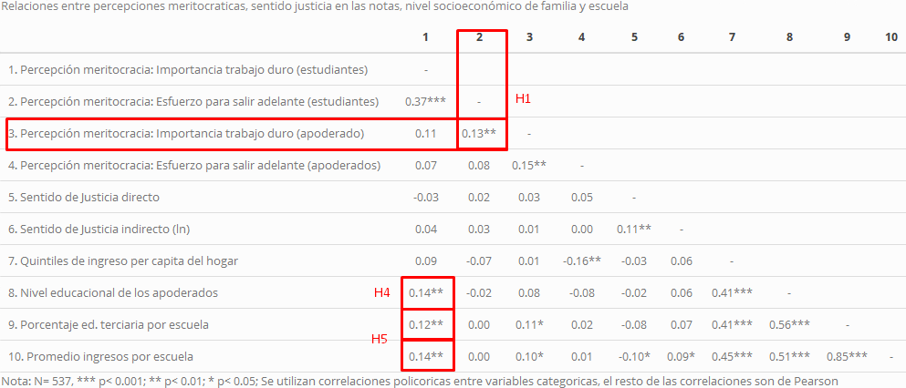

layout: true
class: animated, fadeIn

---
class: inverse, left, middle

# _Socialización de la meritocracia: el rol de la familia y la escuela. <br> .small[Juan Carlos Castillo, Julio Iturra, Francisco Meneses y Martín Venegas]_

***
[_VI Seminario Internacional Desigualdad y Movilidad Social **(DEMOSAL)**_](https://github.com/formacionciudadana)

<br>

#### Noviembre, 2021

---
class: center, middle

```{r setup, include=FALSE,eval=TRUE}
options(htmltools.dir.version = FALSE)
```

```{r xaringan-themer, include=FALSE, warning=FALSE}
library(xaringanthemer)
```

```{r cache=FALSE, include=FALSE}
library(RefManageR)
bibobject <- BibOptions(check.entries = FALSE,
           hyperlink = FALSE,
           dashed = FALSE)

BibOptions(bibobject)

myBib <- ReadBib("input/bib/Educación-ciudadana-PACES.bib", check = FALSE)
```


# _Estructura de la presentación_

- Introducción
- Antecedentes e hipótesis
- Datos, variables y método
- Resultados
- Discusión y conclusiones
---
class: slideInRight, middle, inverse

***
# Introducción
***

---
# Meritocracia

#### Definición: 

La meritocracia es un ideal que aspira a que los recursos se distribuyan según el esfuerzo y talento personal (Young, 2006)

#### Implicancias en los jovenes: 

- Las vivencias negativas de los jóvenes (frustración, discriminación, baja autoestima) en contextos desiguales pueden ser fomentados por creer en el ideal meritocrático (Major et al., 2017).

- Las creencias meritocraticas se asocian a valores contrarios a los promovidos por la formación ciudadana (e.g. Azevedo et al., 2019; Madeira et al., 2019).

---
# Este artículo

#### Brecha

Pese al reciente alza en los estudios sobre las creencias meritocráticas y la importancia evidenciada de la meritocracia en las vivencias juveniles de la desigualdad, se ha puesto poca atención a la formación de estas creencias en etapas tempranas.

#### Propuesta: dos enfoques

**Socialización política**: distintos agentes tienen el potencial de contribuir a la formación de percepciones, actitudes y creencias en los jóvenes. Los más importantes: familia y escuela.

**Justicia distributiva**: 
  + En la escuela: las experiencias de justicia distributiva en la escuela tienen efectos en los comportamientos, actitudes y percepciones de los jóvenes.
  + En población adulta: individuos de mayor estatus suelen percibir más meritocracia

---
# Este artículo

### Pregunta general

** ¿En qué medida las percepciones meritocraticas parentales, las experiencias escolares de justicia distributiva y el nivel socioeconómico influyen en las percepciones meritocráticas de estudiantes secundarios?** 

### Aportes a la literatura

- Relación agenda de socialización política y justicia distributiva
  + Aporte a la agenda socialización política a través del estudio de otras ideas transmisibles
  + Aporte a la agenda de justicia distributiva a través del estudio de dimensiones de la desigualdad subjetiva no exploradas
- Medición directa de respuestas de apoderados

---
class: slideInRight, middle, inverse

***
# Antecedentes e hipótesis
***
---
# Conceptos principales

#### Percepciones meritocraticas

La convicción de los sujetos sobre que su sociedad realmente distribuye recursos según el mérito individual (Castillo et al., 2019)

#### Sentido de justicia en las notas

Evaluaciones de justicia en la distribución de notas en la escuela (subrecompensado, justo, sobrerecompensado) (Resh, 2010)

#### Nivel socioeconómico

Posición en la estructura social, cantidad de recursos.

---
# Sobre la familia

La familia es un primer contexto de socialización que provee valores, expectativas y reglas (Martinez y Cumsille, 2015). Las creencias parentales ejercen una gran influencia en las creencias, actitudes y comportamientos de los niños (Olivos, 2020; Bandura et al. 2001; Frye 2012; Wigfield et al. 2006). Los padres crian a sus hijos a partir de principios basados en su clase social, transmitiendo creencias y actitudes estratificadas (McCory, 2014). 
  
  ### Hipótesis 1: 
  Padres con mayor nivel de percepción de meritocracia estarán asociados a hijos con similares percepciones.
---
# Sobre la escuela

La escuela contribuye a formar la visión de mundo de los estudiantes, en esto, la experiencia de justicia de los estudiantes juega un rol fundamental (Resh y Sabaggh, 2014; 2017). Estudiantes que sienten que la asignación de su nota fue justa, tienden a reportar mayores orientaciones liberales democráticas (Resh y Sabaggh, 2014). Además, los estudiantes tienden a considerar los principios meritocráticos como más adecuados para la distribución de notas (Resh, 2009).
  
  ### Hipótesis 2: 
  
  Estudiantes con una mayor sensación de justicia en sus notas percibirán mayor meritocracia
---
# Moderacion: familia y escuela

**Teoría de los supuestos rotos (_shattered assumptions_):** la influencia de los discursos puede ser moderada si las experiencias de injusticia no respaldan dichos discursos (Foster et al., 2006).
  
  ### Hipótesis 3: 
  
  La relación entre percepción meritocrática de los padres y de los hijos (H1) será más positiva para aquellos que experimentan un mayor sentido de justicia en la escuela (H2)
---
# Nivel socioeconómico: nivel familia y escuela

La evidencia en torno a las percepciones meritocráticas destacan el rol que juega la posición social. En general, personas de mayor estatus poseen mayores percepciones de meritocracia (Kunovich & Slomczynski, 2007).
  
  ### Hipótesis 4: 
  
  El estatus socioeconómico de la familia posee un efecto positivo sobre las percepciones meritocráticas del estudiante. 
  
  ### Hipótesis 5: 
  
  El estatus socioeconómico de la escuela posee un efecto positivo sobre las percepciones meritocráticas del estudiante
---
# Mediación: nivel socioeconómico y percepciones meritocráticas

De ser efectiva H4, se podría discutir hasta qué punto el efecto del nivel socioeconómico sobre las percepciopnes meritocratcas registrado en la literatura se explica más por la socialización familiar que por la posición socioeconómica en sí misma.

  ### Hipótesis 6: 
  
  La percepción meritocrática de los padres media la relación entre el estatus socioeconómico de los padres y la percepción           meritocrática de los estudiantes
  
---
# Mediación: sentido de justicia, nivel socioeconómico escuela y percepciones meritocraticas

Resh (2010) ha evidenciado que los recursos de los padres poseen un efecto en la sensación de justicia que siente el estudiante respecto a sus notas. Siguiendo a Solt (2020b), si consideramos que en Chile existe mayor desigualdad social que en Israel, podríamos suponer que dicho efecto se mantendrá e incluso podría ser mayor.

  ### Hipótesis 7: 
  
  La sensación de justicia en las notas media la relación entre el estatus socioeconómico de la escuela y la percepción               meritocrática estudiantes
---
# Modelo teorico graficado

---
class: slideInRight, middle, inverse

***
# Datos, variables y método
***

---
# Datos:

Panel de Ciudadania Escolar (PACES): Estudio longitudinal con muestra repreentativa de estudiantes de segundo medio, apoderados y profesores en la Región Metropolitana y las comunas de Antofagasta, Calama, Talca, Curicó y Linares.

- Muestra original: 1635 estudiantes, 744 apoderados en 64 escuelas.
- Muestra para este estudio (transversal): 537 estudiantes y apoderados en 59 escuelas
---
#### <span style="color:red"> **Variables**</span>

- **Percepciones meritocráticas** (estudiantes y apoderados)
  + _En Chile, los que se esfuerzan salen adelante. Likert 4 categorias grado de acuerdo_
  + _Actualmente en Chile, para surgir en la vida ¿Cuán importante es el trabajo duro? Idem grado importancia_
- **Sentido de justicia en las notas**
  + Directo: _Tomando en cuenta el tiempo que le dedico a mis estudios, las notas que me saco son. . . Más/Menos las que merezco_
  + Indirecto: Formula Jasso (1978) con notas
- **Nivel socioeconómico**
  + Nivel educactivo
  + Quintiles de ingreso
  


#### <span style="color:red"> **Método**</span>
- Análisis descriptivo: frecuencias y correlaciones de Pearson y Policloricas
- Análisis multivariado: regresiones ordinales logísticas multinivel y mediaciones

---
class: slideInRight, middle, inverse

***
# Resultados
***

---
# Descriptivos


Más del 80% de la muestra de estudiantes y apoderados cree que es importante o muy importante el trabajo duro para surgir en la vida

---
# Descriptivos



---

.center[]
---
# Resumen resultados

**H1, H3, H4**: Evidencia parcial

- Percepciones meritocráticas (trabajo duro) de apoderados están relacionadas positivamente con las de sus hijos

- Las experiencias de injusticia en las notas (directo) mitigan la relación positiva entre percepciones meritocráticas (trabajo duro) padres-hijos.

- El nivel socioeconómico de la familia está relacionado positivamente con las percepciones meritocráticas (trabajo duro) de los hijos.

**H2, H5, H6, H7**: No hay evidencia

---
class: slideInRight, middle, inverse

***
# Discusión y conclusiones

***
---
# Tres puntos de discusión

1. **Reproducción de la desigualdad:** transmisión intergeneracional de las percepciones meritocráticas

2. **Efecto moderador, pero no directo:** ¿sentido de justicia directo o indirecto?

3. **Tipos de socialización:** esclareciendo el rol de los agentes (familia y escuela)
---
# Conclusiones y futuras inevstigaciones

- Apertura a más estudios que indaguen la dimensión subjetiva de la desigualdad en jóvenes desde la socialización, especialmente de agentes como la familia y escuela

- Avanzar en la agenda de justicia en la escuela tomando en cuenta otros indicadores de desigualdad subjetiva e indagando el rol de la forma de medición

---
class: center, middle

# ¡Muchas gracias!
