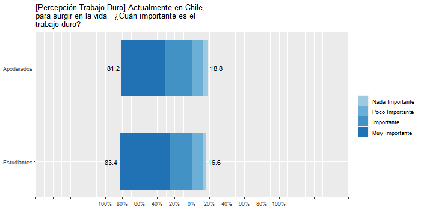
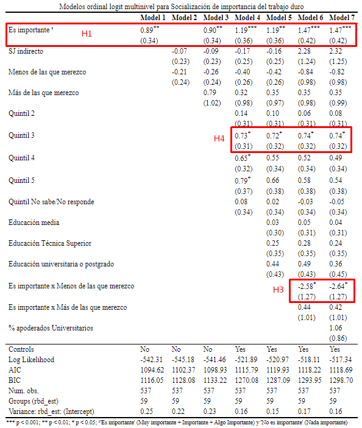

layout: true
class: animated, fadeIn

```{r xaringanExtra, echo = FALSE}
  xaringanExtra::use_progress_bar(color = "red", location = "bottom")
```

```{r setup, include=FALSE,eval=TRUE}
options(htmltools.dir.version = FALSE)
```

```{r xaringan-themer, include=FALSE, warning=FALSE}
library(xaringanthemer)
```

```{r cache=FALSE, include=FALSE}
library(RefManageR)
bibobject <- BibOptions(check.entries = FALSE,
           hyperlink = FALSE,
           dashed = FALSE)

BibOptions(bibobject)

myBib <- ReadBib("input/bib/Educación-ciudadana-PACES.bib", check = FALSE)
```


---
class: inverse, right, middle

# Socialización de la meritocracia: el rol de la familia y la escuela. <br> 

.orange[**Juan Carlos Castillo (juancastillov @uchile.cl),  Julio Iturra, Francisco Meneses y Martín Venegas**]

Departamento de Sociología, Universidad de Chile 

Centro de Estudios de Conflicto y Cohesión Social - [.orange[COES]]()

Proyecto FONDECYT 1181239 (2018-2021)

***
[.orange[_VI Seminario Internacional Desigualdad y Movilidad Social **(DEMOSAL)**_]](https://github.com/formacionciudadana)

Noviembre, 2021

---
class: inverse, right, middle

# .bolder[Contenidos]

<br>
###1- Contexto

###2- Antecedentes e hipótesis

###3- Datos, variables y método

###4- Resultados

###5- Discusión y conclusiones
---
class: inverse, right, middle

# .bolder[Contenidos]

<br>
### .red[1- Contexto]

###2- Antecedentes e hipótesis

###3- Datos, variables y método

###4- Resultados

###5- Discusión y conclusiones

---
## Proyecto FONDECYT 1181239 (2018-2021)

.pull-left[
- **Socialización política y experiencia escolar: El rol de la familia y la escuela**

- Inverstigador principal: Cristián Cox

- Estudio Panel Ciudadanía Escolar .red[**PACES**]

- Actualmente realizado estudios de primera ola y levantando segunda
]

.pull-right[
(aquí logo paces)
]


---
class: inverse, right, middle

# .bolder[Contenidos]

<br>
###1- Contexto

###2- .red[Antecedentes e hipótesis]

###3- Datos, variables y método

###4- Resultados

###5- Discusión y conclusiones


---
# Este estudio

### .red[Objeto de investigación]: percepciones meritocráticas de estudiantes secundarios

### .red[Factores explicativos]: 

a. Nivel socio-económico 

b. Experiencias escolares de justicia distributiva

c. Percepciones meritocráticas parentales
  
  
percepciones meritocráticas de estudiantes secundarios


---
# Meritocracia

### Definición: 

La meritocracia es un ideal que aspira a que los recursos se distribuyan según el esfuerzo y talento personal (Young, 2006)

### Posibles implicancias en los jovenes: 

- Fomento de la competencia y valores individualistas (contrarios al ideal solidario de formación ciudadana) (e.g. Azevedo et al., 2019; Madeira et al., 2019).

- Creer en el ideal meritocrático puede llevar a responsabilizarse por bajo desempeño escolar (Major et al., 2017).

---
# Conceptos principales

### Percepciones meritocraticas

La convicción de los sujetos sobre que su sociedad realmente distribuye recursos según el mérito individual (Castillo et al., 2019)

### Sentido de justicia en las notas (escuela)

Evaluaciones de justicia en la distribución de notas en la escuela (subrecompensado, justo, sobrerecompensado) (Resh, 2010)

### Nivel socioeconómico (familia)

Posición en la estructura social, cantidad de recursos.

---
 

## Hipótesis de socialización

- El estatus socioeconómico de la familia posee un efecto positivo sobre las percepciones meritocráticas del estudiante.

- Padres con mayor nivel de percepción de meritocracia estarán asociados a hijos con similares percepciones.

## Hipótesis de justicia en la escuela

Estudiantes con una mayor sensación de justicia en sus notas percibirán mayor meritocracia

---

## Hipótesis de interacción

La relación entre percepción meritocrática de los padres y de los hijos será más positiva para aquellos que experimentan un mayor sentido de justicia en la escuela 

---
# Modelo teórico


---
class: inverse, right, middle

# .bolder[Contenidos]

<br>
###1- Contexto

###2- Antecedentes e hipótesis

### .red[3- Datos, variables y método]

###4- Resultados

###5- Discusión y conclusiones


---
# Datos

- Panel de Ciudadania Escolar (PACES): Estudio longitudinal con muestra repreentativa de estudiantes de segundo medio, apoderados y profesores en la Región Metropolitana y las comunas de Antofagasta, Calama, Talca, Curicó y Linares.

- Muestra original: 1635 estudiantes, 744 apoderados en 64 escuelas.

- Muestra para este estudio (transversal): 537 estudiantes y apoderados en 59 escuelas

---
# Variables

.medium[

- **Percepciones meritocráticas** (estudiantes y apoderados)

  + _En Chile, los que se esfuerzan salen adelante. Likert 4 categorias grado de acuerdo_
  
  + _Actualmente en Chile, para surgir en la vida ¿Cuán importante es el trabajo duro? Idem grado importancia_
  

- **Sentido de justicia en las notas**

  + Directo: _Tomando en cuenta el tiempo que le dedico a mis estudios, las notas que me saco son. . . Más/Menos las que merezco_
  
  + Indirecto: Formula Jasso (1978) con notas

- **Nivel socioeconómico**:  Nivel educactivo, Quintiles de ingreso
]  
---
# Métodos

- Análisis descriptivo: frecuencias y correlaciones de Pearson y Policloricas

- Análisis multivariado: regresiones ordinales logísticas multinivel y mediaciones


---
class: inverse, right, middle

# .bolder[Contenidos]

<br>
###1- Contexto

###2- Antecedentes e hipótesis

###3- Datos, variables y método

###  .red[4- Resultados]

###5- Discusión y conclusiones


---
class: center, middle




---
class: middle


---

.center[]

---
class: inverse, right, middle

# .bolder[Contenidos]

<br>
###1- Contexto

###2- Antecedentes e hipótesis

### 3- Datos, variables y método

###4- Resultados

### .red[5- Discusión y conclusiones]

---
# Resumen resultados preliminares

- El nivel socioeconómico de la familia está relacionado positivamente con las percepciones meritocráticas (trabajo duro) de los hijos.

- Percepciones meritocráticas (trabajo duro) de apoderados están relacionadas positivamente con las de sus hijos

- Las experiencias de injusticia en las notas (directo) mitigan la relación positiva entre percepciones meritocráticas (trabajo duro) padres-hijos.


---
# Futuras investigaciones

- Más estudios que indaguen la dimensión subjetiva de la desigualdad en jóvenes desde la socialización, especialmente de agentes como la familia y escuela

- Avanzar en la agenda de justicia en la escuela tomando en cuenta otros indicadores de desigualdad subjetiva y profundizando en la medición de variables

- Vínculo meritocracia y ciudadanía

---
class: inverse, center, middle

# ¡Muchas gracias!


---
class: inverse, right, middle

# Socialización de la meritocracia: el rol de la familia y la escuela. <br> 

**Juan Carlos Castillo (juancastillov @uchile.cl),  Julio Iturra, Francisco Meneses y Martín Venegas**

Departamento de Sociología, Universidad de Chile 

Centro de Estudios de Conflicto y Cohesión Social - [COES]()

Proyecto FONDECYT 1181239 (2018-2021)

***
[_VI Seminario Internacional Desigualdad y Movilidad Social **(DEMOSAL)**_](https://github.com/formacionciudadana)

Noviembre, 2021


