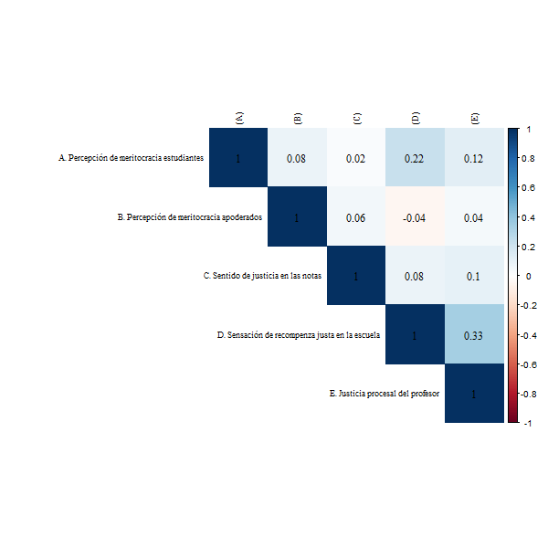

```{r eval=FALSE, include=FALSE}
# for render in pdf run rmarkdown::render_site("docs/preanalisis.Rmd", output_format = "all")
# clean #in the yml
library(citr)
#rmarkdown::render("docs/preanalisis.Rmd", output_format = "bookdown::pdf_document2")
#rmarkdown::render("docs/preanalisis.Rmd", output_format = "bookdown::html_document2")
```

```{r setup, include=FALSE}
knitr::opts_chunk$set(warning = FALSE,message = FALSE, cache = FALSE,out.width = '85%',fig.pos= "H")
# knitr::opts_knit$set(base.url = "../") #relative path for .html output file
# knitr::opts_knit$set(root.dir = "../") #relative path for chunks within .rmd files
options(scipen=999)
rm(list=ls())
options(knitr.kable.NA = '')
options(knitr.graphics.error = FALSE)
Sys.setlocale("LC_ALL", "ES_ES.UTF-8")
```

```{r message=FALSE, warning=FALSE, include=FALSE, echo=FALSE}
pacman::p_load(knitr, kableExtra, dplyr, lavaan)
```

```{r echo=FALSE }
table_format = if(is_html_output()) {
  "html"
} else if(is_latex_output()) {
  "latex"
}
table_format2 = if(is_html_output()) {
  T
} else if(is_latex_output()) {
  F
}
```

```{r eval=FALSE, echo=FALSE}
# Para obtener doble output (html/pdf) correr directamente en consola/terminal:
rmarkdown::render('production/index.rmd', output_format = 'all',output_dir = ".")
```

```{r include=FALSE}
#Determine the output format of the document
outputFormat   = knitr::opts_knit$get("rmarkdown.pandoc.to")

#Figure and Table Caption Numbering, for HTML do it manually
capTabNo = 1; capFigNo = 1;

#Function to add the Table Number
capTab = function(x){
  if(outputFormat == 'html'){
    x = paste0("Tabla ",capTabNo,". ",x)
    capTabNo <<- capTabNo + 1
  }; x
}

#Function to add the Figure Number
capFig = function(x){
  if(outputFormat == 'html'){
    x = paste0("**","Figura ",capFigNo,": ","**",x)
    capFigNo <<- capFigNo + 1
  }; x
}
```


# Introducción: 

La meritocracia es un ideal que aspira a la distribución equitativa de los recursos según esfuerzo y talento personal [@young_rise_2006]. Este ideal se encuentra ampliamente extendido en las sociedades modernas donde se alza como una forma legítima de progresar individualmente en la sociedad en base a logros personales, contrario a la antigua distribución en base a herencias y a las ventajas que pueden generar otro tipo de actividades como sobornos o uso de contactos personales. Si bien la obtención de recompensas proporcionales a esfuerzo y talento parece una representación fidedigna de la justicia por equidad, la implementación de sistemas meritocráticos no está exenta de problemas. Por un lado, la meritocracia permite la justificación de las desigualdades mediante a atribución a logro personal, subestimando de esta manera las condiciones de origen o el "punto de partida" [@hadjar_Meritokratie_2008;@bay-cheng_Agency_2015]. Por otro lado, el énfasis en las capacidades individuales se asociaría a responsabilizar a las personas de su situación y por lo tanto a un menor apoyo a políticas sociales que compensen situaciones de desventaja: “¿por qué las personas que  triunfan en la vida iban a deber nada a los miembros menos favorecidos de la sociedad?” [@sandel_tirania_2021 p.292]. De esta manera, la meritocracia mermaría la preocupación por el bien común y la solidaridad.

Si bien el último tiempo se ha incrementado el interés por el estudio de la meritocracia, asociado a situaciones de desigualdad y concentración de ingreso [], hasta ahora se ha puesto poca atención al origen de estas creencias en etapas previas a la vida adulta. Al respecto, desde una perspectiva de socialización se asume que son dos los agentes principales en la transmisión de contenidos y pautas culturales: la familia y la escuela. En el presente trabajo nuestro objetivo es estudiar en qué medida las ideas parentales y las experiencias escolares influyen en las percepciones respecto a la meritocracia en estudiantes de educación media. Basados en trabajos previos de Resh y Sabbagh [] sobre el sentido de justicia en la escuela, analizaremos en qué medida los logros obtenidos en cuanto a notas obtenidas en la escuela se asocian a una mayor percepción de meritocracia en la sociedad, así como también estudiaremos la relación entre la percepción de meritocracia de padres y sus hijos.


Preguntarse  sobre la socialización familiar y escolar de las percepciones meritocráticas está relacionado con las ideas que poseen los ciudadanos sobre la justicia social y, por ende, la pregunta se enmarca en los estudios de justicia distributiva definidos por @jasso_New_1980. Más específicamente, el trabajo se enmarca en los estudios sobre justicia en la escuela [@resh_Sense_2010a; @sabbagh_Unfolding_2016c], particularmente en la esfera de las calificaciones y sus consecuencias [@resh_Justice_2016a]. Considerando los estudios de justicia distributiva y meritocracia, así como la evidencia sobre las consecuencias de las sensaciones de injusticias de las notas, este trabajo busca evidenciar, para el contexto chileno, que la sensación de (in)justicia en las notas afecta la percepción general del estudiante sobre la realización de la meritocracia a nivel nacional. Esta es una hipótesis plausible por dos motivos, primero se ha evidenciado que la sensación de justicia en las notas afecta creencias sobre la sociedad en general más allá del contexto de la escuela, por ejemplo, se sabe que la sensación de injusticia genera un influjo negativo en la confianza en las instituciones [@resh_Sense_2014b], por lo cual se puede suponer que afecta otros aspectos de la sociedad. En segundo lugar, según @mijs_Inequality_2018, las personas infieren a partir de sus contextos y experiencias particulares creencias sobre la desigualdad en general, por lo cual, un estudiante que siente que sus esfuerzos no son recompensados podría inferir dicha situación se replica a nivel general. 

Además, al abordar la transmisión intergeneracional de ideas y valores relacionados con las prácticas democráticas, este estudio se enmarca en las investigaciones de socialización política incorporando otras ideas transmisibles, las sensaciones de justicia y las creencias meritocráticas. Los estudios sobre la reproducción intergeneracional de la política han estudiado la transmisión de habilidades, creencias, actitudes y prácticas para el ejercicio de la ciudadanía [@astill_Multilevel_2002a;@miranda_Desigualdad_2018a]. Al respecto se ha estudiado la transmisión de opiniones e intenciones de participación política [@boonen_Adolescent_2013a;@quintelier_Intergenerational_2015a], las creencias políticas sobre la democracia [@greenstein_Personality_2016a] y orientaciones políticas [@jennings_Politics_2009a]. No obstante, no se han incorporado aspectos relativos a la justicia distributiva, los cuales pueden ser fundamentales si se considera que las ideas de las personas sobre la desigualdad pueden generar apatía política e incluso deseos de insubordinación [@easterbrook_social_2021], además de estar relacionadas con la tolerancia y las ideas autoritarias [@madeira_Primes_2019a; @azevedo_Neoliberal_2019b].

Dentro del marco de los estudios de la justicia distributiva y meritocracia, esta propuesta contribuye profundizando y problematizando algunas dimensiones estudiadas. Se ha evidenciado repetidamente que personas en situación de ventaja social, ya sea por ingresos, educación o por raza, poseen una mayor adhesión a las ideas meritocráticas [@reynolds_Perceptions_2014;@solt_Economic_2016], lo cual suele interpretarse como una idea racional [@kunovich_Systems_2007]. Pese a ello, hasta ahora no se ha indagado sobre hasta qué punto las creencias meritocráticas de las personas de altos recursos se adquieren no solo por su posición social, sino también por la socialización en ambientes familiares de alta posición social, es decir, hasta qué punto los padres transmiten a sus hijos sus percepciones sobre la meritocracia.

Los estudios que trabajan sobre la formación de creencias meritocráticas aluden comúnmente a dos ideas respecto a la socialización, una que denominaremos socialización de la institucionalidad económica y otra referente a la socialización universitaria. La primera idea posee bastante evidencia a favor y señala que las características económicas del país influyen en las creencias meritocráticas de sus ciudadanos [@smith_Two_2012a ; @orkeny_Views_2000]. Además, se ha demostrado que el nivel de redistribución, la existencia de estados de bienestar y la desigualdad del país influyen las creencias sobre la meritocracia de modo tal que quienes se crían en contextos más desiguales, con menor presencia de redistribución y desigualdad en el acceso a servicios sociales perciben mayor meritocracia y validan menos las políticas asistenciales. La segunda idea, proveniente de los planteamientos de Bourdieu, señala que el pasar por la universidad socializa a las personas en valores propios de los grupos dominantes lo cual los hace respaldar la meritocracia [@baer_Education_2008]. En vista de lo anterior, podemos decir que al hablar de socialización se ha señalado insuficientemente dos agentes socializadores fundamentales, la familia y la escuela. Por ello, un aporte de este trabajo es ampliar el concepto de socialización en las ideas de la meritocracia para incluir la influencia de las opiniones parentales que es señalada por la línea de la reproducción intergeneracional.

Centrándonos en nuestro estudio nuestro propósito es evaluar si existe coincidencia entre las percepciones meritocráticas de padres y estudiantes. Además, como se señaló buscamos comprender el efecto de la sensación de justicia en las calificaciones sobre la creencia de una distribución justa en la sociedad en general.  Un trabajo similar ha sido elaborado por @olivos_Motivation_2021, quién ha probado el efecto de las creencias meritocráticas sobre las buenas calificaciones en la escuela demostrando que las presiones meritocráticas de los padres no se transforman en incentivos al esfuerzo que mejoren las calificaciones. Además, el autor evidencia a partir de modelos longitudinales, que las calificaciones si poseen un efecto sobre las creencias de los estudiantes en el funcionamiento general de la meritocracia a nivel país. A diferencia de este aporte, el presente trabajo busca comprender, cómo se ha señalado, el efecto directo que podrían tener las creencias de los padres sobre las creencias de sus hijos  y cómo estas pueden estar moderadas por experiencias de sensaciones de (in)justicia  en la escuela en torno a las notas.

## Aprendiendo sobre desigualdad: socialización de actitudes y sentido de justicia en la escuela

El estudio de la desigualdad social ha tenido un lugar central en la sociología. Por un lado, está el desarrollo de la investigación en el ámbito de la estratificación social, desde donde se ha puesto atención en las características de la estructura social y en los mecanismos de preproducción de la desigualdad [@kerbo_Estratificacion_1998, @chan_Class_2007, @lopez-roldan_Comparative_2021]. Por otro lado, durante las últimas décadas se ha desarrollado un ámbito de investigación que se propone estudiar las actitudes distributivas de los individuos en relación a su posición en la estructura social, principalmente a través de sus percepciones y preferencias en torno a la desigualdad económica [@kluegel_Beliefs_2017, @kluegel_Social_2018, @janmaat_Subjective_2013]. Una de las dimensiones que ha sido abordada desde esta perspectiva se relaciona con la legitimidad de la desigualdad en ámbitos como los salarios [@Kelley1993, @evans_Justifications_2010] o el acceso a bienestar social [@maldonado_Risk_2019, @jensen_Deservingness_2017]. Desde un enfoque de interés racional se sostiene que la posición relativa de los individuos en la estructura social, representada a través de los ingresos, logro educacional y posición en el mercado laboral, trae consigo que individuos de mayor estatus manifiesten actitudes menos igualitarias, y por tanto, tiendan a justificar mayor desigualdad [@meltzer_Tests_1983, @gugushvili_Intergenerational_2016]. Por otro lado, la literatura también ha demostrado que las actitudes de los individuos no solo se ven afectadas por su posición objetiva, sino que también son influenciadas por sus experiencias en torno a la desigualdad , donde las percepción en torno a la actual distribución económica juega un rol clave en cómo las sociedades legitiman la asignación de recursos en la sociedad [@garcia-castro_Perceiving_2020, @trump_Income_2018].

Frente a la complejidad y amplitud de conceptos utilizados en los estudios sobre desigualdad subjetiva, autores como @jasso_New_1980  o @janmaat_Subjective_2013 proponen marcos conceptuales de trabajo que facilitan la comprensión del campo de estudio. Según @janmaat_Subjective_2013a una primera distinción fundamental es entre los conceptos de desigualdad subjetiva y las dimensiones. Por un lado, los tres principales conceptos sobre desigualdad subjetiva son percepciones de desigualdad; referidos a estimaciones subjetivas sobre la desigualdad existente, creencias sobre la desigualdad; comprendidas como ideas normativas de justicia respecto a cómo debería ser, y por último, juicios sobre la desigualdad: relativos a evaluaciones sobre que tan buena o mala es la situación actual de la justicia. Por otro lado, las dimensiones de análisis, la primera son las magnitudes y buscan responder preguntas en torno a cuánta desigualdad perciben las personas o cuánta desigualdad consideran justa, la segunda dimensión de análisis alude a los criterios de justicia utilizados por los sujetos, entre los cuales destacan el criterio meritocrático (asignar según logros, habilidades y esfuerzo), carga de trabajo (según responsabilidades), igualdad, necesidad y adscripción (pertenencia a determinado grupo). En particular este trabajo utilizará el concepto de percepción junto al criterio de distribución de la meritocracia, para evaluar hasta qué punto los ciudadanos consideran que la meritocracia opera efectivamente en la sociedad chilena de modo tal que los recursos se distribuyen según talento y esfuerzo, idea que se resume en el concepto percepción de meritocracia. 


En línea con lo anterior, investigaciones recientes han puesto mayor atención a cómo la percepción en torno al funcionamiento de la meritocracia juega un rol clave en la justificación de la desigualdad económica [@mijs_Paradox_2019, @bucca_Merit_2016]. En este sentido, la sociedades contemporáneas de occidente han sostenido el relato de que el mérito, entendido como la conjunción del esfuerzo con el talento individual [@young_rise_2006], es central en la obtención de recompensas [@hadjar_Meritokratie_2008]. Una de las dimensiones centrales en el logro de estatus ha sido la obtención de credenciales educativas que dan paso a ocupaciones de mayor calificación en el mercado laboral [@goldthorpe_myth_2003]. El estudio de la meritocracia desde un punto de vista subjetivo ha puesto en debate dos aproximaciones contrapuestas. Por un lado está el enfoque _reproduccionista_ [@bourdieu_reproduccion_1998, @Bernstein2003], desde donde se sostiene que el rol de la institución escolar contribuye a reforzar los principios meritocráticos de los individuos, por tanto un mayor logro educacional se traduce en mayor adscripción a la meritocracia como principio distributivo [@reynolds_Perceptions_2014, @xian_Bootstraps_2017a, @lampert_Meritocratic_2013b]. Por otro lado, se encuentra la hipótesis de _instrucción_, la cual sostiene que individuos más educados poseen mayor capacidad crítica respecto del rol que juegan los factores estructurales e individuales en la adquisición de recompensas en la sociedad, lo cual se traduce en un debilitamiento en torno al ideal meritocrático [@duru-bellat_Who_2012, @castillo_Meritocracia_2019]. Por este motivo, se vuelve central prestar mayor atención al proceso de socialización.


### Evidencia en población adulta


La evidencia sobre la percepción de desigualdad y de movilidad social meritocrática nos indican que las personas comúnmente poseen ideas distorsionadas respecto a los reales niveles de desigualdad en sus países [@gimpelson_Misperceiving_2018a], esto es sumamente interesante pues da cuenta de que no solo importa los niveles reales de desigualdad sino que también las percepciones juegan un rol en las opiniones y preferencias de los ciudadanos. En esta línea  @mccall_Exposure_2017a evidencia que exponer a los ciudadanos estadounidenses a los reales niveles de desigualdad fomenta en ellos una menor creencia en las oportunidades para salir adelante en base al esfuerzo propio. Similarmente,  @mijs_How_2020 señala que al exponer a ciudadanos indonesios, australianos y mexicanos a los niveles reales de desigualdad y movilidad disminuye su percepción de meritocracia.  Estas percepciones distorsionadas sobre la desigualdad y la meritocracia varían consistentemente según nivel socioeconómico, pues las personas aventajadas socioeconómicamente suelen percibir mayores niveles de meritocracia que las personas de escasos recursos. Las diferencias frente a la percepción según nivel socioeconómico varían según el nivel de desigualdad de la sociedad lo cual es explicado por distintas teorías. La teoría del conflicto supone que mayores niveles de desigualdad generan menor percepción de meritocracia y menor tolerancia a la desigualdad, a la vez que existe mayor disenso en estos temas entre distintos estratos sociales [@newman_Replication_2015]. No obstante, según @solt_Economic_2016 quien replica los análisis de Newman, la evidencia señala lo contrario, lo cual es coherente con la teoría del poder relativo, según la cual a mayor desigualdad económica el poder de la riqueza es más capaz de imponer discursos a distintos grupos sociales, por lo cual a mayor desigualdad existe mayor consenso entre grupos sociales sobre la percepción de meritocracia. En síntesis, podemos decir que la percepción de meritocracia es  mayor en grupos aventajados aunque tiende a ser menor la diferencia con la percepción de los pobres en países más desiguales.


### Evidencia en población infanto-juvenil

También se han realizado estudios sobre creencias meritocráticas en población de menor edad, puesto que las edades tempranas son un momento crucial para la formación de actitudes (Martinez y Cumsille, 2015; Ericksson, 1998). En lo que refiere a actitudes hacia la desigualdad, los estudios han demostrado que los niños son capaces de formar nociones acerca de justicia y desigualdad a muy temprana edad [@imhoff_Nociones_2015]. Si bien los niños más pequeños presentan problemas para comprender los términos de “rico” y “pobre” (Danziger, 1957), durante los 3 y 6 años ya empiezan a comprender dichos términos aunque no son capaces explicar estas diferencias hasta alrededor de los 10 años (Sigelman, 2013). En esta edad los niños tienden a destacar en gran medida las atribuciones individuales como causantes de la desigualdad [@sigelman_Rich_2012], aunque presentan incipientes explicaciones basadas en la desigualdad de oportunidades, especialmente como consecuencia de la discriminacion [@imhoff_Nociones_2015]. No obstante algunos autores señalan que las atribuciones multifacéticas de la desigualdad pueden encontrarse a edades menores, así un estudio con niños de 5 a 8 años, dio cuenta de que en esta etapa los niños eran capaces de explicar la pobreza a partir de razones internas y externas, aludiendo a desigualdades salariales y discriminación [@mistry_Children_2016]. Según estos autores los resultados son coherentes con la teoría del desarrollo cognitivo (Leahy, 1981) y del construccionismo social (Emler & Dickinson, 1985) según la cual un mayor desarrollo cognitivo posibilitará una comprensión más acabada de la desigualdad. 

Además de la comprensión y explicación de los niños frente a la desigualdad, algunos estudios han profundizado en el uso de criterios de justicia distributiva por parte de los niños. En esta línea @kanngiesser_Young_2012 señalan que pese a su tendencia egoísta, los niños entre 3 y 5 años ya son capaces de utilizar criterios meritocráticos para distribuir recursos, considerando el esfuerzo invertido de otros niños aun cuando esto podría afectar su propio interés. En suma, los niños y niñas a temprana edad son capaces de comprender conceptos relativos a la desigualdad, a la vez que son capaces de utilizar distintos criterios de distribución para explicar dichas diferencias o asignar recursos. 

Desde distintas disciplinas se ha enfatizado la importancia de la socialización en el proceso de formación de creencias y opiniones sobre la desigualdad. Desde la psicología social se ha puesto de manifiesto que el aprendizaje de la desigualdad se también en las micro interacciones donde se evidencias las diferencias de estatus de las personas, además se ha destacado que el aprendizaje es diferenciado según la posición social del sujeto, de modo tal que distintos contextos influencian que los sujetos generen distintas explicaciones de la desigualdad (Mortimer y McLaughlin, 2014; Elenbaas et al., 2020). Desde la sociología, hace 40 años se ha llamado a profundizar los estudios de socialización sobre la desigualdad (Kluegel y Smith, 1981) pero aún sigue siendo una propuesta emergente. Liebig y Sauer (2013) han propuesto comprender la cuestión de cómo las instituciones moldean las actitudes de justicia dentro de una sociedad, entendiendolas cómo agentes de socialización. Así, los individuos son testigos de cómo se toman decisiones al interior de las instituciones y en base a eso forman sus actitudes. Mijs (2017; 2018) ha profundizado en esta idea proponiendo un modelo que concibe a las instituciones sociales cómo “espacios inferenciales”, en donde los individuos elaboran modelos explicativos para la desigualdad infiriendo a partir de la información obtenida en su experiencia con estas instituciones (familia, escuela, barrio, entre otras).

Los estudios empíricos sobre las actitudes hacia la desigualdad desde una óptica de socialización son escasos, y los existentes abordan esta relación en medidas macro. Por ejemplo, Le Garrec (2015) propone un modelo matemático para demostrar que la observación durante la niñez acerca de cómo los adultos no han implementado colectivamente políticas redistributivas justas reduce la preocupación por la equidad o el costo moral de no apoyar una tributación justa. Por otro lado, Ignácz (2018) muestra, a través de un análisis edad-periodo-cohorte, el efecto sustancial que tiene la socialización en las actitudes, y en detalle como una socialización socialista marca la diferencia en las percepciones y preferencias hacia la desigualdad de ingresos en individuos de países post-socialistas e individuos de países occidentales. Así también, VanHeuvelen y Copas (2018) muestran, a través de un análisis edad-periodo-cohorte, los cambios en las actitudes hacia la desigualdad en distintos cohortes de edad expuestos a distintos zeitgest. Estos tres artículos tienen en común el supuesto de que la observación pasiva y la exposición a ciertos momentos, acciones y culturas impacta lo suficiente para la formación de actitudes hacia la desigualdad. 

La familia es un primer agente de socialización que provee valores, expectativas y reglas (Martinez y Cumsille, 2015). Las creencias parentales ejercen una gran influencia en las creencias, actitudes y comportamientos de los niños (Olivos, 2020; Bandura et al. 2001; Frye 2012; Wigfield et al. 2006). Los padres crían a sus hijos a partir de principios basados en su clase social, transmitiendo creencias y actitudes estratificadas (McCory, 2014). De modo coherente, los padres transmiten a sus hijos actitudes cívicas, intenciones de participación, posiciones políticas entre otras características. En función de la evidencia en torno a la transmisión de creencias y el efecto de los cohortes temporales, es posible suponer que la transmisión  de creencias es igualmente aplicable a las creencias meritocráticas, de modo tal que padres con mayor nivel de percepción de meritocracia estarán a asociados a hijos con similares creencias. 

Un segundo agente de socialización es la escuela. Esta  contribuye a formar la visión del mundo de los estudiantes, en esto, la experiencia de justicia de los estudiantes juega un rol fundamental (Resh y Sabaggh, 2014; 2017) en tanto fomenta la inferencia de ideas respecto a la desigualdad (Mijs, 2018).  Entre los distintas esferas de justicia de la escuela (Walzer, 1987; Resh y Sabbagh, 2016), se destaca el rol que cumple la sensación de justicia en las notas, la cual es relevante en tanto determina las experiencias relativas a lo justo o injusto de los estudiantes afectando tanto  la formación de la autoimagen, de creación de jerarquías en el aula y su visión del mundo sobre diversos temas (Jasso y Resh, 2002; Resh, 2012). Entre ellos se ha demostrado que la sensación de justicia en la nota fomenta orientaciones liberales democráticas (Resh y Sabaggh, 2014), genera confianza en las instituciones,y hace que los estudiantes apoyen más la asignación meritocrática de las notas  (Resh, 2009). Frente a lo anterior, esta investigación propone que la sensación de justicia en las notas también fomenta una mayor percepción de meritocracia por parte de los estudiantes, lo cual es consistente con la evidencia señalada por Olivos (2020).

Además del efecto directo de las creencias de los padres y la sensación de justicia sobre la percepción de meritocracia de los estudiantes, consideramos un plausible en base a la teoría un efecto de moderación. Evidentemente los fenómenos como la formación de creencias son multifacéticos e influyen no sólo los discursos sino también las experiencias. Más aun, como señala la teoría de los supuestos rotos (shattered assumptions), la influencia de los discursos puede ser moderada si las experiencias  de discriminación no respaldan dichos discursos [@foster_Responding_2006a]. En base a lo anterior, proponemos que el efecto de la percepción meritocrática de los padres hacia los hijos será más fuerte si el estudiante siente que sus calificaciones son justas. Inversamente, aunque el estudiante sea socializado en creencias meritocráticas si él experimenta injusticia en sus notas el efecto de las creencias de sus padres sera más debil. 	

Como se mencionó, la evidencia en torno a las creencias meritocráticas destacan el rol que juega la posición social.  @reynolds_Perceptions_2014 señala que las personas de mayor estatus en Estados Unidos poseen una mayor percepción de meritocracia que quienes poseen un menor estatus. En la misma línea, @kunovich_Systems_2007 reafirma que los datos se comportan de modo consistente con las teorías del interés propio de modo tal que a mayores ingresos y educación los sujetos poseen mayor preferencia por pago meritocrático. Pese a sus diferencias, Solt y Newman consiguen resultados que comprueban la relación entre ingresos y creencias meritocráticas. En base a esta evidencia es sensato suponer que padres con mayor nivel socioeconómico poseerán mayor nivel de creencias meritocráticas. De modo similar, proponemos que estudiantes de colegios con mayor nivel socioeconómico en general también poseen mayor adhesión a las creencias meritocráticas. 

Un corolario del efecto del nivel socioeconómico de la familia sobre la percepción de los padres  y el efecto de las creencias de estos sobre la de sus hijos, es la posibilidad de una mediación. Esto supone un mecanismo causal de tres etapas donde el nivel socioeconómico de la familia fomenta una mayor percepción de meritocracia por parte de los padres, lo que a su vez genera una mayor percepción meritocrática en sus hijos. De ser significativo este efecto de mediación se podría discutir hasta qué punto el efecto registrado en la literatura del nivel socioeconómico sobre las creencias meritocráticas se debe solo a racionamientos individuales sobre la posición propia y hasta qué punto se debe a la socialización en un contexto donde se comparten esas ideas. 

Respecto a la relación entre nivel socioeconómico y sentido de justicia en las notas se puede decir algo similar.  @resh_Sense_2010 ha evidenciado que en el caso de israel los recursos de los padres poseen un efecto no solo en las notas de los estudiante sino también en la sensación de justicia que siente el estudiante respecto a sus notas. Si consideramos que en Chile existe mayor desigualdad social que en Israel  (Solt, 2021), podríamos suponer que dicho efecto se mantendrá e incluso podría ser mayor.  Por ende, de ser efectiva la relación entre nivel socioeconómico y sentido de justicia en las notas se podría hipotetizar una segunda medicación, según la cual, los estudiantes de familias con mayor NSE tendrán una mayor sensación de justicia en sus notas lo que fomentará una mayor percepción de meritocracia. 


En resumen, este trabajo aporta a la comprensión de la formación de percepciones meritocraticas centrándose en la juventud, incorporando para ello la socialización familiar y las experiencias como predictores principales. Además se propone que las ideas de los padres mediaran el efecto del nivel socioeconómico de los estudiantes sobre su percepción meritocrática, a la vez que las experiencias de injusticia en la escuela pueden afectar la transmisión de percepciones meritocraticas. 


# Metodología:


## Datos: 
 
Los datos provienen de un estudio sobre socialización política familiar que fue realizado aplicando una encuesta a estudiantes, sus apoderados y sus profesores. Esta encuesta se denomina Panel de Ciudadanía Escolar (PACES) y fue producida por el proyecto Fondecyt n°1181239 “Socialización política y experiencia escolar: el rol de la familia y la escuela” financiado por la Agencia Nacional de Investigación (ANID) del Ministerio de Ciencia y Tecnología chileno. Para el diseño y el trabajo en terreno se contrató a la empresa Datavoz. 

Para el caso particular de este articulo solo utilizamos la primera ola del panel, por lo que este es un estudio transversal. La muestra es representativa de los estudiantes de segundo medio (décimo grado) que asisten a escuelas de la Región Metropolitana o en las comunas de Antofagasta, Calama, Talca, Curicó y Linares. En total se seleccionaron 64 escuelas. En cada establecimiento educacional seleccionado se consideró encuestar a un curso completo, sus apoderados y sus docentes de historia, ciencias sociales y/o formación ciudadana. En concreto, se cuenta con los datos de 1635 estudiantes, 744 apoderados y 103 profesores. Los datos fueron producidos entre agosto y diciembre del año 2019. Eliminando los casos perdidos y considerando solo aquellos alumnos cuyos apoderados contestaron la encuesta, contamos con una muestra final de NNN, en NN escuelas. 

El marco muestral a utilizado para la selección de los establecimientos fue construido para la definición del universo, desde el Directorio de Establecimientos del Mineduc del año 2019, considerando todos los colegios de los sectores señalados.  La selección fue aleatoria y sistemática, considerando localidad, dependencia administrativa (municipal, subvencionado o particular) y tipo de educación (Humanista científica, técnico profesional o mixto). La metodología de aplicación fue Presencial y autoaplicada en el establecimiento para docentes y alumnos, siendo llevada a cabo por un encuestador especialmente entrenado para ello.  En el caso de los apoderados fue autoaplicada en sus hogares. 


## Variables:

Las variables más relevantes para el estudio se muestran a continuación:

```{r include=FALSE}
cap1 <- "Variables dependientes."
# if (knitr::is_html_output()) {tb <- table_nums("tb",cap)} else {tb <- cap}
```

```{r table-dependientes, echo=FALSE}
tab01 <- read.csv(file = "../input/prereg/table01.csv",header = 1,sep = ";",encoding = "UTF-8")
cnames <- c("Variable","Pregunta", "Categorías de respuesta")
kable(tab01,table_format,booktabs = T, linesep = "",col.names = cnames, caption = cap1) %>%
  kable_styling(
    full_width = T,
    latex_options = c("hold_position"),
    position = "center",
    font_size = 10,
    bootstrap_options=c("striped", "bordered")) %>%
  column_spec(column = 1, width = "2 cm", ) %>%
  column_spec(column = 2,width = "7 cm") %>%
  column_spec(column = 3,width = "4 cm") %>%
  collapse_rows(columns = 1:2,valign = "middle")
```

La variable dependiente de este estudio es la percepción meritocrática de los estudiantes. Esta se medirá a partir de dos indicadores, uno respecto a la opinión del éxito y el esfuerzo, y otro respecto a la importancia del trabajo duro. Ambos indicadores corresponden a escalas Likert de cuatro categorías, midiendo grado de acuerdo y grado de importancia, respectivamente.


```{r include=FALSE}
cap2 <- "Variables independientes de nivel 1."
# if (knitr::is_html_output()) {tb <- table_nums("tb",cap)} else {tb <- cap}
```

```{r table-independientesn1, echo=FALSE}
tab02 <- read.csv(file = "../input/prereg/table02.csv",header = 1,sep = ";",encoding = "UTF-8")

kable(tab02,table_format,booktabs = T, linesep = "",col.names =  c("Variable","Pregunta","Categorías de respuesta"), caption = cap2) %>%
  kable_styling(
    full_width = T,
    latex_options = c("hold_position"),
    position = "center",
    font_size = 10,
    bootstrap_options=c("striped", "bordered")) %>%
  column_spec(column = 1, width = "3 cm", ) %>%
  column_spec(column = 2,width = "7 cm") %>%
  column_spec(column = 3,width = "4 cm") %>%
  collapse_rows(columns = 1:2,valign = "middle")
```


En cuanto a las variables independientes, a nivel individual pueden dividirse de acuerdo a si corresponden a padres o estudiantes. En el caso de los padres, existen dos variables relevantes: percepción de meritocracia y estatus socioeconómico. Para la percepción de meritocracia los indicadores y categorías son idénticas a la variable dependiente utilizada en el cuestionario de estudiantes. Para el estatus socioeconómico, el indicador a utilizar serán los ingresos declarados por los padres, el cuál cuenta con 11 tramos de ingresos. En el caso de los estudiantes, se utiliza una pregunta para medir directamente la sensación de justicia en las notas y otro que lo hace de manera indirecta. El indicador de medición indirecta de justicia en las notas se obtiene mediante una proporción entre el reporte de la nota promedio obtenida el año anterior (recompensa obtenida) y el reporte sobre la nota considerada justa. A partir de estos indicadores se utilizará la formula de @jasso_New_1980 sobre la evaluación de justicia, siguiendo las aplicaciones al ámbito educativo por parte de @resh_Sense_2014, @resh_Sense_2017, @resh_Sense_2018. La formula corresponde al logaritmo natural de la proporción entre la recompensa obtenida y la recompensa justa, en este caso las notas:

$\text{Sentido de justicia en notas}= ln(\frac{\text{nota obtenida}}{\text{nota justa}})$

\pagebreak


```{r include=FALSE}
cap3 <- "Variables independientes de nivel 2."
# if (knitr::is_html_output()) {tb <- table_nums("tb",cap)} else {tb <- cap}
```

```{r table-independientesn2, echo=FALSE}
tab03 <- read.csv(file = "../input/prereg/table03.csv",header = 1,sep = ";",encoding = "UTF-8")


kable(tab03,table_format,booktabs = T, linesep = "",col.names =  c("Variable","Pregunta","Categorías de respuesta"), caption = cap3) %>%
  kable_styling(
    full_width = T,
    latex_options = c("hold_position"),
    position = "center",
    font_size = 10,
    bootstrap_options=c("striped", "bordered")) %>%
  column_spec(column = 1, width = "4 cm", ) %>%
  column_spec(column = 2,width = "6 cm") %>%
  column_spec(column = 3,width = "4 cm") %>%
  collapse_rows(columns = 1:2,valign = "middle")

```

Para calcular el estatus socioeconómico de la escuela se utilizará el promedio de estatus socioeconómico de los padres. Se utilizara el valor intermedio de cada rango de ingresos para calcular el promedio de la escuela, utilizando el estatus socioeconómico familiar como una variable cuantitativa. El nivel educativo de los padres a nivel escuela se trabajara como una variable cuantitativa generada a partir de la proporción de padres con educación universitaria.

Las variables control incluirán edad, sexo, posición política de padres y estudiantes, ciudad, dependencia administrativa de la escuela, heterogeneidad socioeconómica de la escuela y cantidad de libros en el hogar.


## Técnicas de análisis de información: 

 Debido a que la muestra posee una estructura jerárquica (estudiantes anidados en escuelas), se estimarán   regresiones   multinivel   para   contrastar   las   hipótesis   siguiendo   los   pasos recomendados para este tipo de modelos (Aguinis et al., 2013). El estudio considera 1635 estudiantes  participantes anidados  en  64 escuelas.

Esta investigación posee dos variables dependientes de nivel ordinal. En un primer momento se analizará la distribución de ellas así como su grado de correlación, y en caso que su correlación sea estadísticamente significativa a ambos niveles y con un tamaño de efecto al menos moderado, se construirá un índice promedio simple que será la variable dependiente del estudio. En este caso se utilizará el estimador de máxima verosimilitud restringida para modelos con efectos aleatorios mediante la librería `lme4` de `R`. En caso que no se fundamente apropiadamente la construcción de un índice, se trabajará con modelos multinivel para variables ordinales [@arfan_Ordinal_2017][^1] .

[^1]: En modelos ordinales multinivel la variables dependiente representa el cálculo de la probabilidad acumulada de que un estudiante responda hasta $C$ en los indicadores de percepción de meritocracia, siendo $Y_{cij}$ una respuesta categórica ordenada de un estudiante $i^{th}$ en una escuela (cluster) $j^{th}$ con $C$ categorías ordenadas, codificadas como $C = 1,2,3,4$. Esta probabilidad se calcula en función de: el intercepto por cada categoría $a_c$, los coeficientes $\gamma_1$ y $\gamma_2$ para la percepción de meritocracia de los padres y el sentido de justicia en las notas respectivamente, $\gamma_n$ para las variables de control, $u_{0j}$ como termino de error para una escuela $j$ y $e_{ij}$ como error de la estimación para el individuo $i$ en una escuela $j$. Para la estimación se utilizarán librerías especializadas de R como `clmm2` y `mvord` [@hirk_mvord_2020]

Los modelos serán estimados incorporando las variables independientes asociadas a cada hipótesis más las variables de control.

El análisis se llevará a cabo con el software estadístico `R` versión 4.0.3 "Bunny-Wunnies Freak Out".


# Resultados

# Análisis desciptivo


A partir del gráfico de barras se puede observar que la mayoría de las personas, tanto apoderados como estudiantes, persiven que el esfuerzo importante o muy importante para salir adelante. No obstante, existe una proporción considerable de personas que considera que el esfuerzo es poco o nada importante para surgir en la vida. Considerando la estimación puntual se puede decir que en general los estudiantes poseen una mayor percepción de meritocracia que sus padres, aunque es necesario señalar que las diferencias son tan leves que no pueden ser consideradas como significativas. 





```{r results='asis', echo=FALSE}
load(file="../output/tables/mmn_td_cwc.R")
load(file="../output/tables/mml1_td_cwc1.R")
load(file="../output/tables/mml1_td_cwc2.R")
load(file="../output/tables/mml1_td_cwc3.R")
load(file="../output/tables/mml1_td_cwc4.R")

library(texreg)
#htmlreg(list(mmn_td_cwc,mml1_td_cwc1,mml1_td_cwc2, mml1_td_cwc3, mml1_td_cwc4), custom.model.names = c("Nulo", "Modelo 1", "Modelo #2", "Modelo 3", "Modelo 4"), 
#        star.symbol = "\\*", center = T, custom.note = " <div style='text-align: justify'> $***p <$ 0.001, $**p <$ 0.01, $*p <$ #0.05 <br>" , caption.above = T, caption = "Var. Dep.: Percepción Trabajo Duro Estudiantes", 
#        omit.coef = "(perc_esfuerzo_factor_ap)|(resp_prof_cwc)|(pos_pol_ap_cwc)|(pos_pol_est_cwc)|(genero_factor_est)|(libros_hoga#r_ap_cwc)|(dependencia_factor_ap)" 
#        
#        ,custom.coef.names = c("Nada importante|Algo importante", "Algo importante|Importante", "Importante|Muy importante",  #"Ingresos PC|Quintil 2", "Ingresos PC|Quintil 3", "Ingresos PC|Quintil 4", "Ingresos PC|Quintil 5", "Ingresos PC|Ns/Nr", #"Percepcion Trabajo Duro Ap|Algo importante", "Percepcion Trabajo Duro Ap|Importante", "Percepcion Trabajo Duro Ap|Muy #importante", "Sentido de justicia en las notas", "Recompensa justa estudiantes"
#        ))
```


# Bibliografia 
