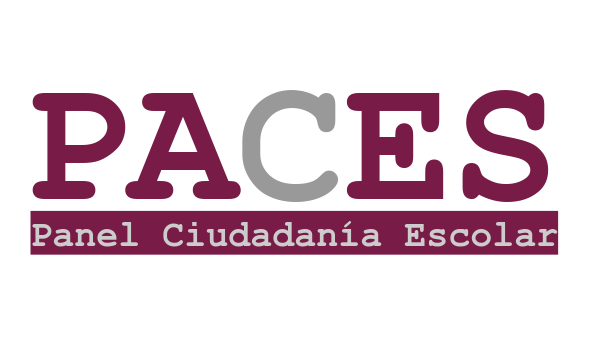
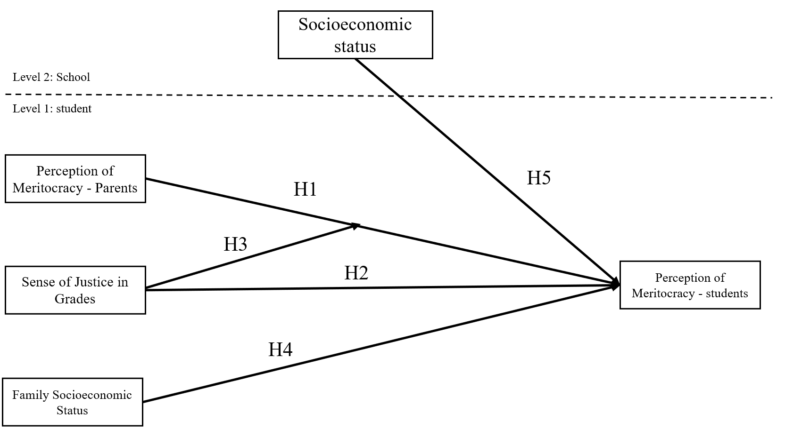
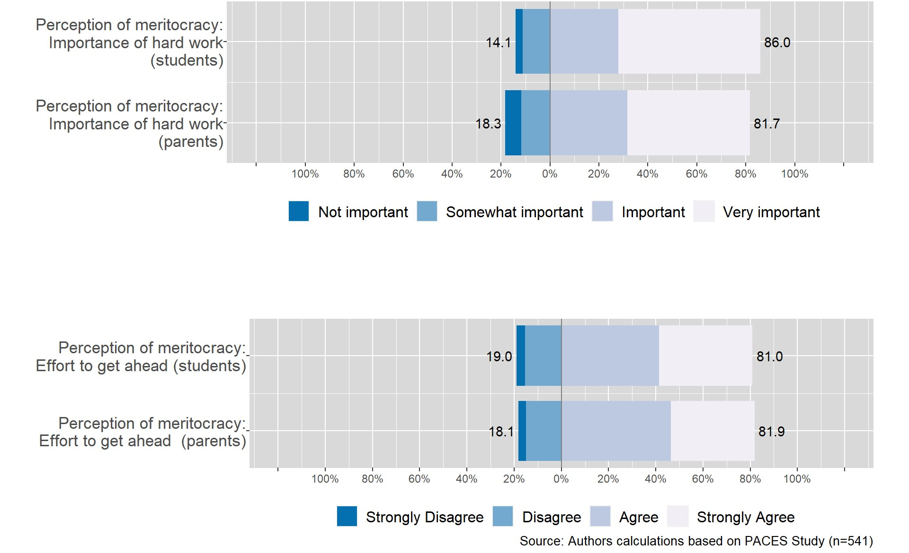
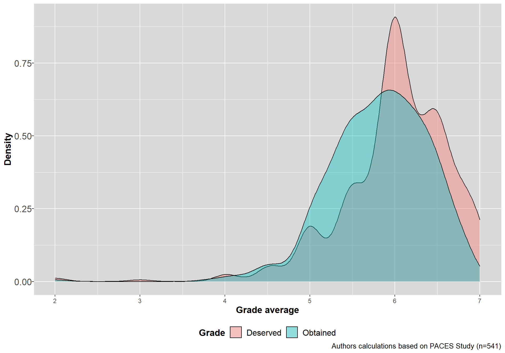
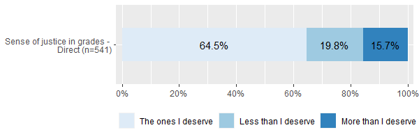
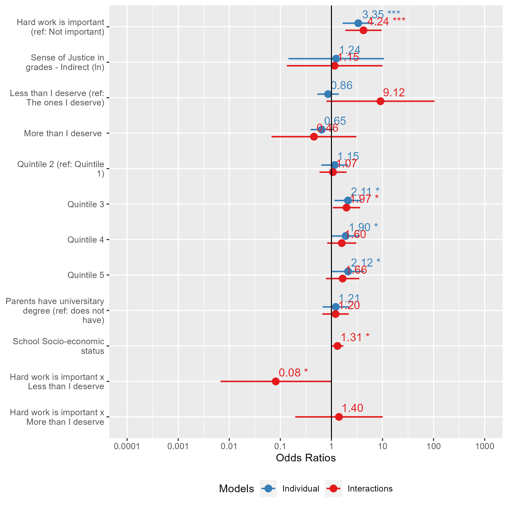
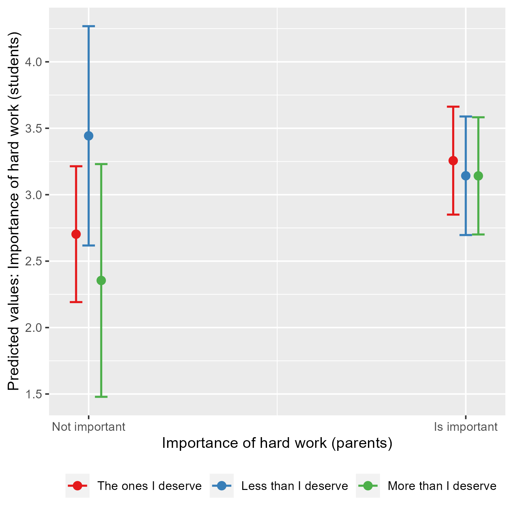
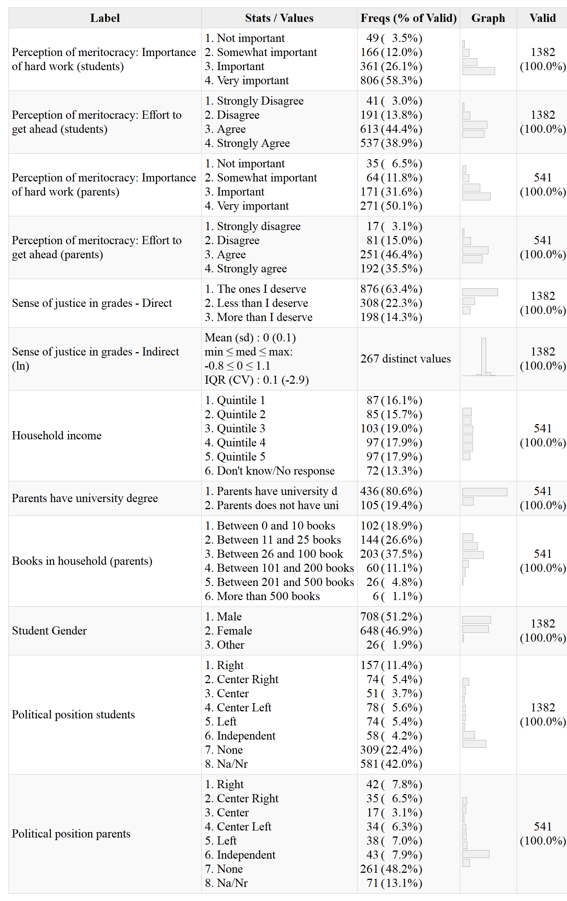

class: middle title-slide

```{r xaringanExtra, echo = FALSE}
  xaringanExtra::use_progress_bar(color = "red", location = c("top"))
```

.pull-left-narrow[

<br>
<br>
<br>
<br>
<br>
<br>
<br>


.small[.red[FONDECYT N°1181239 Political socialisation and citizenship education]
]
]


.pull-right-wide[
.right[

.content-box-red[
## The Socialization of Meritocracy: The role of the Family and the School

]

----
<br>
.espaciosimplelineas[
.small[
Julio Iturra -  Bremen Int. Graduate School of Social Sciences
<br>
Juan Carlos Castillo -  Universidad de Chile
<br>
Francisco Meneses & Martín Venegas
] 
]


.small[Effort and Inequality Conference - 16th June 2022]
]
]


---
class: inverse animated slideInRight

## .red[The Socialization of Meritocracy: The role of the Family and the School
]

.pull-right[
.large[
1. Introduction
2. Hypothesis
3. Methodology
4. Results
5. Discussion
]
]

---
class: inverse 

## .red[The Socialization of Meritocracy: The role of the Family and the School
]

.pull-right[
.large[
1. .yellow[Introduction]
2. Hypothesis
3. Methodology
4. Results
5. Discussion
]
]
 

---
<br>
.pull-left[
  .content-box-gray[
## Meritocracy
  - Merit: .bold[Effort] and talent (Young, 1958)  
  - Subjective meritocracy (Duru-Bellat & Tenret, 2012;Castillo et al, 2019)
    - Normative (_How it should be_) 
    - **Perception** (_How is it_) 
  ] 
]

.pull-right[
  .content-box-purple[
## Justice experiences
  - Justice experiences in school (Jasso & Resh, 2002)
  - Deserved vs obtained .bold[rewards]  (Resh & Sabbagh, 2014)
  ] 
]


---
# .black[Socialization agents]
----

.pull-left[
.content-box-purple[
## Family

  - Self-interest: family socio-economic resources 
  
  - Intergenerational transmission of beliefs and attitudes (Bandura et al., 2001; Olivos, 2021)

  ]
  ]

.pull-right[
.content-box-yellow[

## School

- Meritocracy perceptions (Lampert, 2013; Mijs, 2018).

- Direct and indirect evaluation about grades (Resh, 2018; Resh & Sabbagh, 2014)

<br>

]

]

  
  
---
class:inverse middle left

###.yellow[.small[_What is the association between parental perceived meritocracy with their children's perceived meritocracy?_]]

### .yellow[.small[_To what extent the experiences of justice in grades influence student's perceived meritocracy?_]] 


---
class: inverse animated slideInRight

## .red[The Socialization of Meritocracy: The role of the Family and the School
]
.pull-right[
.large[
1. Introduction
2. .yellow[Hypothesis]
3. Methodology
4. Results
5. Discussion
]
]

---
## Hypothesis

.center[]

.small[
* Pre-registration: [https://osf.io/fazdx](https://osf.io/fazdx)
]
---
class: inverse animated slideInRight

## .red[The Socialization of Meritocracy: The role of the Family and the School
]

.pull-right[
.large[
1. Introduction
2. Hypothesis
3. .yellow[Method]
4. Results
5. Discussion
]
]

---
## Data and methods
----

.pull-left[

* School Citizenship Panel Survey (2019)

- Highschool students (2nd) and parents (n = 541) nested in schools (n = 60)
  
* _Method:_  Multilevel regression models   
]

.pull-right[
.right[
]
]

---

### Perceived Meritocracy

_Today in Chile, for getting ahead in life, how important is (...) Hard work_

.center[]

 
---
###  Justice in grades: Indirect  


.pull-left[


.bold[Obtained:] _What was your last year average grade? If you don't remember exactly, please give an approximate grade._ 

.bold[Deserved:] _And, what grade average do you think you deserved?_ 
$$\text{Justice}= \ln\biggl(\frac{\text{grade obtained}}{\text{grade deserved}}\biggl)$$

]

.pull-right[  

.center[]

]

---
### Justice in grades:  Direct 

_Taking into account the time I ddedicate to my studies, the grades I get are:_

.center[]
  ]  
    
---

## Dependent variables
----
.pull-left[
.content-box-purple[
### Family

* Educational level of parents
 
* Number of books in the household

* Household Income Quintile 

]
]

.pull-right[
.content-box-yellow[
### School

* Type of School (Public, Charter, Private)

* School Socioeconomic Level (Adm. data)


]
]

---
class: inverse animated slideInRight

## .red[The Socialization of Meritocracy: The role of the Family and the School
]

.pull-right[
.large[
1. Introduction
2. Hypothesis
3. Methodology
4. .yellow[Results]
5. Discussion
]
]
---

.pull-left-narrow[
<br>
### How important is hard work to get ahead in life?

]

.pull-right-wide[
.center[]
]
---

.pull-left-narrow[
<br>
### How important is hard work to get ahead in life?
]

.pull-right-wide[
.center[]
]


---
class: inverse animated slideInRight

## .red[The Socialization of Meritocracy: The role of the Family and the School
]

.pull-right[
.large[
1. Introduction
2. Hypothesis
3. Methodology
4. Results
5. .yellow[Discussion]
]
]

---
# Discussion

- Family socialisation: parents influence student's perceived meritocracy 

- SES-family has an inconsistent association. SES at the school does not influence student's perceived meritocracy in terms of the importance of hard work
- Justice experience in grades .bold[does not] have a direct influence on perceived meritocracy

- Negative justice experiences in grades descrease the influence of socialisation on the importance of hard work.


---
class: roja middle

# ¡Thank you!

.right[
.yellow[More information: 

[www.ciudadania-escolar.cl](https://ciudadania-escolar.cl/)
]]


---
class: middle title-slide


.pull-left-narrow[

<br>
<br>
<br>
<br>
<br>
<br>
<br>


.small[.red[FONDECYT N°1181239 Political socialisation and citizenship education]
]
]


.pull-right-wide[
.right[

.content-box-red[
## The Socialization of Meritocracy: The role of the Family and the School

]

----
<br>
.espaciosimplelineas[
.medium[
Julio Iturra -  Bremen Int. Graduate School of Social Sciences
<br>
Juan Carlos Castillo -  Universidad de Chile
<br>
Francisco Meneses & Martín Venegas
] 
]


.small[Effort and Inequality Conference - 16th June 2022]
]
]

---



