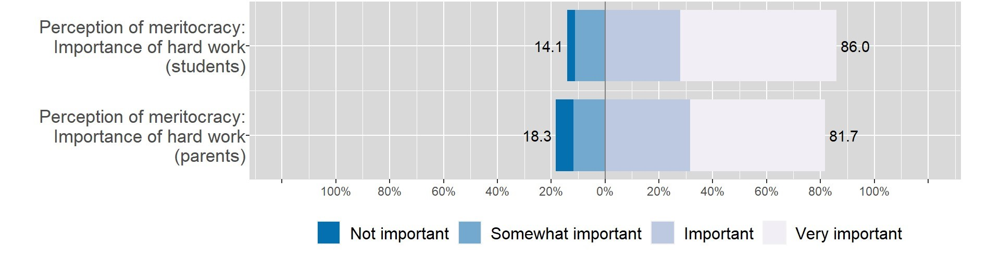

class: middle title-slide

```{r xaringanExtra, echo = FALSE}
  xaringanExtra::use_progress_bar(color = "red", location = c("top"))
```

.pull-left-narrow[

<br>
<br>
<br>
<br>
<br>
<br>
<br>


.small[.red[FONDECYT N°1181239 Political socialisation and citizenship education]
]
]


.pull-right-wide[
.right[

.content-box-red[
## The Socialization of Meritocracy: The role of the Family and the School

]

----
<br>
.espaciosimplelineas[
.medium[
Juan Carlos Castillo, Julio Iturra, Francisco Meneses & Martín Venegas
] 
]


.small[Effort and Inequality Conference - 16th June 2022]
]
]

---

layout: true
class: animated, fadeIn


---
class: middle

.pull-left-narrow[
# **PRICE**:
### Programa de Investigación en Ciudadanía Escolar
(School Citizenship Research Programme)
]

.pull-right-wide[


.right[
[ciudadania-escolar.cl/](https://ciudadania-escolar.cl)
]]


---
class: middle

.pull-left-narrow[
# **PRICE**:
### Programa de Investigación en Ciudadanía Escolar
(School Citizenship Research Programme)
]

.pull-right-wide[


.right[
Projects since 2011 ]
]


---
.pull-left-narrow[
# **PRICE**:
### Programa de Investigación en Ciudadanía Escolar

(School Citizenship Research Programme)
]

.pull-right-wide[


]

---
class: inverse animated slideInRight

## .red[The Socialization of Meritocracy: The role of the Family and the School
]

.pull-right[
.large[
1. Introduction
2. Hypothesis
3. Methodology
4. Results
5. Discussion
]
]

---
class: inverse 

## .red[The Socialization of Meritocracy: The role of the Family and the School
]

.pull-right[
.large[
1. .yellow[Introduction]
2. Hypothesis
3. Methodology
4. Results
5. Discussion
]
]
 

---

# .black[Introduction]

.pull-left[
  .content-box-gray[
## Meritocracy
  - Effort and talent  
  - Descriptive (perception) 
  - Normative (preferences)   
  ] 
]
  
--
.pull-right[
<br><br>

.content-box-green[
## Socialisation
  - Family and school as socialisation agents 
  - Justice experiences at school
  ]  
]

  
  
---
class:inverse middle left

###.yellow[
_Is there an association between the meritocratic perceptions of parents with those of their offsprings?_
]

### .yellow[_To what extent is school experience in terms of distributive justice (in relation to grades) linked to the meritocratic perceptions of students?_] 

---
# .black[Introduction]

----

.pull-left[
.content-box-purple[
## Family

  - Socio-economic status (self-interest)
  
  - Intergenerational transmission of beliefs and attitudes (socialisation)

<br>

  ]
  ]

.pull-right[
.content-box-yellow[
## School

- Meritocracy perceptions (school and society)

- Justice evaluations about grades 

<br>

]

]

---
class: inverse animated slideInRight

## .red[The Socialization of Meritocracy: The role of the Family and the School
]
.pull-right[
.large[
1. Introduction
2. .yellow[Hypothesis]
3. Methodology
4. Results
5. Discussion
]
]

---
## Hypothesis

.center[]

.small[
* Pre-registration: [https://osf.io/fazdx](https://osf.io/fazdx)
]
---
class: inverse animated slideInRight

## .red[The Socialization of Meritocracy: The role of the Family and the School
]

.pull-right[
.large[
1. Introduction
2. Hypothesis
3. .yellow[Method]
4. Results
5. Discussion
]
]

---
## Data and methods
----

.pull-left[

* School Citizenship Panel Survey (2019)

* Students, parents and teachers 

* Analytical sample ( $n_i$ =541) 

  - Student and parent information
  - $n_j$ = 60 (schools) 
  
* _Method:_  Multilevel Ordinal logit  
]

.pull-right[
.right[
]
]

---

### DV: Perceived Meritocracy

.center[]


---
### IV: Justice in grades 

.pull-left[  

*Indirect*

$$\text{Justice}= \ln\biggl(\frac{\text{grade obtained}}{\text{grade deserved}}\biggl)$$


.center[]

]


.pull-right[ 

*Direct*

"Taking into account the time I devote to my studies, the grades I get are:"

.center[]
  
  ]
    
---

## Dependent variables
----
.pull-left[
.content-box-purple[
### Family

* Educational level of parents
 
* Number of books in the household

* Household Income Quintile 

]
]

.pull-right[
.content-box-yellow[
### School

* Type of School (Public, Charter, Private)

* School Socioeconomic Level (Adm. data)


]
]

---
class: inverse animated slideInRight

## .red[The Socialization of Meritocracy: The role of the Family and the School
]

.pull-right[
.large[
1. Introduction
2. Hypothesis
3. Methodology
4. .yellow[Results]
5. Discussion
]
]
---

.pull-left-narrow[
<br>
### How important is hard work to get ahead in life?

]

.pull-right-wide[
.center[]
]
---

.pull-left-narrow[
<br>
### How important is hard work to get ahead in life?
]

.pull-right-wide[
.center[]
]

---

.pull-left-narrow[
<br>
### In Chile those who work hard get ahead
]

.pull-right-wide[

.center[]
]

---

.pull-left-narrow[
<br>
### In Chile those who work hard get ahead
]

.pull-right-wide[
.center[]
]


---
class: inverse animated slideInRight

## .red[The Socialization of Meritocracy: The role of the Family and the School
]

.pull-right[
.large[
1. Introduction
2. Hypothesis
3. Methodology
4. Results
5. .yellow[Discussion]
]
]

---
# Discussion

- Family socialisation: mixed, relevant only for the importance of hard work
- SES-family has an inconsistent association. SES at the school level positively influences the importance of hard work but is null for perceived rewards. 

- Justice experience in grades .bold[does not] have a direct influence on perceived meritocracy

- Interactions are mixed, decreasing the influence of socialisation on the importance of hard work, but positive effort is rewarded.


---
class: roja middle

# ¡Thank you!

.right[
.yellow[More information: 

[www.ciudadania-escolar.cl](https://ciudadania-escolar.cl/)
]]


---
class: middle title-slide


.pull-left-narrow[

<br>
<br>
<br>
<br>
<br>
<br>
<br>


.small[.red[FONDECYT N°1181239 Political socialisation and citizenship education]
]
]


.pull-right-wide[
.right[

.content-box-red[
## The Socialization of Meritocracy: The role of the Family and the School

]

----
<br>
.espaciosimplelineas[
.medium[
Juan Carlos Castillo, Julio Iturra, Francisco Meneses & Martín Venegas
] 
]


.small[Effort and Inequality Conference - 16th June 2022]
]
]

