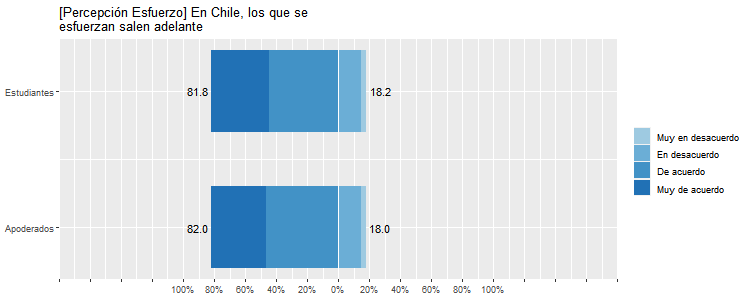
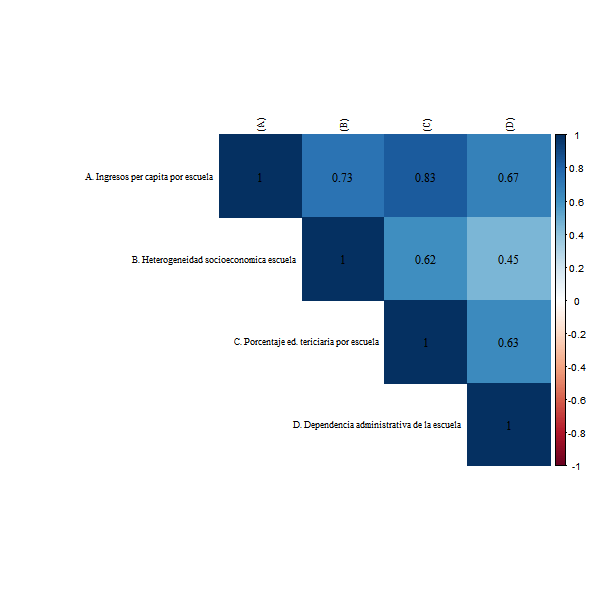

layout: true
class: animated, fadeIn

---
class: slideInRight, middle, inverse

***
# Legitimidad

Juan Carlos Castillo, Julio Iturra, Francisco Meneses y Martín Venegas.
***
---
class: inverse, left, middle

# _Transmisión intergeneracional de la meritocracia y sentido de justicia en la escuela. <br> .small[Borrador y resultados]_

***
[FONDECYT Regular 1181239](https://github.com/formacionciudadana)

<br>

#### Marzo 2021
```{r include=FALSE}
# Cargar librerías
pacman::p_load(dplyr, #Manipulacion de datos
              stargazer, #Tablas
              sjmisc, # Tablas
              summarytools, # Tablas
              kableExtra, #Tablas
              sjPlot, #Tablas y gráficos
              corrplot, # Correlaciones
              sessioninfo, #  Información de la sesión de trabajo
              ggplot2, # Graficos
              sjlabelled, # Etiquetas
              ordinal, # Modelos ordinales,
              mixor, # Modelos ordinales
              lme4, # Modelos mixtos,
              lavaan, # CFA
              texreg, # Tablas modelos
              reghelper, # ICC,
              table1 #Tabla bonita
)

# Cargar datos
load(file = "../../input/data/ap_est.RData") # Base conjunta

# Remover etiquetas para rende
ap_est <- sjlabelled::remove_all_labels(ap_est)
```
---
class: center, middle

# _Estructura de presentación_

- Introducción
- Antecedentes
- Hipótesis
- Indicadores
- Resultados
- Conclusión
- Discusión
---
# Introducción

1. El mérito de la meritocracia... y sus consecuencias. 

2. La brecha, socialización de la meritocracia: el rol de la familia y la escuela.

3. Algunos argumentos:  sensación de justicia, espacios inferenciales y expectativas rotas. 
---
# Antecedentes

4. La desigualdad y la meritocracia en niños y jóvenes. 

5. El trabajo de Olivos: Una motivación inexistente

???
Ideal extendido por su carácter moderno contrario al mérito. aparentemente equitativo pero justificador de desigualdad. 
evidencia del efecto de sj en confianza podría extenderse. 
los sujetos se basan en sus experiencias para generar ideas sobre la realidad social en general.
---
# Hipótesis

*Hipótesis principales de socialización de la meritocracia*

* $H_1$: Estudiantes cuyos padres manifiestan una mayor percepción de meritocracia, perciben mayor meritocracia.

* $H_2$: Estudiantes con una mayor sensación de justicia en sus notas percibirán mayor meritocracia.

Hipótesis de moderación

* $H_3$: La relación entre percepción meritocrática de los padres y de los hijos (H1) será más positiva para aquellos que experimentan un mayor sentido de justicia en la escuela.

---
# Hipótesis

*Hipótesis de contexto socioeconómico*

* $H_4$: El estatus socioeconómico de la familia posee un efecto positivo sobre las percepciones meritocráticas del estudiante

* $H_5$: El estatus socioeconómico de la escuela posee un efecto positivo sobre las percepciones meritocráticas del estudiante.

*Hipótesis de mediación*

* $H_6$: La percepción meritocrática de los padres media la relación entre el estatus socioeconómico de los padres y la percepción meritocrática de los estudiantes.

* $H_7$: La sensación de justicia en las notas media la relación entre el estatus socioeconómico de la escuela y la percepción meritocrática estudiantes.
---
# Indicadores
## _Recordando nuestras variables..._
--

### Variable dependiente
Dos indicadores:
- ** (A) Percepción esfuerzo estudiantes:** "¿Cuán de acuerdo o en desacuerdo estás con las siguientes afirmaciones? - En Chile, los que se esfuerzan salen adelante"

- ** (B) Percepción trabajo duro estudiantes:** "Actualmente en Chile, para surgir en la vida ¿Cuán importante es el trabajo duro?"
--

- **(A+B) Percepción meritocrática estudiantes:** Promedio de ambos indicadores
---
# Indicadores
## _Recordando nuestras variables..._
--

### Variables independientes
- **Sentido de justicia indirecto:** Logaritmo natural de la razón entre el promedio obtenido y el promedio justo reportado por el estudiante.

- **Sentido de justicia directo:** "Tomando en cuenta el tiempo que le dedico a mis estudios, las notas que me saco son... - Menos de las que merezco| Las que merezco| Más de las que merezco"

- **NSE:** Quintiles de ingreso per capita + Ns/Nr
---
# Indicadores
## _Recordando nuestras variables..._
--

### Controles
- **Recompensa justa estudiantes:** "¿Cuán de acuerdo o en desacuerdo estás con las siguientes afirmaciones? - En este colegio/liceo, los esfuerzos son recompensados"

- **Justicia en el trato profesores:** "En general, siento que mi opinión es tomada en cuenta por mis profesores"
---
# Indicadores
## _Recordando nuestras variables..._
### Controles

- Posición política estudiantes y apoderados
- Genero estudiantes
- Libros en el hogar reportados por el apoderado
- Dependencia administrativa de la escuela
---
# Resultados
## _Descriptivos univariados_


---
# Resultados
## _Descriptivos univariados_


---
# Resultados
## _Descriptivos bivariados_
###### Variables númericas x NSE


---
# Resultados
## _Descriptivos bivariados_
###### Variables númericas x Dependencia administrativa

---
# Resultados
## _Correlaciones_
---
class: center
###### Matriz correlaciones variables nivel 1

---
# Resultados
## _Correlaciones_
---
class: center
###### Matriz correlaciones variables nivel 2

---
# Resultados
## _Multivariados_

Se realizaron tres tandas de modelos:

- **Regresión multinivel (lmer)** - Percepción meritocrática estudiantes

- **Regresión logística ordinal multinivel (clmm)** - Percepción esfuerzo estudiantes

- **Regresión logística ordinal multinivel (clmm)** - Percepción trabajo duro estudiantes
---
# Resultados
## _Multivariados_

- **Regresión multinivel (lmer)** - Percepción meritocrática estudiantes

  * Percepción meritocrática apoderados mantiene efecto al 95% (Beta 0.10)
  * Recompensa justa estudiantes mantiene efecto al 99.9% (Beta 0.18)
  * Genero estudiantes|Otro mantiene efecto al 95% (Beta -0.45)
  
---
# Resultados
## _Multivariados_

- **Regresión logística ordinal multinivel (clmm)** - Percepción esfuerzo estudiantes

  * Quintiles 2 y 4 mantienen efecto al 95%
  * Recompensa justa estudiantes mantiene efecto al 99.9%
  * Genero estudiantes|Otro mantiene efecto al 95%
---
# Resultados
## _Multivariados_

- **Regresión logística ordinal multinivel (clmm)** - Percepción trabajo duro estudiantes:
---
class: center

---
# Conclusión:

> Las hipótesis de efectos directos fueron parcialmente cumplidas

> Las hipótesis de interacción (moderación y mediación) fueron descartadas

---
# Discusión 

> Los agentes de socialización son relevantes para comprender la percepción de meritocracia, lo cual da pie profundizar la teoría del interés racional, la socialización económico-institucional y la hipótesis de los supuestos rotos. 

???
Existe una transmisión intergeneracional de percepciones meritocráticas aunque es bastante débil. Mejorar la medición podría ayudar.

Por su parte, solo en determinadas circunstancias la sensación de justicia en las notas afecta 
aunque la sensación de justicia general en el colegio sí importa, destacando el rol del trato con profesores. 
---
class: center, middle

# _¡Muchas gracias!_