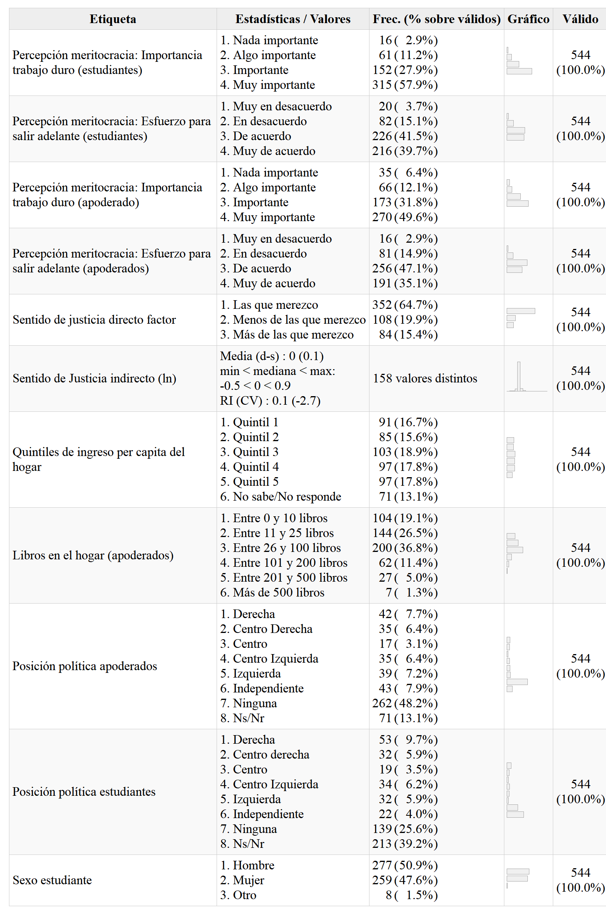
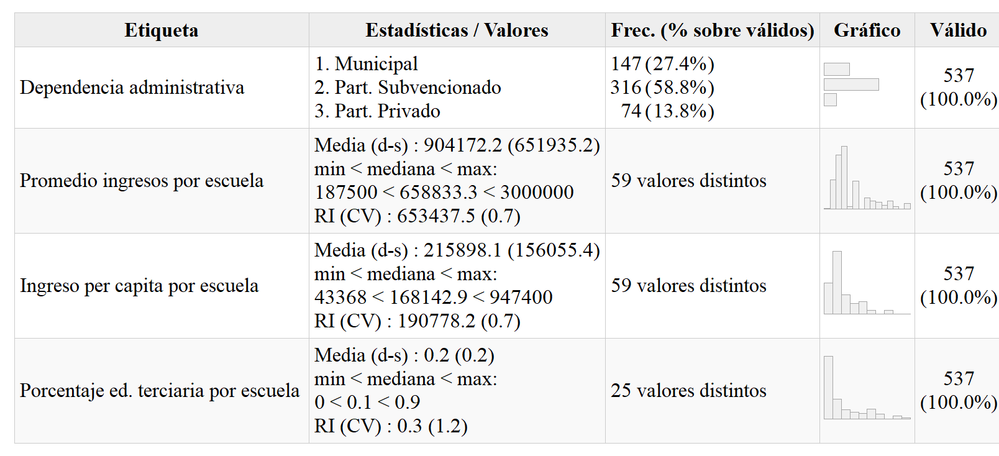

```{r eval=FALSE, include=FALSE}
# for render in pdf run rmarkdown::render_site("docs/preanalisis.Rmd", output_format = "all")
# clean #in the yml
library(citr)
#rmarkdown::render("docs/paper.Rmd", output_format = "bookdown::pdf_document2")
#rmarkdown::render("docs/paper.Rmd", output_format = "bookdown::html_document2")
```

```{r setup, include=FALSE}
knitr::opts_chunk$set(warning = FALSE,message = FALSE, cache = FALSE,out.width = '85%',fig.pos= "H")
# knitr::opts_knit$set(base.url = "../") #relative path for .html output file
# knitr::opts_knit$set(root.dir = "../") #relative path for chunks within .rmd files
options(scipen=999)
rm(list=ls())
options(knitr.kable.NA = '')
options(knitr.graphics.error = FALSE)
Sys.setlocale("LC_ALL", "ES_ES.UTF-8")
```

```{r message=FALSE, warning=FALSE, include=FALSE, echo=FALSE}
pacman::p_load(knitr, kableExtra, dplyr, lavaan, summarytools,haven,sjPlot,htmlwidgets)
```

```{r echo=FALSE }
table_format = if(is_html_output()) {
  "html"
} else if(is_latex_output()) {
  "latex"
}
table_format2 = if(is_html_output()) {
  T
} else if(is_latex_output()) {
  F
}
```


# Introducción {.tabset}


## Opción 1 

La meritocracia es un ideal que aspira a la distribución de los recursos en una sociedad según esfuerzo y talento personal [@young_rise_2006]. Este ideal se encuentra ampliamente extendido en las sociedades modernas donde se alza como una forma legítima de progresar individualmente en base a logros personales, contrario a la antigua distribución en base a herencias y a las ventajas que pueden generar otro tipo de actividades como sobornos o uso de contactos personales. Si bien la obtención de recompensas proporcionales a esfuerzo y talento parece una representación fidedigna de la justicia por equidad, la implementación de sistemas meritocráticos no está exenta de problemas. Por un lado, la meritocracia permite la legitimación de las desigualdades mediante la atribución a logro personal, subestimando de esta manera las condiciones de origen o el "punto de partida" [@hadjar_Meritokratie_2008; @bay-cheng_Agency_2015]. Ello implica una gran presión psíquica y social hacia los jóvenes, quienes independiente de las desiguales de sus contextos, crecen rodeados de discursos meritocráticos de posibilidades infinitas que contrastan constantemente con la realidad [@allen_Top_2016]. Por otro lado, el énfasis en las capacidades individuales se asociaría a responsabilizar a las personas de su situación y por lo tanto a un menor apoyo a políticas sociales que compensen desventajas: "¿por qué las personas que triunfan en la vida iban a deber nada a los miembros menos favorecidos de la sociedad?" [@sandel_tirania_2021 p.292]. De esta manera, la meritocracia mermaría la preocupación por el bien común y la solidaridad.

En el último tiempo se ha incrementado el interés por el estudio de la meritocracia en las ciencias sociales. Desde la sociología, se ha desarrollado una agenda de investigación que ha aportado en resaltar los aspectos subjetivos de la meritocracia [@jasso_New_1980; @kluegel_Beliefs_1981; @janmaat_Subjective_2013], trabajando teórica y empíricamente en torno a conceptos cómo preferencias redistributivas, atribuciones de pobreza o percepciones meritocráticas, [e.g. @newman_False_2015; @reynolds_Perceptions_2014] siendo estas últimas el objeto de este estudio. Las percepciones meritocráticas se entienden cómo la convicción de los sujetos sobre que su sociedad realmente distribuye recursos según el mérito individual [@castillo_Meritocracia_2019]. Pese a recientes avances en el estudio de la meritocracia, se ha puesto poca atención al origen de estas percepciones en etapas previas a la vida adulta, específicamente en cómo la meritocracia podría ser transmitida intergeneracionalmente. Desde una perspectiva de socialización, distintos agentes tienen el potencial de contribuir a la formación de percepciones, actitudes y creencias en los jóvenes, siendo dos de ellos los más importantes: la familia y la escuela [@gidengil_Political_2016; @torney-purta_School_2002]. En el presente trabajo, nuestro objetivo es estudiar en qué medida las ideas parentales y las experiencias escolares influyen en las percepciones meritocráticas de estudiantes secundarios. Basados en los trabajos sobre justicia en la escuela y en la agenda de socialización política familiar buscamos responder dos preguntas: ¿De qué modo se asocia el sentido de justicia sobre la asignación de notas con las percepciones meritocráticas de los jóvenes? y ¿Cómo las percepciones meritocráticas de los padres pueden fomentar o disminuir las percepciones meritocráticas de sus hijos?

La literatura sobre justicia en la escuela ha logrado evidenciar la importancia que tienen las experiencias distributivas en la configuración de la visión del mundo en los jóvenes. Trabajos como lo de Resh y Sabbagh han demostrado que el sentido de justicia que tienen los estudiantes con respecto a la distribución de notas tiene un impacto en sus actitudes y comportamientos democráticos [@resh_Sense_2014; @resh_Sense_2017], así como también en la confianza institucional y social [@resh_Sense_2018]. Esta evidencia llama a profundizar en el efecto del sentido de justicia en otros aspectos de la visión del mundo de los jóvenes, como por ejemplo las percepciones de meritocracia. Esta propuesta se refuerza si se considera a la escuela no sólo como un formador de visiones, sino como un determinante de la forma en que se percibe la desigualdad de una sociedad, o como lo denomina @mijs_Inequality_2018, *espacios inferenciales*. Los espacios inferenciales consisten en instituciones que son capaces de formar percepciones sobre las causas de la desigualdad a partir de la información y experiencias que proveen. En este caso, un estudiante que siente que sus esfuerzos son recompensados podría inferir que dicha situación se replica a nivel general, o dicho de otro modo, percibe mayor meritocracia. En base a este planteamiento, la primera hipótesis de este trabajo es que, para el contexto chileno, la sensación de justicia en las notas implica mayores percepciones de meritocracia.

La segunda hipótesis que proponemos en este trabajo es que las percepciones meritocráticas de los padres se transmiten hacia los hijos. Los estudios sobre la reproducción intergeneracional de la política han generado vasta evidencia en torno a la transmisión de habilidades, creencias, actitudes y prácticas para el ejercicio de la ciudadanía [@astill_Multilevel_2002; @miranda_Desigualdad_2018]. En esta línea, se ha estudiado la transmisión de opiniones e intenciones de participación política [@boonen_Adolescent_2013a; @quintelier_Intergenerational_2015], las creencias políticas sobre la democracia [@greenstein_Personality_2016a] y orientaciones políticas [@jennings_Politics_2009]. No obstante, estas investigaciones por lo general no incorporan aspectos relativos a la justicia distributiva, los cuales pueden ser fundamentales si se considera que las ideas de las personas sobre la desigualdad pueden generar apatía política e incluso deseos de insubordinación [@easterbrook_social_2021], además de estar relacionadas con la tolerancia y las ideas autoritarias [@madeira_Primes_2019; @azevedo_Neoliberal_2019]. De esta manera, esta investigación busca contribuir al cuerpo de estudios sobre socialización política incorporando otras ideas transmisibles, como las sensaciones de justicia y percepciones meritocráticas.


## Oprción 2 (Propuesta FM)

La meritocracia es un ideal que aspira a que los recursos se distribuyan según el esfuerzo y talento personal [@young_rise_2006].  Este ideal fomenta la frustración de los jóvenes y corroe en ellos los principios de la democracia, especialmente en contextos desiguales. La desigualdad social está creciendo a nivel mundial, lo que amenaza con agravar los problemas que de ella derivan [@solt_Measuring_2020]. Por ello, los jóvenes seguirán viéndose enfrentados a diversos problemas tales como la desigualdad de oportunidades [@woodman_Inequality_2020; @pitkanen_Parental_2021], mayores presiones por conseguir estatus, menor autoestima, sintomatología ansiosa e incluso depresión adolescente [@nadler_Relative_2020;@du_Perceived_2021; @kim_Does_2020]. También serán expuestos a vivir más experiencias de discriminación  [@conde_Desigualdad_2014]. Este tipo de vivencias negativas en contextos desiguales pueden ser agravadas por el ideal meritocrático [@major_Perceived_2007]. Pese a su carácter moderno y aparentemente equitativo, el ideal meritocrático no está exento de problemas. Por un lado, esta creencia fomenta un discurso de posibilidades infinitas, que se contradice con las limitaciones socioeconómicas reales que enfrentan los sujetos [@allen_Top_2016; @guzman_Legitimacion_2016]. Esta contradicción entre discurso y realidad deriva en un sentimiento de frustración en jóvenes de estratos bajos, usualmente asociado a temas educativos [@araujo_escuela_2015]. Esta frustración meritocrática, se debe a responsabilizar a los individuos de su posición social, obviando las diferencias de oportunidades [@hadjar_Meritokratie_2008]. Por otro lado, las creencias meritocraticas se asocian a valores contrarios a los promovidos por la educación cívica y ciudadana, ya que fomentan creencias antidemocráticas e intolerantes [@azevedo_Neoliberal_2019; @madeira_Primes_2019], así como corroe el sentido de comunidad [@sandel_tirania_2021 p.292] y legitima la desigualdad disminuyendo el apoyo a políticas asistenciales [@suhay_Ideology_2021]. 

Pese a la importancia evidenciada de la meritocracia en las vivencias juveniles de la desigualdad, se ha puesto poca atención a la formación de estas creencias en etapas tempranas. En el último tiempo se ha incrementado el interés por el estudio de la meritocracia en las ciencias sociales. Desde la sociología, se ha desarrollado una agenda de investigación que ha aportado en resaltar los aspectos subjetivos de la meritocracia [@jasso_New_1980; @kluegel_Beliefs_1981; @janmaat_Subjective_2013], trabajando teórica y empíricamente en torno a conceptos cómo preferencias redistributivas, atribuciones de pobreza o percepciones meritocráticas, [e.g. @newman_False_2015; @reynolds_Perceptions_2014] siendo estas últimas el objeto de este estudio. Las percepciones meritocráticas se entienden cómo la convicción de los sujetos sobre que su sociedad realmente distribuye recursos según el mérito individual [@castillo_Meritocracia_2019]. Pese a recientes avances en el estudio de la meritocracia, se ha puesto poca atención al origen de estas percepciones en etapas previas a la vida adulta, específicamente en cómo la meritocracia podría ser transmitida intergeneracionalmente. Desde una perspectiva de socialización, distintos agentes tienen el potencial de contribuir a la formación de percepciones, actitudes y creencias en los jóvenes, siendo dos de ellos los más importantes: la familia y la escuela [@gidengil_Political_2016; @torney-purta_School_2002]. En el presente trabajo, nuestro objetivo es estudiar en qué medida las ideas parentales y las experiencias escolares influyen en las percepciones meritocráticas de estudiantes secundarios. Basados en los trabajos sobre justicia en la escuela y en la agenda de socialización política familiar buscamos responder dos preguntas: ¿De qué modo se asocia el sentido de justicia sobre la asignación de notas con las percepciones meritocráticas de los jóvenes? y ¿Cómo las percepciones meritocráticas de los padres pueden fomentar o disminuir las percepciones meritocráticas de sus hijos?

La literatura sobre justicia en la escuela ha logrado evidenciar la importancia que tienen las experiencias distributivas en la configuración de la visión del mundo en los jóvenes. Trabajos como lo de Resh y Sabbagh han demostrado que el sentido de justicia que tienen los estudiantes con respecto a la distribución de notas tiene un impacto en sus actitudes y comportamientos democráticos [@resh_Sense_2014; @resh_Sense_2017], así como también en la confianza institucional y social [@resh_Sense_2018]. Esta evidencia llama a profundizar en el efecto del sentido de justicia en otros aspectos de la visión del mundo de los jóvenes, como por ejemplo las percepciones de meritocracia. Esta propuesta se refuerza si se considera a la escuela no sólo como un formador de visiones, sino como un determinante de la forma en que se percibe la desigualdad de una sociedad, o como lo denomina @mijs_Inequality_2018, *espacios inferenciales*. Los espacios inferenciales consisten en instituciones que son capaces de formar percepciones sobre las causas de la desigualdad a partir de la información y experiencias que proveen. En este caso, un estudiante que siente que sus esfuerzos son recompensados podría inferir que dicha situación se replica a nivel general, o dicho de otro modo, percibe mayor meritocracia. En base a este planteamiento, la primera hipótesis de este trabajo es que, para el contexto chileno, la sensación de justicia en las notas implica mayores percepciones de meritocracia.

La segunda hipótesis que proponemos en este trabajo es que las percepciones meritocráticas de los padres se transmiten hacia los hijos. Los estudios sobre la reproducción intergeneracional de la política han generado vasta evidencia en torno a la transmisión de habilidades, creencias, actitudes y prácticas para el ejercicio de la ciudadanía [@astill_Multilevel_2002; @miranda_Desigualdad_2018]. En esta línea, se ha estudiado la transmisión de opiniones e intenciones de participación política [@boonen_Adolescent_2013a; @quintelier_Intergenerational_2015], las creencias políticas sobre la democracia [@greenstein_Personality_2016a] y orientaciones políticas [@jennings_Politics_2009]. No obstante, estas investigaciones por lo general no incorporan aspectos relativos a la justicia distributiva, los cuales pueden ser fundamentales si se considera que las ideas de las personas sobre la desigualdad pueden generar apatía política e incluso deseos de insubordinación [@easterbrook_social_2021], además de estar relacionadas con la tolerancia y las ideas autoritarias [@madeira_Primes_2019; @azevedo_Neoliberal_2019]. De esta manera, esta investigación busca contribuir al cuerpo de estudios sobre socialización política incorporando otras ideas transmisibles, como las sensaciones de justicia y percepciones meritocráticas.


# Antecedentes conceptuales y empíricos

## Estudio subjetivo de la desigualdad y las percepciones meritocráticas

El estudio de la desigualdad social ha tenido un lugar central en la sociología. Por un lado, está el desarrollo de la investigación en el ámbito de la estratificación social, donde se ha puesto atención en las características de la estructura social y en los mecanismos de preproducción de la desigualdad [@kerbo_Estratificacion_1998; @chan_Class_2007; @lopez-roldan_Comparative_2021]. Una de las dimensiones que ha sido abordada desde esta perspectiva se relaciona con la legitimidad de la desigualdad en ámbitos como los salarios [@evans_Justifications_2010] o el acceso a bienestar social [@maldonado_Risk_2019]. Por otro lado, durante las últimas décadas se ha desarrollado un ámbito de investigación que propone estudiar las actitudes distributivas de los individuos en relación a su posición en la estructura social, principalmente a través de sus percepciones y preferencias en torno a la desigualdad económica [@kluegel_Beliefs_2017; @kluegel_Social_2018; @janmaat_Subjective_2013; @jensen_Deservingness_2017]. En este marco, desde un enfoque de interés racional se sostiene que la posición relativa de los individuos en la estructura social - representada a través de los ingresos, logro educacional y posición en el mercado laboral - trae consigo que individuos de mayor estatus manifiesten actitudes menos igualitarias, y por tanto, tiendan a justificar mayor desigualdad [@meltzer_Tests_1983; @gugushvili_Intergenerational_2016]. Por otro lado, la literatura también ha demostrado que las actitudes de los individuos no solo se ven afectadas por su posición objetiva, sino que también son influenciadas por sus experiencias en torno a la desigualdad, donde la percepción en torno a la actual distribución económica juega un rol clave en cómo las sociedades legitiman la asignación de recursos en la sociedad [@garcia-castro_Perceiving_2020; @trump_Income_2018].

Frente a la complejidad y amplitud de conceptos utilizados en los estudios sobre desigualdad subjetiva, autores como @jasso_New_1980 o @janmaat_Subjective_2013 proponen marcos conceptuales que facilitan la comprensión del campo de estudio. Según @janmaat_Subjective_2013 los tres principales conceptos sobre desigualdad subjetiva son percepciones de desigualdad (estimaciones subjetivas sobre la desigualdad existente), creencias sobre la desigualdad (ideas normativas de justicia respecto a cómo debería ser la desigualdad), y por último, juicios sobre la desigualdad (evaluaciones sobre que tan buena o mala es la situación actual). Dentro de este marco, el presente estudio se focaliza en el aspecto específico de la percepción meritocrática, que tiene que ver con la estimación de la medida en que los esfuerzos y talentos son recompensados, lo que es distinto de la evaluación normativa de la meritocracia en la sociedad [@castillo_Meritocracia_2019].

## Evidencia en población adulta

La evidencia sobre los aspectos asociados a las percepciones meritocráticas son variadas y se han centrado en distintos ámbitos, entre ellos la información a la que los individuos se encuentran expuestos. En general, las investigaciones muestran que los sujetos poseen estimaciones sesgadas tanto de los niveles de desigualdad como del real funcionamiento de la meritocracia [@gimpelson_Misperceiving_2018]. De modo similar, @mccall_Exposure_2017 evidencian que exponer a los ciudadanos estadounidenses a los reales niveles de desigualdad fomenta en ellos una menor creencia en las oportunidades para salir adelante en base al esfuerzo propio. @mijs_How_2020 señalan que al exponer a ciudadanos indonesios, australianos y mexicanos a los niveles reales de desigualdad y movilidad disminuye su percepción de meritocracia. Estas percepciones distorsionadas sobre la desigualdad y la meritocracia varían consistentemente según nivel socioeconómico, pues las personas aventajadas socioeconómicamente suelen percibir mayores niveles de meritocracia que las personas de escasos recursos [@reynolds_Perceptions_2014]. La adhesión a creencias meritocráticas suele ser interpretada desde una perspectiva racional, considerando que quienes están en mejor posición económica poseen mejores razones para percibir y preferir la meritocracia [@kunovich_Systems_2007]. Además, las diferencias frente a la percepción según nivel socioeconómico varían según el nivel de desigualdad de la sociedad, lo cual es explicado por distintas teorías. La teoría del conflicto supone que mayores niveles de desigualdad generan menor percepción de meritocracia y menor tolerancia a la desigualdad, a la vez que existe mayor disenso en estos temas entre distintos estratos sociales [@newman_False_2015]. No obstante, según @solt_Economic_2016a a mayor desigualdad económica el poder de la riqueza es más capaz de imponer discursos a distintos grupos sociales, por lo cual a mayor desigualdad existe mayor consenso entre grupos sociales sobre la percepción de meritocracia. En síntesis, podemos decir que la percepción de meritocracia es mayor en grupos aventajados, aunque tiende a ser menor la diferencia con la percepción de los pobres en países más desiguales.

Otra característica del estatus-socioeconómico relevante en el estudio de las percepciones y preferencias meritocráticas ha sido la tenencia de credenciales educativas que dan paso a ocupaciones de mayor calificación en el mercado laboral [@goldthorpe_myth_2003]. Para explicar la relación entre creencias meritocráticas y años de educación se ha recurrido a dos hipótesis. Por un lado está el enfoque *reproduccionista* [@bourdieu_reproduccion_1998; @bernstein_Poder_1988], desde donde se sostiene que el rol de la institución escolar contribuye a reforzar los principios meritocráticos de los individuos, por tanto un mayor logro educacional se traduce en mayor adscripción a la meritocracia como principio distributivo [@reynolds_Perceptions_2014; @xian_Bootstraps_2017a; @lampert_Meritocratic_2013]. Por otro lado, se encuentra la hipótesis de *instrucción*, la cual sostiene que individuos más educados poseen mayor capacidad crítica respecto del rol que juegan los factores estructurales e individuales en la adquisición de recompensas en la sociedad, lo cual se traduce en un debilitamiento en torno al ideal meritocrático [@duru-bellat_Who_2012; @castillo_Meritocracia_2019].

## Evidencia en población infanto-juvenil

Si bien existen escasos estudios sobre meritocracia a nivel escolar, existen varias investigaciones en temas relacionados de desigualdad y justicia. En lo que refiere a actitudes hacia la desigualdad, los estudios han demostrado que los niños son capaces de formar nociones acerca de justicia y desigualdad a muy temprana edad [@imhoff_Nociones_2015]. Si bien los niños más pequeños presentan problemas para comprender los términos de "rico" y "pobre" [@danziger_child_1957], durante los 3 y 6 años ya logran entenderlos, aunque no son capaces explicar estas diferencias hasta alrededor de los 10 años [@sigelman_Age_2013]. En esta edad los niños tienden a destacar en gran medida las atribuciones individuales, de tipo meritocrático, como causantes de la desigualdad [@sigelman_Rich_2012], a la vez que presentan incipientes explicaciones basadas en la desigualdad de oportunidades, especialmente como consecuencia de la discriminacion [@imhoff_Nociones_2015]. No obstante algunos autores señalan que las atribuciones multifacéticas de la desigualdad pueden encontrarse a edades menores. Por ejemplo, un estudio con niños de 5 a 8 años dio cuenta de que en esta etapa los niños eran capaces de explicar la pobreza a partir de razones de esfuerzo propio y externas, aludiendo a desigualdades salariales y discriminación [@mistry_Children_2016]. Según estos autores los resultados son coherentes con la teoría del desarrollo cognitivo [@leahy_Parental_1981] y del construccionismo social [@emler_Children_1985] según la cual un mayor desarrollo cognitivo posibilitará una comprensión más acabada de la desigualdad.

Además de la comprensión y explicación de los niños frente a la desigualdad, algunos estudios han profundizado en el uso de criterios de justicia distributiva por parte de los niños. En esta línea @kanngiesser_Young_2012 señalan que pese a su tendencia egoísta, los niños entre 3 y 5 años ya son capaces de utilizar criterios meritocráticos para distribuir recursos, considerando el esfuerzo invertido de otros niños aun cuando esto podría afectar su propio interés. En suma, los niños y niñas a temprana edad son capaces de comprender conceptos relativos a la desigualdad, a la vez que son capaces de utilizar distintos criterios de distribución para explicar dichas diferencias o asignar recursos.

Como se mencionó, también existen estudios relacionados a la meritocracia en la población adolescente. @hjort_Individualized_2014 ha evidenciado una adhesión generalizada a los discursos del individualismo y la meritocracia por parte de los jóvenes en la ciudad de Oslo. Los participantes de la investigación señalan que la determinación individual y trabajo duro son fundamentales. No obstante, aunque los jóvenes señalan como fundamental el mérito, esto no impide que reconozcan diferencias de inicio relacionadas a la transmisión de recursos familiares. En esta línea, el trabajo de @irwin_Family_2009b ha demostrado la importancia que los jóvenes le dan a los factores individuales para “salir adelante”, aunque también contribuyen con evidencia en torno a la importancia del apoyo emocional que puede brindar la familia. Por último, @sun_Value_2010 han estudiado si existe una brecha de valores entre generaciones jóvenes y viejas en China, hallando que los más jóvenes tienden a ser más individualistas en sus formas de vida. Estos antecedentes muestran una panorámica de lo estrechamente relacionadas que están las juventudes con los valores meritocráticos.

## Socialización y meritocracia

Desde distintas disciplinas se ha enfatizado la importancia de la socialización en el proceso de formación de creencias y opiniones sobre la desigualdad. En psicología social se ha señalado que el aprendizaje de la desigualdad se da en las micro interacciones entre sujetos con distintos estatus, donde el aprendizaje es diferenciado según la posición social del sujeto, de modo tal que distintos contextos contribuyen explicaciones diferenciadas sobre la desigualdad [@mcleod_Handbook_2014; @elenbaas_DevelopmentalScience_2020]. En el marco de la sociología, desde los planteamientos de @kluegel_Beliefs_1981 es que se ha llamado a adoptar un enfoque de socialización en los estudios de desigualdad subjetiva, pero aún sigue siendo una perspectiva emergente. Aportes como los de @Liebig2016 han propuesto comprender la cuestión de cómo las instituciones moldean las actitudes de justicia dentro de una sociedad, entendiendolas cómo agentes de socialización. Así, los individuos son testigos de cómo se toman decisiones al interior de las instituciones y en base a eso forman sus actitudes. Otros aportes cómo los de @mijs_Inequality_2018 profundizan en esta idea proponiendo un modelo que concibe a las instituciones sociales cómo espacios inferenciales, en donde los individuos elaboran modelos explicativos para la desigualdad infiriendo a partir de la información obtenida en su experiencia con estas instituciones (familia, escuela, barrio, entre otras).

Los estudios que trabajan sobre la formación de creencias meritocráticas aluden comúnmente a dos ideas respecto a la socialización, una que denominaremos socialización de la institucionalidad económica y otra referente a la socialización universitaria. La primera idea posee bastante evidencia a favor y señala que las características económicas del país influyen en las creencias meritocráticas de sus ciudadanos [@smith_Two_2012a; @orkeny_Views_2000]. Además, se ha demostrado que el nivel de redistribución, la existencia de estados de bienestar y la desigualdad del país influyen las creencias sobre la meritocracia de modo tal que quienes se crían en contextos más desiguales, con menor presencia de redistribución y mayor desigualdad en el acceso a servicios sociales perciben mayor meritocracia y validan menos las políticas asistenciales. La segunda idea, proveniente de los planteamientos de Bourdieu, señala que el pasar por la universidad socializa a las personas en valores propios de los grupos dominantes, lo cual los hace respaldar la meritocracia [@baer_Education_2008]. En vista de lo anterior, podemos sostener que al hablar de socialización se ha señalado insuficientemente dos agentes socializadores fundamentales: la familia y la escuela. Por ello, un aporte de este trabajo es ampliar el concepto de socialización en las ideas de la meritocracia para incluir la influencia de las opiniones parentales que es señalada por la línea de la reproducción intergeneracional.

Considerando el énfasis en la socialización que se ha dado en las investigaciones sobre creencias relativas a la desigualdad, es coherente proponer estudiar el efecto de agentes socializadores como la familia y la escuela. A continuación se presentan las hipótesis de este estudio, que en línea con los planteamientos de la ciencia abierta han sido pre-registadas y se pueden encontrar en <https://osf.io/fazdx>.

La familia es un primer agente de socialización que provee valores, expectativas y reglas [@martinez_escuela_2015]. Aunque se ha criticado un sesgo adultocéntrico en los estudios de socialización política al centrarse en el estudio de la transferencia de valores [@andersson_Situational_2015], existe contundente evidencia para señalar la importancia de la socialización familiar, donde las creencias parentales ejercen una gran influencia en las creencias, actitudes y comportamientos de los niños [@olivos_Motivation_2021; @bandura_SelfEfficacy_2001; @wigfield_Development_2006]. Más aún, los padres crían a sus hijos en función de culturas de clase, transmitiendo creencias y actitudes estratificadas [@calarco_Coached_2014]. De modo coherente, los padres transmiten a sus hijos actitudes cívicas, intenciones de participación, posiciones políticas entre otras características. En función de la evidencia en torno a la transmisión de creencias, es posible suponer que la transmisión es igualmente aplicable a las creencias meritocráticas, de modo tal que:

> Hipótesis 1: Padres con mayor nivel de percepción de meritocracia estarán asociados a hijos con similares creencias.

Un segundo agente de socialización es la escuela. Más allá del rol educacional que tiene la escuela, esta contribuye a formar el cómo los jóvenes ven y actúan en el mundo [@nishiyama_Enabling_2019], en esto, la experiencia de justicia de los estudiantes juega un rol fundamental [@resh_Sense_2014; @resh_Sense_2018] en tanto fomenta la inferencia de ideas respecto a la desigualdad [@mijs_Inequality_2018]. Entre los distintos tipos de justicia de la escuela [@resh_Justice_2016], se destaca el rol que cumple la sensación de justicia en las notas, la cual es relevante en tanto determina las experiencias relativas a lo justo o injusto de los estudiantes afectando tanto la formación de la autoimagen, de creación de jerarquías en el aula y su visión del mundo sobre diversos temas [@jasso_Exploring_2002]. Entre ellos se ha demostrado que la sensación de justicia en la nota fomenta orientaciones liberales democráticas [@resh_Sense_2014], genera confianza en las instituciones [@resh_Sense_2018], y hace que los estudiantes apoyen más la asignación meritocrática de las notas [@resh_Justice_2009]. Frente a lo anterior, esta investigación propone que la sensación de justicia en las notas también fomenta una mayor percepción de meritocracia por parte de los estudiantes, lo cual es consistente con la evidencia señalada por @olivos_Motivation_2021.

> Hipótesis 2: Estudiantes con una mayor sensación de justicia en sus notas percibirán mayor meritocracia.

Junto con la importancia de las percepciones de los padres y la sensación de justicia en la formación de la percepción de meritocracia de los estudiantes, consideramos plausible que estas características se refuerzan mutuamente aumentado su influencia cuando se encuentran ambas presentes. Evidentemente los fenómenos como la formación de creencias son multifacéticos e influyen no sólo los discursos sino también las experiencias. Más aún, como señala la teoría de los supuestos rotos (shattered assumptions), la influencia de los discursos puede ser moderada si las experiencias de injusticia no respaldan dichos discursos [@foster_Responding_2006a]. En base a lo anterior, proponemos que el efecto de la percepción meritocrática de los padres hacia los hijos será más fuerte si el estudiante siente que sus calificaciones son justas. Inversamente, aunque el estudiante sea socializado en creencias meritocráticas, si él experimenta injusticia en sus notas el efecto de las creencias de sus padres será más débil.

> Hipótesis 3: La relación entre percepción meritocrática de los padres y de los hijos (H1) será más positiva para aquellos que experimentan un mayor sentido de justicia en la escuela (H2).

Como se mencionó, la evidencia en torno a las creencias meritocráticas destacan el rol que juega la posición social. @reynolds_Perceptions_2014 señala que las personas de mayor estatus en Estados Unidos poseen una mayor percepción de meritocracia que quienes poseen un menor estatus. En la misma línea, @kunovich_Systems_2007 reafirma que los datos se comportan de modo consistente con las teorías del interés propio de modo tal que a mayores ingresos y educación los sujetos poseen mayor preferencia por pago meritocrático. Pese a sus diferencias, @solt_Economic_2016a y @newman_False_2015 consiguen resultados que comprueban la relación entre ingresos y creencias meritocráticas. En base a esta evidencia es sensato suponer que padres con mayor nivel socioeconómico poseerán mayor nivel de creencias meritocráticas. De modo similar, proponemos que estudiantes de colegios con mayor nivel socioeconómico en general también poseen mayor adhesión a las creencias meritocráticas.

> Hipótesis 4: El estatus socioeconómico de la familia posee un efecto positivo sobre las percepciones meritocráticas del estudiante.

> Hipótesis 5: El estatus socioeconómico de la escuela posee un efecto positivo sobre las percepciones meritocráticas del estudiante

Un corolario del efecto del nivel socioeconómico de la familia sobre la percepción de los padres  y el efecto de las creencias de estos sobre la de sus hijos, es la posibilidad de que la crianza en entornos de mayor nivel socioeconómico implique un contexto con mayor percepción de meritocracia. Esto supone un mecanismo causal de tres etapas donde el nivel socioeconómico de la familia fomenta una mayor percepción de meritocracia por parte de los padres, lo que a su vez genera una mayor percepción meritocrática en sus hijos. De ser significativo este efecto de mediación se podría discutir hasta qué punto el efecto registrado en la literatura del nivel socioeconómico sobre las creencias meritocráticas se debe solo a racionamientos individuales sobre la posición propia y hasta qué punto se debe a la socializ ación en un contexto donde se comparten esas ideas. 

> Hipótesis 6: La percepción meritocrática de los padres media la relación entre el estatus socioeconómico de los padres y la percepción meritocrática de los estudiantes.

Respecto a la relación entre nivel socioeconómico y sentido de justicia en las notas se puede decir algo similar.  @resh_Sense_2010 ha evidenciado que en el caso de israel los recursos de los padres poseen un efecto no solo en las notas de los estudiante sino también en la sensación de justicia que siente el estudiante respecto a sus notas. Si consideramos que en Chile existe mayor desigualdad social que en Israel  [@solt_Economic_2016a], podríamos suponer que dicho efecto se mantendrá e incluso podría ser mayor.  Por ende, de ser efectiva la relación entre nivel socioeconómico y sentido de justicia en las notas se podría hipotetizar una segunda mediación, según la cual, los estudiantes de familias con mayor NSE tendrán una mayor sensación de justicia en sus notas lo que fomentará una mayor percepción de meritocracia. 

> Hipótesis 7: La sensación de justicia en las notas media la relación entre el estatus socioeconómico de la escuela y la percepción meritocrática estudiantes.
 
En resumen, este trabajo aporta a la comprensión de la formación de percepciones meritocráticas centrándose en la juventud, incorporando para ello la socialización familiar y las experiencias de justicia como predictores principales. Además se propone que las ideas de los padres mediaran el efecto del nivel socioeconómico de los estudiantes sobre su percepción meritocrática, a la vez que las experiencias de injusticia en la escuela pueden afectar la transmisión de percepciones meritocráticas.

# Metodología

## Datos

Los datos provienen de un estudio sobre socialización política familiar que fue realizado aplicando una encuesta a estudiantes, sus apoderados y sus profesores. Esta encuesta se denomina Panel de Ciudadanía Escolar (PACES) y fue desarrollada por el proyecto Fondecyt N°1181239 "Socialización política y experiencia escolar: el rol de la familia y la escuela" financiado por la Agencia Nacional de Investigación (ANID) del Ministerio de Ciencia y Tecnología chileno. Para el diseño y el trabajo en terreno se contrató a la empresa Datavoz.

Para el caso particular de este artículo solo utilizamos la primera ola del panel, por lo que este es un estudio transversal. La muestra es representativa de los estudiantes de segundo medio (décimo grado) que asisten a escuelas de la Región Metropolitana y las comunas de Antofagasta, Calama, Talca, Curicó y Linares. En total se seleccionaron 64 escuelas. En cada establecimiento educacional seleccionado se consideró encuestar a un curso completo, sus apoderados y sus docentes de historia, ciencias sociales y/o formación ciudadana. En concreto, se cuenta con los datos de 1635 estudiantes, 744 apoderados y 103 profesores. Los datos fueron producidos entre agosto y diciembre del año 2019. Eliminando los casos perdidos y considerando solo aquellos alumnos cuyos apoderados contestaron la encuesta, contamos con una muestra final de 544 alumnos y apoderados en 59 escuelas.

El marco muestral utilizado para la selección de los establecimientos fue construido para la definición del universo, desde el Directorio de Establecimientos del Mineduc del año 2019, considerando todos los colegios de los sectores señalados. La selección fue aleatoria y sistemática, considerando localidad, dependencia administrativa (municipal, subvencionado o particular) y tipo de educación (Humanista científica, técnico profesional o mixto). La metodología de aplicación fue presencial y autoaplicada en el establecimiento para docentes y alumnos, siendo llevada a cabo por un encuestador especialmente entrenado para ello. En el caso de los apoderados fue autoaplicada en sus hogares.

## Variables

En la Tabla N° \@ref(tab:table-dependientes) se expone la variable dependiente de este estudio, la percepción meritocrática de los estudiantes. Esta se medirá a partir de dos indicadores relativos al rol del esfuerzo y el trabajo duro para surgir o salir adelante en la vida. Ambos indicadores corresponden a escalas Likert de cuatro categorías, midiendo grado de acuerdo y grado de importancia, respectivamente. Las preguntas utilizadas corresponden a indicadores de percepción meritocrática presentes en el módulo de desigualdad social del ISSP [@reynolds_Perceptions_2014].

```{r include=FALSE}
cap1 <- "Variables dependientes."
# if (knitr::is_html_output()) {tb <- table_nums("tb",cap)} else {tb <- cap}
```

```{r table-dependientes, echo=FALSE}
tab01 <- read.csv(file = "input/prereg/table01.csv",header = 1,sep = ";",encoding = "UTF-8")
cnames <- c("Variable","Pregunta", "Categorías de respuesta")
kable(tab01,table_format,booktabs = T, linesep = "",col.names = cnames, caption = cap1) %>%
  kable_styling(
    full_width = T,
    latex_options = c("hold_position"),
    position = "center",
    font_size = 10,
    bootstrap_options=c("striped", "bordered")) %>%
  column_spec(column = 1, width = "2 cm", ) %>%
  column_spec(column = 2,width = "7 cm") %>%
  column_spec(column = 3,width = "4 cm") %>%
  collapse_rows(columns = 1:2,valign = "middle")
```

```{r include=FALSE}
cap2 <- "Variables independientes de nivel 1."
# if (knitr::is_html_output()) {tb <- table_nums("tb",cap)} else {tb <- cap}
```

```{r table-independientesn1, echo=FALSE}
tab02 <- read.csv(file = "input/prereg/table02.csv",header = 1,sep = ";",encoding = "UTF-8")

kable(tab02,table_format,booktabs = T, linesep = "",col.names =  c("Variable","Pregunta","Categorías de respuesta"), caption = cap2) %>%
  kable_styling(
    full_width = T,
    latex_options = c("hold_position"),
    position = "center",
    font_size = 10,
    bootstrap_options=c("striped", "bordered")) %>%
  column_spec(column = 1, width = "3 cm", ) %>%
  column_spec(column = 2,width = "7 cm") %>%
  column_spec(column = 3,width = "4 cm") %>%
  collapse_rows(columns = 1:2,valign = "middle")
```

En cuanto a las variables independientes, en la Tabla N° \@ref(tab:table-independientesn1) , a nivel individual pueden dividirse de acuerdo a si corresponden a padres o estudiantes. En el caso de los padres, existen dos variables relevantes: percepción de meritocracia y estatus socioeconómico. Para la percepción de meritocracia los indicadores y categorías son idénticas a la variable dependiente utilizada en el cuestionario de estudiantes. Para el estatus socioeconómico, se construyen quintiles a partir de un indicador de 11 tramos de ingresos declarados por los padres. En el caso de los estudiantes, se utiliza una pregunta para medir directamente la sensación de justicia en las notas y otro que lo hace de manera indirecta. El indicador de medición indirecta de justicia en las notas se obtiene mediante una proporción entre el reporte de la nota promedio obtenida el año anterior (recompensa obtenida) y el reporte sobre la nota considerada justa. A partir de estos indicadores se utilizará la fórmula de @jasso_New_1980 sobre la evaluación de justicia, siguiendo las aplicaciones al ámbito educativo por parte de @resh_Sense_2014, @resh_Sense_2017, @resh_Sense_2018. La fórmula corresponde al logaritmo natural de la proporción entre la recompensa obtenida y la recompensa justa, en este caso las notas:

$\text{Sentido de justicia en notas}= ln(\frac{\text{nota obtenida}}{\text{nota justa}})$

```{r include=FALSE}
cap3 <- "Variables independientes de nivel 2."
# if (knitr::is_html_output()) {tb <- table_nums("tb",cap)} else {tb <- cap}
```

```{r table-independientesn2, echo=FALSE}
tab03 <- read.csv(file = "input/prereg/table03.csv",header = 1,sep = ";",encoding = "UTF-8")


kable(tab03,table_format,booktabs = T, linesep = "",col.names =  c("Variable","Pregunta","Categorías de respuesta"), caption = cap3) %>%
  kable_styling(
    full_width = T,
    latex_options = c("hold_position"),
    position = "center",
    font_size = 10,
    bootstrap_options=c("striped", "bordered")) %>%
  column_spec(column = 1, width = "4 cm", ) %>%
  column_spec(column = 2,width = "6 cm") %>%
  column_spec(column = 3,width = "4 cm") %>%
  collapse_rows(columns = 1:2,valign = "middle")

```

Para calcular el estatus socioeconómico de la escuela se utilizará el promedio de estatus socioeconómico de los padres. Se utilizará la marca de clase de cada rango de ingresos para calcular el promedio de la escuela, utilizando el estatus socioeconómico familiar como una variable cuantitativa. El nivel educativo de los padres a nivel escuela se trabajará como una variable cuantitativa generada a partir de la proporción de padres con educación universitaria.

Las variables control incluirán edad, sexo, posición política de padres y estudiantes, ciudad, dependencia administrativa de la escuela, heterogeneidad socioeconómica de la escuela y cantidad de libros en el hogar.

## Análisis

Debido a que la muestra posee una estructura jerárquica (estudiantes anidados en escuelas), se estimaron regresiones multinivel para contrastar las hipótesis siguiendo los pasos recomendados para este tipo de modelos [@aguinis_BestPractice_2013].

Esta investigación posee dos variables dependientes de nivel ordinal. En un primer momento se analizará la distribución de ellas así como su grado de correlación, y en caso que su correlación sea estadísticamente significativa a ambos niveles y con un tamaño de efecto al menos moderado, se construirá un índice promedio simple que será la variable dependiente del estudio. En este caso se utilizará el estimador de máxima verosimilitud restringida para modelos con efectos aleatorios mediante la librería `lme4` de `R`. En caso que no se fundamente apropiadamente la construcción de un índice, se trabajará con modelos multinivel para variables ordinales [@arfan_Ordinal_2017][^1] .

[^1]: En modelos ordinales multinivel la variable dependiente representa el cálculo de la probabilidad acumulada de que un estudiante responda hasta $C$ en los indicadores de percepción de meritocracia, siendo $Y_{cij}$ una respuesta categórica ordenada de un estudiante $i^{th}$ en una escuela (cluster) $j^{th}$ con $C$ categorías ordenadas, codificadas como $C = 1,2,3,4$. Esta probabilidad se calcula en función de: el intercepto por cada categoría $a_c$, los coeficientes $\gamma_1$ y $\gamma_2$ para la percepción de meritocracia de los padres y el sentido de justicia en las notas respectivamente, $\gamma_n$ para las variables de control, $u_{0j}$ como termino de error para una escuela $j$ y $e_{ij}$ como error de la estimación para el individuo $i$ en una escuela $j$. Para la estimación se utilizará la librería `clmm2` de R.

Como se mencionó anteriormente, los análisis se basarán en las hipótesis que han sido pre-registradas y se pueden acceder en <https://osf.io/fazdx>.

Los modelos serán estimados incorporando las variables independientes asociadas a cada hipótesis más las variables de control.

El análisis se llevará a cabo con el software estadístico `R` versión 4.0.3 "Bunny-Wunnies Freak Out".

\newpage

# Resultados

## Análisis descriptivo

```{r include=FALSE, results='asis'}
pacman::p_load(summarytools,haven,sjPlot,dplyr,htmlwidgets, webshot)
st_css()
st_options(lang = "es",
           footnote = NA,
           bootstrap.css = F,
           custom.css = "input/css/dfsummary.css")
load(file = "input/data/ap_est.RData")
basereg <- ap_est %>% select(perc_trabajo_duro_factor_est,
                             perc_esfuerzo_factor_est,
                             perc_trabajo_duro_factor_ap,
                             perc_esfuerzo_factor_ap,
                             sj_direct_factor,
                             sj_indirect_ln,
                             quintiles_ingresos_pc_factor,
                             libros_hogar_factor_ap,
                             recompensa_factor_est,
                             resp_prof_factor,
                             pos_pol_factor_ap,
                             pos_pol_factor_est,
                             genero_factor_est,
                             dependencia_factor_ap,
                             ingresos_esc,
                             ingresos_pc_esc,
                             univ_esc,
                             # rbd_est
                             ) %>% na.omit(basereg) %>% select(-recompensa_factor_est,-resp_prof_factor)

df<- dfSummary(select(basereg,perc_trabajo_duro_factor_est:genero_factor_est),
               plain.ascii = FALSE,
               style = "grid",
               tmp.img.dir = "/tmp",
               graph.magnif = 0.75,
               headings = F,  # encabezado
               varnumbers = F, # num variable
               labels.col = T, # etiquetas
               na.col = F,    # missing
               graph.col = T, # plot
               valid.col = T, # n valido
               col.widths = c(1000,10,10,10,10)
               )
df$Variable <- NULL # delete variable column
view(df,file = "desc01.html")
webshot(url ="desc01.html" ,file ="output/tables/desc01.png")
df.esc<- dfSummary(select(basereg,dependencia_factor_ap:univ_esc),
               plain.ascii = FALSE,
               style = "grid",
               tmp.img.dir = "/tmp",
               graph.magnif = 0.75,
               headings = F,  # encabezado
               varnumbers = F, # num variable
               labels.col = T, # etiquetas
               na.col = F,    # missing
               graph.col = T, # plot
               valid.col = T, # n valido
               col.widths = c(1000,10,10,10,10)
               )
df.esc$Variable <- NULL # delete variable column
view(df.esc,file = "desc01_esc.html")
webshot(url ="desc01_esc.html" ,file ="output/tables/desc01_esc.png",vheight = 10)
file.remove(c("desc01.html","desc01_esc.html"))
```

```{r desc01, echo=FALSE, results='asis'}
knitr::kable(data.frame(image='{width="500"}'),    # generar tabla
             caption="Descriptivos apoderados y estudiantes",
             col.names = "",
             row.names = F,
             format = "pandoc") %>%  kable_styling(latex_options = c("HOLD_position"),full_width = T)
```


```{r desc01-esc, echo=FALSE, results='asis'}
knitr::kable(data.frame(image='{width="550"}'), # generar tabla
             caption="Descriptivos establecimiento",
             col.names = "",
             row.names = F,
             format = "pandoc") %>% kable_styling(latex_options = c("HOLD_position"),full_width = T)
```


La Tabla N° \@ref(tab:desc01) y N° \@ref(tab:desc01-esc) muestran los estadísticos descriptivos para todas las variables utilizadas en este artículo. Comenzando por las variables de hipótesis, es posible sostener que las percepciones meritocráticas se encuentran ampliamente extendidas. Más de un 80% de las respuestas, tanto de apoderados como estudiantes, se concentran en las categorías más altas, dando cuenta de que los encuestados perciben que el esfuerzo y el trabajo duro son fundamentales para prosperar. Comparando ambas formas de preguntar por la percepción de meritocracia, se puede decir que la frase "En Chile quienes se esfuerzan salen adelante" genera más suspicacia en los encuestados, de modo tal que la distribución de esta pregunta se ve menos cargada al valor máximo y más centrada en valores intermedios. Esto puede deberse a que es una pregunta más directa al aludir a la meritocracia en tanto supone que todos los que se esfuerzan son recompensados efectivamente, y no solo que el esfuerzo es importante en la vida. En lo que respecta a la sensación de justicia en las notas, el indicador indirecto permite concluir que, en promedio, los estudiantes se sienten justamente recompensados con respecto a sus notas. Sin embargo, el indicador directo muestra que un 64.7% de estudiantes consideran que su nota es injustamente baja en consideración de su esfuerzo, en contraste a un 35.3% que se siente sobre o justamente recompensado. En el caso de las variables de nivel socioeconómico, los quintiles de ingreso denotan una muestra relativamente homogenea, no obstante, la cantidad de libros en el hogar desmiente esta tendencia mostrando una distribución asimetrica cargada a los valores medios y bajos. A nivel escuela, también se observa una distribución de ingresos asimetrica positiva.

En la Tabla N° \@ref(tab:correl) se presentan las correlaciones entre las variables relevantes. Estas deben interpretarse como asociaciones positivas o negativas según el signo, de mayor intensidad según se acerquen a 1 o -1 y posiblemente extrapolable a los estudiantes del universo señalado cuando es significativo, lo cual se señalan con asteriscos.

```{r correl, echo=FALSE}
pacman::p_load(summarytools,haven,sjPlot,dplyr,sjlabelled,rvest,knitr,kableExtra)
load(file = "input/data/ap_est.RData")
basereg <- ap_est %>% select(perc_trabajo_duro_factor_est,
                             perc_esfuerzo_factor_est,
                             perc_trabajo_duro_factor_ap,
                             perc_esfuerzo_factor_ap,
                             sj_direct,
                             sj_indirect_noln,
                             quintiles_ingresos_pc_factor,
                             libros_hogar_factor_ap,
                             recompensa_est,
                             resp_prof_factor,
                             pos_pol_factor_ap,
                             pos_pol_factor_est,
                             genero_factor_est,
                             dependencia_factor_ap,
                             univ_esc,
                             ingresos_esc
                             # rbd_est
                             ) %>% na.omit(basereg)

# Crear dataframe para correlacion
cor.df<- data.frame(lapply(basereg[,c("perc_trabajo_duro_factor_est",
                                       "perc_esfuerzo_factor_est",
                                       "perc_trabajo_duro_factor_ap",
                                       "perc_esfuerzo_factor_ap",
                                       "sj_direct",
                                       "sj_indirect_noln",
                                       "quintiles_ingresos_pc_factor",
                                       "univ_esc",
                                       "ingresos_esc")], function(x) as_numeric(x))) 
cor.label <- as.character(get_label(cor.df)) # guardar var labels
cor.tab<-sjPlot::tab_corr(cor.df,
                  triangle = "lower",
                  digits = 2,
                  string.diag = rep(x = "-",max(length(cor.df)))) #Tabla de correlacion
cor.mat <- as.data.frame(read_html(x = cor.tab[["page.content"]]) %>% html_table(fill=FALSE))
cor.mat <- cor.mat[-max(length(cor.mat)),]                    # matriz as dataframe
cor.mat$Var.1 <- paste0(1:length(cor.label),". ",cor.label)   # eliminar fila 
colnames(cor.mat) <- as.character(c(" ",1:length(cor.label))) # asignar colnames
# generar tabla de correlacion 
kable(cor.mat,
      align = c("l",rep(x = "c",max(length(cor.df)))),
      caption = "Relaciones entre percepciones meritocraticas, sentido justicia en las notas, nivel socioeconómico de familia y escuela", 
      booktabs=TRUE,
      format = "latex",
      linesep = "") %>% 
  kable_styling(full_width = F,latex_options = c("scale_down","HOLD_position")) %>%  
  footnote(paste0("N= ",dim(basereg)[1],", ","*** p< 0.001; ** p< 0.01; * p< 0.05"),
           footnote_as_chunk = T,
           general_title = "Nota: " )
```

A grandes rasgos, las correlaciones ofrecen evidencia parcial a las hipótesis planteadas en este estudio. Comenzando con las percepciones de meritocracia, resalta que ambos indicadores relacionan significativamente tanto en estudiantes (*r* = 0.29; *p* \< 0.001), como en apoderados (*r* = 0.11; *p* \< 0.01), lo cual sugiere que refieren al mismo constructo. Lo segundo a destacar es que las percepciones de trabajo duro de los padres correlacionan significativamente con las percepciones de esfuerzo (*r* = 0.08; *p* \< 0.05 ) y de trabajo duro (*r* = 0.09; *p* \< 0.05 ) de los estudiantes, no así las percepciones de esfuerzo de los padres. En otras palabras, los datos apuntan en la dirección propuesta por la hipótesis de transmisión intergeneracional, pero solamente con un indicador, por lo que la relación podría no ser tan intensa como la esperada. En tercer lugar, ninguna de las dos formas de medir la sensación de justicia en las notas poseen la relación esperada con las percepciones meritocráticas de los estudiantes, lo cual brinda evidencia para descartar una relación directa. Finalmente, las hipótesis de nivel socioeconómico se sostienen solamente para el indicador de trabajo duro en estudiantes, correlacionando significativamente a nivel individual (*r* = 0.09; *p* \< 0.05 ) y a nivel escuela, tanto por el nivel de ingresos (*r* = 0.13; *p* \< 0.01 ), como por el porcentaje de educación terciaria (*r* = 0.11; *p* \< 0.01 ). Dada la alta correlación entre ambos indicadores de nivel socioeconómico a nivel escuela (*r* = 0.86; *p* \< 0.001 ), en los modelos se incluirá solamente un indicador con tal de evitar problemas de multicolinealidad.

```{r include=FALSE}
pacman::p_load(ordinal,lme4,texreg, dplyr,knitr,haven,sjPlot)
load(file = "input/data/ap_est.RData")
basereg <- ap_est %>% select(perc_trabajo_duro_factor_est,
                             perc_esfuerzo_factor_est,
                             perc_trabajo_duro_est,
                             perc_esfuerzo_est,
                             perc_trabajo_duro_factor_ap,
                             perc_esfuerzo_factor_ap,
                             perc_tduro_bi_est,
                             perc_tduro_bi2_est,
                             perc_tduro_bi3_est,
                             perc_esfuerzo_bi_est,
                             perc_tduro_bi_ap,
                             perc_tduro_bi2_ap,
                             perc_tduro_bi3_ap,
                             perc_esfuerzo_bi_ap,
                             prom_percmer_est,
                             prom_percmer_ap,
                             sj_direct_factor,
                             sj_indirect_noln,
                             sj_indirect_cat,
                             sj_indirect_qtil,
                             quintiles_ingresos_pc_factor,
                             libros_hogar_factor_ap,
                             recompensa_est,  # recompensa en escuela
                             resp_prof,# justicia trato profesor
                             pos_pol_factor_ap,
                             pos_pol_factor_est,
                             genero_factor_est,
                             dependencia_factor_ap,
                             ingresos_esc,
                             ingresos_pc_esc,
                             univ_esc,
                             rbd_est
                             ) %>% na.omit(basereg)

omit_coef="(Intercept)|(libros_hogar_factor_ap)|(pos_pol_factor_ap)|(pos_pol_factor_est)|(genero_factor_est)|(dependencia_factor_ap)"
con <-c(
  "quintiles_ingresos_pc_factor",
  "libros_hogar_factor_ap",
  "pos_pol_factor_ap",
  "pos_pol_factor_est",
  "genero_factor_est",
  "dependencia_factor_ap"
  )
ref <- "(1|rbd_est)"
```

```{r, results='asis', echo=FALSE}
ref <- "(1|rbd_est)"

getah.or1 <- clmm(formula(paste("perc_trabajo_duro_factor_est~",paste(c("perc_tduro_bi_ap",ref),collapse="+"))), basereg)
getah.or2 <- clmm(formula(paste("perc_trabajo_duro_factor_est~",paste(c("sj_indirect_noln",ref),collapse="+"))), basereg)
getah.or3 <- clmm(formula(paste("perc_trabajo_duro_factor_est~",paste(c("sj_direct_factor",ref),collapse="+"))), basereg)
getah.or4 <- clmm(formula(paste("perc_trabajo_duro_factor_est~",paste(c("perc_tduro_bi_ap","sj_indirect_noln","sj_direct_factor",ref),collapse="+"))), basereg)
getah.or5 <- clmm(formula(paste("perc_trabajo_duro_factor_est~",paste(c("perc_tduro_bi_ap","sj_indirect_noln","sj_direct_factor",con,ref),collapse="+"))), basereg)
getah.or6 <- clmm(formula(paste("perc_trabajo_duro_factor_est~",paste(c("perc_tduro_bi_ap","sj_indirect_noln","sj_direct_factor", con, "perc_tduro_bi_ap*sj_indirect_noln",ref),collapse="+"))), basereg)
getah.or7 <- clmm(formula(paste("perc_trabajo_duro_factor_est~",paste(c("perc_tduro_bi_ap","sj_indirect_noln","sj_direct_factor", con, "perc_tduro_bi_ap*sj_direct_factor",ref),collapse="+"))), basereg)
getah.or8 <- clmm(formula(paste("perc_trabajo_duro_factor_est~",paste(c("perc_tduro_bi_ap","sj_indirect_noln","sj_direct_factor", con, "perc_tduro_bi_ap*sj_direct_factor","univ_esc",ref),collapse="+"))), basereg)

coef_names <- c(
  # "Algo importante","Importante","Muy importante",
  "Es importante ¹",
  "SJ indirecto",
  "Menos de las que merezco","Más de las que merezco",
  "Quintil 2","Quintil 3","Quintil 4","Quintil 5","No sabe/No responde",
  "Es importante x SJ indirecto",
  "Es importante x Menos de las que merezco",
  "Es importante x Más de las que merezco",
  "% apoderados Universitarios"
  )
texreg(list(getah.or1,getah.or2,getah.or3,getah.or4,getah.or5,getah.or6,getah.or7,getah.or8),
        caption = "Modelos ordinal logit multinivel para Socialización de importancia del trabajo duro",
        caption.above=TRUE,
        omit.coef=omit_coef,
        include.thresholds=FALSE,
        custom.gof.rows=list(Controls=c("No","No","No","No","Yes","Yes","Yes","Yes")),
        # groups=list("Perc. Meritocracia (apoderado)"=1:3,
        #             "Setido justicia (indirecto)"=4:6,
        #             "Sentido justicia (directo)"=7:8),
        custom.coef.names=coef_names,
        custom.note="*** p < 0.001; ** p < 0.01; * p < 0.05; ¹'Es importante' (Muy importante + Importante + Algo Importante) y 'No es importante' (Nada importante)"
        )
```

## Análisis multivariado

La Tabla 4[^2] presenta los resultados de la estimación del modelo de regresión ordinal multinivel para la variable de importancia del trabajo duro como indicador de percepción meritocrática en estudiantes. Las estimaciones de los modelos siguen un orden de complejidad ascendente con tal de poder analizar el comportamiento de los coeficientes en la medida que se introducen predictores. Bajo esta lógica, primero se estiman modelos simples para las variables principales, luego modelos multivariados, para luego introducir controles e interacciones.

[^2]: El indicador de esfuerzo no presentó resultados significativos en el análisis multivariado, por lo que no se incorpora en el análisis principal. Se puede ver en la sección de [Apéndice web](https://htmlpreview.github.io/?https://github.com/juancarloscastillo/socialisacion-merit/blob/metodo/paper_analysis.html#Esfuerzo_recompensado11).

Los resultados son consistentes con lo vislumbrado por los análisis descriptivos. En el caso de la hipótesis de transmisión intergeneracional se observa un efecto significativo entre las percepciones meritocráticas de los padres y las percepciones meritocráticas de los estudiantes, relación que se mantiene significativa pese a los controles estadísticos (Model 8: *logit* = 1.45; *p* \< 0.001 ). Con respecto a la hipótesis del sentido de justicia, podemos ver que en ninguna de las formas en que se mide la sensación de justicia en las notas permite concluir una relación positiva con la percepción meritocrática de los estudiantes.

Seguidamente, podemos apreciar el efecto del nivel socioeconómico en las percepciones meritocráticas de los estudiantes. En comparación con el primer quintil, los estudiantes de los tres quintiles con mayores ingresos poseen más probabilidades de indicar que el trabajo duro es importante para surgir en la vida (ver *logit* Modelos 5,6 y 7 con *p* \< 0.05). Esta evidencia es consistente con los antecedentes que señalan la importancia del nivel socioeconómico al explicar las percepciones meritocráticas, a la vez que aporta evidencia para señalar que dicha asociación, evaluada comúnmente en adultos, es aplicable a los jóvenes. Por su parte, no se encuentra un efecto significativo del nivel socioeconómico de la escuela medido mediante la proporción de apoderados con título universitario. En suma, los hallazgos confirman la relación del nivel socioeconómico con la percepción meritocrática a nivel individual, pero no a nivel escuela.

Respecto a las interacciones, se observa que aunque la justicia en las notas no tenga un efecto en sí misma, si posee una interacción significativa con la percepción meritocrática de los padres. Esto va en la línea de lo hipotetizado, en tanto se esperaba que la experiencia escolar debilitase la asociación entre la percepción meritocrática de los padres y los estudiantes. Efectivamente, como se puede observar en la Figura N° \@ref(fig:interac), para quienes consideran que su nota es menos de la que merecían, que sus padres consideren importante el trabajo duro no implica una mayor probabilidad de señalar que el trabajo duro es muy importante. Dicho de otra forma, las probabilidades de que un estudiante con papás que perciben meritocracia, perciba que el trabajo duro es muy importante cuando se siente subrecompensado con sus notas, es mucho menor a cuando siente que sus notas son asignadas de manera justa.

Por último, este estudio propuso dos caminos para explicar la relación entre nivel socioeconómico y percepciones de meritocracia en los estudiantes, señalando como posibles mediadores las percepciones meritocraticas de los padres y las experiencias de justicia en las notas.  Estas ideas corresponden respectivamente a las hipótesis $H_6$ y $H_7$. Considerando la influencia positiva de los ingresos sobre la percepción de meritocracia [@kunovich_Systems_2007], así como la transmisión intergeneracional de variadas creencias y valores [@tam_Understanding_2015; @dhar_Intergenerational_2019], la hipótesis seis ($H_6$) propone que el NSE familiar se asocia a tener padres con mayores percepciones de meritocracia, lo cual consecutivamente,  fomenta en sus hijos creencias similares. Por su parte, en vista de la evidencia producida por @resh_Sense_2010 sobre el efecto positivo de los ingresos en la sensación de justicia y relacionando esta evidencia con hipótesis anteriores, la última hipótesis ($H_7$) sugiere que mayores ingresos implican una mayor sensación de justicia en las notas lo cual fomenta la legitimación de la percepción meritocrática de los estudiantes. A partir del análisis empírico de mediación, este estudio no encuentra evidencia para respaldar estas hipótesis. En ambos casos, no es significativo ninguno de los efectos indirectos de los quintiles de ingreso sobre las percepciones meritocráticas, ni mediante la percepción de los padres ni mediante sensación en los estudiantes sobre la justicia respecto a las notas ($p$ > 0.05)[^3].

[^3]: El análisis de mediación en detalle se puede ver en el [Apéndice web](https://htmlpreview.github.io/?https://github.com/juancarloscastillo/socialisacion-merit/blob/metodo/mediation.html).

```{r interac, fig.width=11,fig.cap="Interacción entre percepciones meritocraticas parentales, del estudiante y justicia en las notas", echo=FALSE, out.width='100%'}


library(ggplot2)
basereg$fitted_or7 <- getah.or7$fitted.values
pred_or7<- basereg %>%
  mutate(sj_direct_factor=relevel(sj_direct_factor,ref = "Menos de las que merezco")) %>%
  group_by(perc_trabajo_duro_factor_est,perc_tduro_bi_ap,sj_direct_factor) %>%
  summarise(yhat=mean(fitted_or7))

ggplot(data=pred_or7, aes(x=perc_tduro_bi_ap, y=yhat,
                          group=sj_direct_factor,
                          color=sj_direct_factor,
                         # fill=sj_direct_factor
                         )) +
  geom_point() +
  geom_line()+
  facet_grid(~perc_trabajo_duro_factor_est) + xlab("Percepciones meritocráticas apoderados") + ylab("Probabilidad") + scale_color_discrete("Justicia en las notas")
```

# Conclusiones preliminares

En este artículo buscamos probar si existía evidencia suficiente para demostrar la socialización de percepciones meritocráticas. Nuestras hipótesis centrales giraron en torno a dos agentes de socialización: la familia y la escuela. Además, indagamos si la relación entre nivel socioeconómico y percepciones meritocráticas se replicaba en población joven. Primero, propusimos que dado el rol fundamental que tiene la familia en la formación de los jóvenes, las percepciones meritocráticas podrían ser transmitidas de padres a hijos. Según nuestros resultados, sí hay evidencia lo suficientemente robusta para sostener que las percepciones de los padres se transmiten a las de sus hijos. Segundo, basados en los trabajos de justicia en la escuela propusimos que al igual que sucede con las actitudes políticas, las percepciones meritocráticas podrían estar determinadas por la experiencia de justicia distributiva en la escuela. En contraste a la primera hipótesis, no hay suficiente evidencia para sostener esta relación, ya sea con una medición directa del sentido de justicia o con la fórmula propuesta por @jasso_New_1980. En otras palabras, la percepción de meritocracia parece ser indiferente a las experiencias que tengan los estudiantes con respecto a la distribución de notas en la escuela. Tercero, probamos si la relación entre nivel socioeconómico y percepciones meritocráticas se replicaba en jóvenes, hallando evidencia para sostener la hipótesis en el nivel individual, pero no para el nivel escuela. También, propusimos una interacción entre las percepciones meritocráticas de los padres y el sentido de justicia. Los resultados preliminares muestran evidencia del efecto moderador del sentido de justicia en las notas en la transmisión de percepciones de padres a hijos. Finalmente, probamos dos hipótesis de mediación de las cuáles no se hallaron resultados significativos.

Los resultados de esta investigación nos invitan a discutir en torno a tres puntos relevantes. El primero se relaciona a la legitimación de las desigualdades. El estudio de las desigualdades desde una perspectiva actitudinal ha mostrado consistentemente cómo las desigualdades pueden ser legitimadas por parte de los individuos [@castillo_Legitimacy_2011]. Los individuos que perciben que la sociedad funciona acorde a los criterios meritocráticos tienden a prestar menos apoyo a políticas sociales [@sandel_tirania_2021] y, en última instancia, a preocuparse menos del bien común y la solidaridad. Si se lleva esta problemática al plano de la transmisión intergeneracional, entonces se podría plantear que la legitimación de la desigualdad se comienza a formar tempranamente en la adolescencia: si los jóvenes forman sus percepciones meritocráticas desde la esfera familiar, entonces se puede ver la legitimación de la desigualdad cómo un proceso de reproducción continuo y temprano. Entonces ¿cómo hacemos a nivel de política pública para disminuir los niveles de desigualdad si es que a nivel subjetivo no solo se legitiman, sino que se legitiman intergeneracionalmente? Nuestros resultados dan luces para pensar en esa dirección, ya que la experiencia de justicia en la escuela demuestra un efecto moderador en esta relación, es decir: tiene el potencial de mitigar la formación de percepciones meritocráticas aprendidas en la familia. Poner el foco en cómo los niños experimentan justicia en la escuela podría entonces ayudar a formar ciudadanos más preocupados por el bien común.

El segundo punto de relevancia se relaciona a los aportes que esta investigación hace hacia la agenda de justicia en la escuela. El concepto de sentido de justicia tiene una larga data en el estudio de la justicia distributiva [@jasso_Justice_1978], siendo respaldado teórica y empíricamente [@jasso_New_1980] y trabajado en población escolar [@resh_Justice_2016]. Lo que llama la atención respecto de nuestros resultados es que los efectos directos del sentido de justicia no han podido confirmarse con las pruebas realizadas, en contraste a los hallazgos de @resh_Sense_2014; @resh_Sense_2017 que muestran su relevancia cómo predictor para distintos tipos de actitudes y comportamientos políticos. En cambio, sí se ha podido confirmar el efecto moderador del sentido de justicia, pero medido de forma directa y no con la función propuesta por @jasso_New_1980. Este contraste abre una serie de preguntas: ¿las percepciones meritocráticas pertenecen a un conjunto de características muy distintas a las actitudes y comportamientos políticos? ¿la medición directa del sentido de justicia tiene algún beneficio en términos de medición por sobre la medición indirecta? ¿o simplemente la sensación de justicia en las notas no son un predictor tan relevante y es necesario avanzar hacia el estudio de otros bienes distribuidos en la escuela? Estas preguntas sirven de punto de partida para estudios posteriores.

El tercer y último punto a discutir tiene que ver con el tipo de socialización estudiada hasta ahora y los aportes que este artículo hace. Los estudios con perspectiva de socialización generalmente se han centrado en cómo los valores y actitudes son aprendidos en función de los contextos. Lo que hemos denominado cómo socialización de la institucionalidad económica asume que son las características de un país las que influyen en las creencias meritocráticas [@smith_Two_2012a ; @orkeny_Views_2000]. Asimismo, desde la sociología de Bourdieu se afirma que es el paso por la universidad y la socialización de valores dominantes lo que lleva a respaldar la meritocracia [@baer_Education_2008]. También, numerosos estudios empíricos trabajan en torno a la idea de que son determinados períodos los que forman estas creencias [@legarrec_Distributive_2015; @ignacz_Remains_2018; @vanheuvelen_Intercohort_2018]. Si bien todos han sido grandes contribuciones, hasta ahora no se había hecho la pregunta de ¿quiénes son los que contribuyen a formar esas creencias y percepciones? Este estudio ha contribuido con evidencia suficiente para sostener que la familia es un agente socializador de la meritocracia y que la escuela puede contribuir a mitigar esa formación. De todos modos, aún queda por explorar cuáles son las formas en las que estos agentes contribuyen a transmitir la meritocracia ¿es una socialización de tipo activa cómo plantea @calarco_Coached_2014? ¿o se da de forma más automática en discusiones de sobremesa y otras instancias?

Pese a los aportes de esta investigación, es necesario señalar algunas limitaciones relevantes. En primer lugar, se puede apreciar un tema de potencia estadística asociado a la cantidad de casos utilizados, pues si bien la muestra cuenta con aproximadamente 1700 estudiantes, solo cerca de 700 padres respondieron la encuesta, los cuales no siempre respondieron todas las preguntas. Por ello, al dejar una muestra que posee padres y estudiantes pareados, el número con el que se trabaja se reduce a 544. Esto es perjudicial en tanto la relación hipotetizada entre sentido de justicia en las notas y percepciones meritocráticas de los estudiantes solo es significativa con la muestra de solo estudiantes y no con la muestra restringida según los apoderados que respondieron. En segundo lugar, las preguntas presentes en el cuestionario no permiten medir las distintas dimensiones de las creencias meritocráticas, distinguiendo según percepciones, preferencias e ideas meritocráticas y antimeritocraticas. Más bien, debido a las preguntas del cuestionario sólo fue posible incorporar percepciones meritocráticas lo que puede afectar la validez del constructo dependiente al no controlarlo por las otras dimensiones. En último lugar, el que este sea un estudio de corte transversal y no longitudinal imposibilita estudiar la dirección de las relaciones, por ejemplo, este trabajo supone, basados en los estudios de socialización política que las percepciones meritocráticas son traspasadas de padres a hijos, cuando bien podría ser también de manera opuesta.

# Referencias


# Referencias
