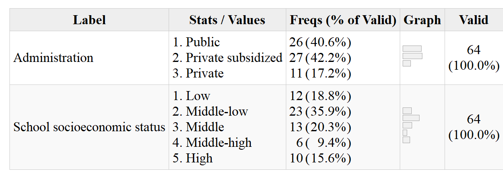

```{r setup, include=FALSE}
knitr::opts_chunk$set(warning = FALSE, message = FALSE, cache = TRUE)

if (!require("pacman")) install.packages("pacman")  #si falta pacman, instalar
if (!require("tinytex")) install.packages("tinytex")#si falta tinytex, instalar
pacman::p_load(knitr, kableExtra, dplyr, lavaan, summarytools, haven, sjPlot, htmlwidgets, ggplot2, sjmisc, texreg, webshot, utils, sjlabelled, rvest, fastDummies) # librerias
knitr::opts_chunk$set(warning = FALSE,  # mensaje de warning
                      message = FALSE,  # mensajes/avisos de librerias
                      cache = FALSE,    # cache de los chunks,usar analisis pesados
                      out.width = '85%',# largo de imagen en %
                      fig.pos= "H",     # posicion figuras H = HERE
                      echo = FALSE      # incluir chunk en output
                      )

# Otras configuraciones
options(scipen=999) # notacion cientifica
rm(list=ls())       # limpiar workspace
options(knitr.kable.NA = '') # NA en kable = ''

# Funciones para renderizar tablas tanto en HTML como en pdf.
table_format = if(is_html_output()) { # Usar en argumento "format=" de kable
  "html"
} else if(is_latex_output()) {
  "latex"
}

fwidth = if(is_html_output()) { #Usar en argumento "full_width" de kableExtra
  T
} else if(is_latex_output()) {
  F
}

format_size = if(is_html_output()) { # Usar en argumento "format=" de kable
 20
} else if(is_latex_output()) {
  10
}

stars.pval2=function (p.value) # Usar en correlaciones policloricas
 {
    unclass(symnum(p.value, corr = FALSE, na = FALSE, cutpoints = c(0,
        0.001, 0.01, 0.05, 1), symbols = c("***",
        "**", "*", " ")))
}

graph.magnif_table = if(is_html_output()) { # Usar en argumento "graph.magnif=" de summarytools
  1.2
} else if(is_latex_output()) {
  0.75
}

width_table = if(is_html_output()) {
  800
} else if(is_latex_output()) { # Usar en "width=" dentro del argumento "image=" en kable
  500
}

```

# Introducción

La meritocracia es un ideal que aspira a la distribución de los recursos en una sociedad según esfuerzo y talento personal [@young_rise_2006]. Este ideal se encuentra ampliamente extendido en las sociedades modernas donde se alza como una forma legítima de progresar individualmente en base a logros personales, contrario a la antigua distribución en base a herencias y a las ventajas que pueden generar otro tipo de actividades como sobornos o uso de contactos personales [@hadjar_Meritokratie_2008]. Si bien la obtención de recompensas proporcionales a esfuerzo y talento parece una representación fidedigna de la justicia por equidad, la implementación de sistemas meritocráticos no está exenta de problemas. Por un lado, se ha argumentado que la meritocracia permite la legitimación de las desigualdades mediante la atribución del éxito al logro personal, subestimando de esta manera las condiciones de origen o el "punto de partida" [@hadjar_Meritokratie_2008; @bay-cheng_Agency_2015]. Ello implica una gran presión psíquica y social hacia los jóvenes, quienes independiente de las desigualdades de sus contextos, crecen rodeados de discursos meritocráticos que contrastan constantemente con la realidad [@allen_Top_2016]. Por otro lado, el énfasis en las capacidades individuales llevaría a responsabilizar a las personas de su situación y por lo tanto a un menor apoyo a políticas sociales que compensen desventajas: "¿Por qué las personas que triunfan en la vida iban a deber nada a los miembros menos favorecidos de la sociedad?" [@sandel_tirania_2021 p.292]. De esta manera, la creencia en la meritocracia podría mermar la preocupación por el bien común y la solidaridad.

En el último tiempo se ha incrementado el interés por el estudio de la meritocracia en las ciencias sociales. Desde la sociología, se ha desarrollado una agenda de investigación que ha resaltado los aspectos subjetivos de la meritocracia [@mijs_How_2020, @mijs_Inequality_2018, @castillo_Meritocracia_2019 ], donde una distinción central es entre percepciones meritocráticas (que tan meritocrática es la sociedad) y preferencias meritocráticas (que tan meritocrática debería ser la sociedad)  [@reynolds_Perceptions_2014, @castillo_Meritocracia_2019] siendo las percepciones el objeto principal de este estudio. Sin embargo, hasta ahora se ha puesto poca atención al origen de estas percepciones en etapas previas a la vida adulta. Desde una perspectiva de socialización, distintos agentes tienen el potencial de contribuir a la formación de percepciones, actitudes y creencias en los jóvenes, siendo dos de ellos los más importantes la familia y la escuela [@gidengil_Political_2016; @torney-purta_School_2002]. En el presente trabajo, nuestro objetivo es estudiar en qué medida las ideas parentales y las experiencias escolares se asocian a percepciones meritocráticas de estudiantes secundarios. Basados en los trabajos sobre justicia en la escuela y en la agenda de socialización política familiar, buscamos responder dos preguntas:¿Existe una asociación entre las percepciones meritocráticas de los padres con las de sus hijos/hijas? Y, ¿En qué medida la experiencia escolar en términos de justicia distributiva (en relación a las notas) se vincula a las percepciones meritocráticas de las/los estudiantes?

En relación a la primera pregunta, nuestro interés es analizar en qué medida las percepciones meritocráticas de los padres se encuentran asociadas a las de sus hijos. Los estudios sobre la reproducción intergeneracional de actitudes políticas han generado vasta evidencia en torno a la transmisión de habilidades, creencias, actitudes y prácticas para el ejercicio de la vida social y política [@astill_Multilevel_2002; @miranda_Desigualdad_2018]. En esta línea, se ha estudiado la transmisión de opiniones e intenciones de participación política [@boonen_Adolescent_2013a; @quintelier_Intergenerational_2015], las creencias políticas sobre la democracia [@greenstein_Personality_2016a] y orientaciones políticas [@jennings_Politics_2009]. No obstante, estas investigaciones por lo general no incorporan aspectos relativos a la justicia distributiva, los cuales pueden ser fundamentales si se considera que las ideas de las personas sobre la desigualdad y la distribución de recursos pueden generar apatía política e incluso deseos de insubordinación [@easterbrook_social_2021], además de estar relacionadas con la tolerancia y las ideas autoritarias [@madeira_Primes_2019; @azevedo_Neoliberal_2019]. De esta manera, esta investigación busca contribuir al cuerpo de estudios sobre socialización política incorporando otras ideas transmisibles en el entorno familiar, como son las percepciones meritocráticas.

El segundo tema de interés en este trabajo es el rol de la escuela en las percepciones meritocráticas de los estudiantes. Al respecto, la literatura sobre justicia en la escuela ha logrado evidenciar la importancia que tienen las experiencias distributivas en la configuración de la visión del mundo en los jóvenes. Trabajos como lo de Resh y Sabbagh han demostrado que el sentido de justicia que tienen los estudiantes con respecto a la distribución de notas tiene un impacto en sus actitudes y comportamientos democráticos [@resh_Sense_2014; @resh_Sense_2017], así como también en la confianza institucional y social [@resh_Sense_2018]. Esta evidencia llama a profundizar en el efecto del sentido de justicia en otros aspectos de la visión del mundo de los jóvenes, como por ejemplo las percepciones de meritocracia. Esta propuesta se refuerza si se considera el potencial efecto de la escuela en la forma en que se percibe la desigualdad de una sociedad.

# Antecedentes conceptuales y empíricos

## Sobre el estudio subjetivo de la desigualdad

El estudio de la desigualdad social ha tenido un lugar central en la sociología. Por un lado, está el desarrollo de la investigación en el ámbito de la estratificación social, donde se ha puesto atención en las características de la estructura social y en los mecanismos de reproducción de la desigualdad [@kerbo_Estratificacion_1998; @chan_Class_2007; @lopez-roldan_Comparative_2021]. Por otro lado, y de manera posterior a los estudios clásicos de estratificación, se ha desarrollado un ámbito de investigación que propone estudiar las actitudes distributivas de los individuos en relación a su posición en la estructura social, principalmente a través de sus percepciones y preferencias en torno a la desigualdad económica [@kluegel_Beliefs_2017; @kluegel_Social_2018; @janmaat_Subjective_2013; @jensen_Deservingness_2017]. Una de las dimensiones que ha sido abordada desde esta perspectiva se relaciona con la legitimidad de la desigualdad en ámbitos como los salarios [@evans_Justifications_2010] o el acceso a bienestar social [@maldonado_Risk_2019].  En este marco, desde un enfoque de interés racional se sostiene que la posición relativa de los individuos en la estructura social - representada a través de los ingresos, logro educacional y posición en el mercado laboral - trae consigo que individuos de mayor estatus manifiesten actitudes menos igualitarias, y por tanto, tiendan a justificar mayor desigualdad [@meltzer_Tests_1983; @gugushvili_Intergenerational_2016]. Sin embargo, una segunda línea de investigación se enmarca en la así denominada _desigualdad subjetiva_, que plantea que las actitudes de los individuos hacia la desigualdad no solo se ven afectadas por su posición objetiva y su interés racional, sino que también son influenciadas por otros elementos culturales, normativos y experienciales [@mcleod_handbook_2014].

Frente a la amplitud de conceptos utilizados en los estudios sobre desigualdad subjetiva, autores como @jasso_New_1980 o @janmaat_Subjective_2013 han realizado precisiones conceptuales con el objetivo de clarificar la comprensión del campo de estudio. Según @janmaat_Subjective_2013 los tres principales conceptos sobre desigualdad subjetiva son percepciones de desigualdad (estimaciones subjetivas sobre la desigualdad existente), creencias sobre la desigualdad (ideas normativas de justicia respecto a cómo debería ser la desigualdad), y por último, juicios sobre la desigualdad (evaluaciones sobre que tan buena o mala es la situación actual). Dentro de este marco, el presente estudio se enfoca en las percepciones de desigualdad, específicamente en la estimación de la magnitud en que los esfuerzos y talentos son recompensados, lo que denominamos percepción de meritocracia [@castillo_Meritocracia_2019].

## Percepción de meritocracia

La evidencia sobre los aspectos asociados a las percepciones meritocráticas son variadas y se han centrado en distintos ámbitos, entre ellos la información a la que los individuos se encuentran expuestos. En general, las investigaciones muestran que los sujetos poseen estimaciones sesgadas tanto de los niveles de desigualdad como del real funcionamiento de la meritocracia [@gimpelson_Misperceiving_2018]. De modo similar, @mccall_Exposure_2017 evidencian que exponer a los ciudadanos estadounidenses a los reales niveles de desigualdad fomenta en ellos una menor creencia en las oportunidades para salir adelante en base al esfuerzo propio. En la misma línea, @mijs_How_2020 señalan que al exponer a ciudadanos indonesios, australianos y mexicanos a los niveles reales de desigualdad y movilidad social disminuye su percepción de meritocracia. Estas percepciones distorsionadas sobre la desigualdad y la meritocracia varían consistentemente según nivel socioeconómico, pues las personas aventajadas socioeconómicamente suelen percibir mayores niveles de meritocracia que las personas de escasos recursos [@reynolds_Perceptions_2014].

La adhesión a creencias meritocráticas suele ser interpretada desde una perspectiva de interés racional, considerando que quienes detentan mayores recursos económicos y estatus poseen mejores razones para percibir y preferir la meritocracia [@kunovich_Systems_2007]. Adicionalmente, se ha evidenciado que dichas diferencias en la percepción según nivel socioeconómico se ven afectadas por el nivel de desigualdad económica de la sociedad, lo cual es abordado desde distintas teorías. Por un lado, la teoría del conflicto supone que mayores niveles de desigualdad generan menor percepción de meritocracia y menor tolerancia a la desigualdad, a la vez que existe mayor disenso en estos temas entre distintos estratos sociales [@newman_False_2015]. Por otro lado, la teoría del poder relativo [@solt_Economic_2016a] sostiene que mayor desigualdad económica trae consigo una mayor concentración de riqueza y poder, lo cual tiene como consecuencia que las visiones de los grupos más aventajados permeen las visiones de aquellos más desaventajados, por lo cual a mayor desigualdad existe mayor consenso entre grupos sociales sobre la percepción de meritocracia. En síntesis, se puede decir que la percepción de meritocracia es mayor en grupos aventajados, sin embargo la brecha respecto a los más pobres tiende a ser menor en sociedades más desiguales.

Otra característica del estatus-socioeconómico relevante en el estudio de las percepciones y preferencias meritocráticas ha sido la tenencia de credenciales educativas que dan paso a ocupaciones de mayor calificación en el mercado laboral [@goldthorpe_myth_2003]. Para explicar la relación entre creencias meritocráticas y años de educación se ha recurrido a dos hipótesis. Por un lado está el enfoque *reproduccionista* [@bourdieu_reproduccion_1998; @bernstein_Poder_1988], desde donde se sostiene que el rol de la institución escolar contribuye a reforzar los principios meritocráticos de los individuos, por tanto un mayor logro educacional se traduce en mayor adscripción a la meritocracia como principio distributivo [@reynolds_Perceptions_2014; @xian_Bootstraps_2017a; @lampert_Meritocratic_2013]. Por otro lado, se encuentra la hipótesis de *instrucción*, la cual sostiene que individuos más educados poseen mayor capacidad crítica respecto del rol que juegan los factores estructurales e individuales en la adquisición de recompensas en la sociedad, lo cual se traduce en un debilitamiento en torno al ideal meritocrático [@duru-bellat_Who_2012; @castillo_Meritocracia_2019].

## Meritocracia en la etapa escolar

La investigación sobre meritocracia en población joven ha sido escasamente abordada, pero si es posible encontrar algunos estudios sobre actitudes hacia la desigualdad y la justicia. En lo que refiere a actitudes hacia la desigualdad, los estudios han demostrado que los niños son capaces de formar nociones acerca de justicia y desigualdad a muy temprana edad [@imhoff_Nociones_2015]. Si bien los niños más pequeños presentan problemas para comprender los términos de "rico" y "pobre" [@danziger_child_1957], durante los 3 y 6 años ya logran entenderlos, aunque no son capaces explicar estas diferencias hasta alrededor de los 10 años [@sigelman_Age_2013]. En esta edad, los niños tienden a destacar en gran medida las atribuciones individuales de tipo meritocrático como causantes de la desigualdad [@sigelman_Rich_2012], a la vez que presentan incipientes explicaciones basadas en la desigualdad de oportunidades, especialmente como consecuencia de la discriminacion [@imhoff_Nociones_2015]. No obstante, algunos autores señalan que las atribuciones multifacéticas de la desigualdad pueden encontrarse a edades menores. Por ejemplo, un estudio con niños de 5 a 8 años dio cuenta de que en esta etapa los niños eran capaces de explicar la pobreza a partir de factores como el esfuerzo individual y elementos situacionales, aludiendo a desigualdades salariales y discriminación [@mistry_Children_2016]. Según estos autores, los resultados son coherentes con la teoría del desarrollo cognitivo [@leahy_Parental_1981] y del construccionismo social [@emler_Children_1985], donde un mayor desarrollo cognitivo posibilitará una comprensión más acabada de la desigualdad.

Además de la comprensión y explicación de los niños frente a la desigualdad, algunos estudios han profundizado en el uso de criterios de justicia distributiva por parte de los niños. En esta línea @kanngiesser_Young_2012 señalan que pese a su tendencia egoísta, los niños entre 3 y 5 años ya son capaces de utilizar criterios meritocráticos para distribuir recursos, considerando el esfuerzo invertido de otros niños aun cuando esto podría afectar su propio interés. En suma, los niños y niñas a temprana edad son capaces de comprender conceptos relativos a la desigualdad, a la vez que son capaces de utilizar distintos criterios de distribución para explicar dichas diferencias o asignar recursos.

En relación a estudios sobre meritocracia en población adolescente, @hjort_Individualized_2014 ha evidenciado una adhesión generalizada a los discursos del individualismo y la meritocracia por parte de los jóvenes en la ciudad de Oslo. Los participantes de la investigación señalan que la determinación individual y trabajo duro son fundamentales. No obstante, aunque los jóvenes señalan como central el mérito, esto no impide que reconozcan diferencias de inicio relacionadas a la transmisión de recursos familiares. En esta línea, el trabajo de @irwin_Family_2009b ha demostrado la importancia que los jóvenes le dan a los factores individuales para “salir adelante”, aunque también contribuyen con evidencia en torno a la importancia del apoyo emocional que puede brindar la familia. Adicionalmente, una investigación en jóvenes de secundaria en Estados Unidos sugiere que las visiones que tienen los adolescentes respecto a las recompensas provenientes del esfuerzo encuentran mayor apoyo en estudiantes migrantes de segunda generación que detentan mayores expectativas de movilidad social ascendente [@peguero_Schools_2015, pág. 33]. Por último, @sun_Value_2010 han estudiado si existe una brecha de valores entre generaciones jóvenes y viejas en China, hallando que los más jóvenes tienden a ser más individualistas en sus formas de vida. Estos antecedentes muestran que desde edades tempranas los niños y jóvenes se forman juicios y opiniones acerca de la desigualdad, lo que probablemente tambien aplica para sus visiones sobre la meritocracia.

## El presente estudio: La socialización de la meritocracia por parte de la familia y la escuela

La familia es un primer agente de socialización que provee valores, expectativas y reglas [@martinez_escuela_2015]. Aunque se ha criticado un sesgo adultocéntrico en los estudios de socialización política al centrarse en el estudio de la transferencia de valores [@andersson_Situational_2015], existe contundente evidencia para señalar la importancia de la socialización familiar, donde las creencias parentales ejercen influencia en las creencias, actitudes y comportamientos de los niños [@olivos_Motivation_2021; @bandura_SelfEfficacy_2001; @wigfield_Development_2006]. Más aún, los padres crían a sus hijos en función de culturas de clase,  transmitiendo creencias y actitudes estratificadas [@calarco_Coached_2014]. De modo coherente, se ha evidenciado que los padres transmiten a sus hijos actitudes cívicas, intenciones de participación, posiciones políticas entre otras características [@muddiman_Young_2019; @nesbit_Influence_2013]. En esta línea, la evidencia en torno a la socialización de distintas características subjetivas permite suponer que la transmisión intergeneracional también se expresaría en torno a las percepciones meritocráticas, de modo tal que:

  > Hipótesis 1: Existe una asociación positiva entre el nivel de percepción de meritocracia de los padres y de sus hijos.

Un segundo agente relevante de socialización es la escuela. Más allá de su rol educacional, la escuela contribuye a dar forma a la conducta y las visiones del mundo de los jóvenes estudiantes [@nishiyama_Enabling_2019]. En este contexto, la experiencia de justicia de los estudiantes juega un rol fundamental [@resh_Sense_2014; @resh_Sense_2018] en tanto fomenta la inferencia de ideas respecto a la desigualdad [@mijs_Inequality_2018]. Entre los distintos tipos de justicia de la escuela [@resh_Justice_2016], se destaca el rol que cumple la sensación de justicia en las notas, la cual es relevante en tanto representa las experiencias de los estudiantes relativas a lo justo o injusto, afectando tanto la formación de la autoimagen, de creación de jerarquías en el aula y su visión del mundo sobre diversos temas [@jasso_Exploring_2002]. Los estudios en este ámbito han demostrado que la sensación de justicia en las notas fomenta orientaciones liberales-democráticas [@resh_Sense_2014], genera confianza en las instituciones [@resh_Sense_2018], y contribuye que los estudiantes apoyen más la asignación meritocrática de las notas [@resh_Justice_2009]. Frente a lo anterior, esta investigación propone que la sensación de justicia en las notas también fomenta una mayor percepción de meritocracia por parte de los estudiantes, lo cual es consistente con la evidencia señalada por @olivos_Motivation_2021. Dicho lo anterior, se sostiene que

  > Hipótesis 2: Estudiantes con una mayor sensación de justicia en sus notas percibirán mayor meritocracia.

La socialización familiar y escolar de la percepción meritocrática ocurren en conjunto y probablemente se afectan mutuamente. Por ello, proponemos que la asociación de la percepción meritocrática de los padres con  la de sus hijos se verá potenciada si el estudiante siente que sus calificaciones son justas. Inversamente, aunque el estudiante sea socializado en creencias meritocráticas, si él experimenta injusticia en sus notas el efecto de las creencias de sus padres será más débil. Por ello, proponemos como hipótesis que:

  > Hipótesis 3: La relación entre percepción meritocrática de los padres y de los hijos (H1) será más positiva para aquellos que experimentan un mayor sentido de justicia en la escuela (H2).

La evidencia en torno a las creencias meritocráticas destacan el rol que juegan factores asociados a la posición social. @reynolds_Perceptions_2014 señala que las personas de mayor estatus en Estados Unidos poseen una mayor percepción de meritocracia que quienes poseen un menor estatus. En la misma línea, @kunovich_Systems_2007 da cuenta de evidencia  consistente con un enfoque de interés racional, de modo tal que a mayores ingresos y educación los sujetos poseen mayor preferencia por pago meritocrático. Pese a sus diferencias, los resultados de @solt_Economic_2016a y @newman_False_2015  proveen respaldo empírico de la relación positiva entre ingresos y creencias meritocráticas. En base a esta evidencia es posible sostener que padres con mayor nivel socioeconómico poseerán mayor nivel de creencias meritocráticas. En la misma línea, proponemos que estudiantes en escuelas  con mayor nivel socioeconómico tenderán a percibir mayor meritocracia.

  > Hipótesis 4: El estatus socioeconómico de la familia posee un efecto positivo sobre las percepciones meritocráticas del estudiante.

  > Hipótesis 5: El estatus socioeconómico de la escuela posee un efecto positivo sobre las percepciones meritocráticas del estudiante

Un corolario del efecto del nivel socioeconómico de la familia sobre la percepción de los padres y el efecto de las percepciones de estos sobre la de sus hijos, es la posibilidad de que la crianza en entornos de mayor nivel socioeconómico implique un contexto familiar con mayor percepción de meritocracia. Esto supone una cadena de asociaciones donde el nivel socioeconómico de la familia fomenta una mayor percepción de meritocracia por parte de los padres, lo que a su vez genera una mayor percepción meritocrática en sus hijos. De ser efectivo que el nivel socioeconómico afecta las creencias meritocráticas de los hijos mediante las creencias de los padres, se podría discutir hasta qué punto el efecto registrado en la literatura del nivel socioeconómico sobre las creencias meritocráticas se explica más por la socialización familiar que por la posición socioeconómica en sí misma. Por ello, se plantea que:

> Hipótesis 6: La percepción meritocrática de los padres media la relación entre el estatus socioeconómico de los padres y la percepción meritocrática de los estudiantes.

Finalmente, respecto a la relación entre nivel socioeconómico y sentido de justicia en las notas se puede decir algo similar.  Las investigaciones de Resh y Sabbagh en Israel [@resh_Sense_2010] han evidenciado que los recursos de los padres poseen un efecto no solo en las notas de los estudiante sino también en la sensación de justicia que siente el estudiante respecto a sus notas. Siguiendo a @solt_SWIID_2020, si consideramos que en Chile existe mayor desigualdad social que en Israel, podríamos suponer que dicho efecto se mantendrá e incluso podría ser mayor.  Por ende se podría hipotetizar una segunda mediación, donde los estudiantes de familias con mayor nivel socioeconómico tendrán una mayor sensación de justicia en sus notas, lo cual fomentará una mayor percepción de meritocracia. Para sintetizar esto último se propone que:

> Hipótesis 7: La sensación de justicia en las notas media la relación entre el estatus socioeconómico de la escuela y la percepción meritocrática estudiantes.

[esquema resumen]

# Metodología

## Datos

Los datos provienen de la encuesta Panel de Ciudadanía Escolar (PACES), un estudio sobre socialización política familiar que fue realizado aplicando una encuesta a estudiantes, sus apoderados y sus profesores durante 2019-2021. Este estudio fue desarrollado en el marco del  proyecto FONDECYT N°1181239 "Socialización política y experiencia escolar: el rol de la familia y la escuela" financiado por la Agencia Nacional de Investigación (ANID) del Ministerio de Ciencia y Tecnología chileno. En este artículo utilizamos la primera ola del panel disponible al momento de realizar esta investigación, por lo que este es un estudio transversal. La muestra es representativa de los estudiantes de segundo medio (décimo grado) que asisten a escuelas de la Región Metropolitana y las comunas de Antofagasta, Calama, Talca, Curicó y Linares. En total se seleccionaron 64 escuelas. En cada establecimiento educacional seleccionado se consideró encuestar a un curso completo, sus apoderados y sus docentes de historia, ciencias sociales y/o formación ciudadana. En concreto, se cuenta con los datos de 1635 estudiantes, 744 apoderados y 103 profesores. Los datos de esta ola fueron producidos entre agosto y diciembre del año 2019. Eliminando los casos perdidos y considerando solo aquellos alumnos cuyos apoderados contestaron la encuesta, contamos con una muestra final de 537 alumnos y apoderados en 59 escuelas.

El marco muestral utilizado para la selección de los establecimientos fue construido para la definición del universo, desde el Directorio de Establecimientos del Ministerio de Educación del año 2019, considerando todos los colegios de los sectores señalados. La selección fue aleatoria y sistemática, considerando localidad, dependencia administrativa (municipal, subvencionado o particular) y tipo de educación (Humanista científica, técnico profesional o mixto). La metodología de aplicación fue presencial y autoaplicada en el establecimiento para docentes y alumnos, siendo llevada a cabo por un encuestador especialmente entrenado para ello. En el caso de los apoderados fue autoaplicada en sus hogares.

## Variables

En la Tabla N° \@ref(tab:desc01) se presentan las variables de nivel individual de este estudio. Las preguntas utilizadas corresponden a indicadores de percepción meritocrática que han sido utilizadas en otras investigaciones, en particular aquellas que analizan datos del módulo de desigualdad social del _International Social Survey Programme_ (ISSP) [@reynolds_Perceptions_2014]. En este artículo, se midió la percepción meritocrática de los estudiantes  a partir de dos indicadores relativos al rol del esfuerzo y el trabajo duro para surgir en la vida. Ambos indicadores corresponden a escalas Likert de cuatro categorías[^1], midiendo grado de acuerdo y grado de importancia, respectivamente.

```{r include=FALSE, results='asis'}
# Funciones para renderizar tablas tanto en HTML como en pdf
if (!require("pacman")) install.packages("pacman")  #si falta pacman, instalar
if (!require("tinytex")) install.packages("tinytex")#si falta tinytex, instalar
pacman::p_load(knitr, summarytools, kableExtra, dplyr, lavaan, haven, htmlwidgets, webshot, sjPlot) # librerias
knitr::opts_chunk$set(warning = FALSE,  # mensaje de warning
                      message = FALSE,  # mensajes/avisos de librerias
                      cache = FALSE,    # cache de los chunks,usar analisis pesados
                      out.width = '85%',# largo de imagen en %
                      fig.pos= "H",     # posicion figuras H = HERE
                      echo = FALSE      # incluir chunk en output
)

# Otras configuraciones
options(scipen=999) # notacion cientifica
options(knitr.kable.NA = '') # NA en kable = ''

# Funciones para renderizar tablas tanto en HTML como en pdf
fwidth = if(is_html_output()) { #Usar en argumento "full_width" de kableExtra
  T
} else if(is_latex_output()) {
  F
}

graph.magnif_table = if(is_html_output()) { # Usar en argumento "graph.magnif=" de summarytools
  1.2
} else if(is_latex_output()) {
  0.75
}

width_table = if(is_html_output()) {
  800
} else if(is_latex_output()) { # Usar en "width=" dentro del argumento "image=" en kable
  500
}

# Css
st_css()
st_options(lang = "es",
           footnote = NA,
           bootstrap.css = F,
           custom.css = "input/css/dfsummary.css")

# Cargar base de datos procesada
load(file = "input/data/ap_est.RData")

# Seleccionar variables
basereg <- ap_est %>% select(perc_trabajo_duro_factor_est,
                             perc_esfuerzo_factor_est,
                             perc_trabajo_duro_factor_ap,
                             perc_esfuerzo_factor_ap,
                             sj_direct_factor,
                             sj_indirect_ln,
                             quintiles_ingresos_pc_factor,
                             educ_factor_ap,
                             libros_hogar_factor_ap,
                             pos_pol_factor_ap,
                             pos_pol_factor_est,
                             recompensa_factor_est,
                             resp_prof_factor,
                             genero_factor_est,
                             dependencia_factor_ap,
                             ingresos_esc,
                             ingresos_pc_esc,
                             univ_esc,
                             # rbd_est
) %>% na.omit(basereg) %>% select(-recompensa_factor_est,-resp_prof_factor) # Estas dos variables son parte de análisis exploratorios. Se seleccionaron para que el N fuera homogeneo a través de todos los análisis, sin embargo, no son incluídas dentro de los análisis principales de hipótesis.

# Df variables nivel 1
df<- dfSummary(select(basereg,perc_trabajo_duro_factor_est:pos_pol_factor_est),
               plain.ascii = FALSE,
               style = "grid",
               tmp.img.dir = "/tmp",
               graph.magnif = TRUE,
               headings = F,  # encabezado
               varnumbers = F, # num variable
               labels.col = T, # etiquetas
               na.col = F,    # missing
               graph.col = T, # plot
               valid.col = T, # n valido
               col.widths = c(1000,10,10,10,10)
               )
df$Variable <- NULL # delete variable column
view(df,file = "desc01.html") # Ver tabla en un archivo HTML
webshot(url ="desc01.html" ,file ="output/tables/desc01.png") # Remover archivo HTML

# Df variables nivel 2
df.esc<- dfSummary(select(basereg,dependencia_factor_ap:univ_esc),
               plain.ascii = FALSE,
               style = "grid",
               tmp.img.dir = "/tmp",
               graph.magnif = graph.magnif_table,
               headings = F,  # encabezado
               varnumbers = F, # num variable
               labels.col = T, # etiquetas
               na.col = F,    # missing
               graph.col = T, # plot
               valid.col = T, # n valido
               col.widths = c(1000,10,10,10,10)
               )
df.esc$Variable <- NULL # delete variable column
view(df.esc,file = "desc01_esc.html") # Ver tabla en un archivo HTML
webshot(url ="desc01_esc.html" ,file ="output/tables/desc01_esc.png",vheight = 10) # Foto al documento HTML para guardar en png
file.remove(c("desc01.html","desc01_esc.html")) # Remover archivo HTML
```

```{r desc01, echo=FALSE, results='asis'}
knitr::kable(data.frame(image='{height=80%}'),    # generar tabla
             caption="Variables nivel individual",
             col.names = "",
             row.names = F,
             format = "pandoc") %>%  kable_styling(latex_options = c("HOLD_position"),full_width = fwidth)
```

Las variables independientes de nivel individual se dividieron de acuerdo a si corresponden a padres o estudiantes. En el caso de los padres, existen dos variables relevantes: percepción de meritocracia y estatus socioeconómico. Para la percepción de meritocracia se les preguntó lo mismo que a los estudiantes, pero para simplificar el modelamiento posterior se procedió a agrupar las categorías “Muy importante”,  “Importante” y “Algo importante”. En el caso del estatus socioeconómico, se utilizaron los ingresos del hogar y el nivel educacional de los apoderados como indicadores. Se construyeron quintiles a partir del indicador original de 11 tramos de ingresos declarados por los padres. En el caso del nivel educacional de los apoderados, se utilizaron sus categorías originales: "8vo básico o menos" (1); "Educación Media" (2); "Educación Técnica Superior (IP o CFT)" (3); y "Una carrera en la Universidad o estudios de Posgrado" (4).

La variable de justicia en las notas es clave para nuestro estudio, ya que representa la experiencia escolar de justicia. Se emplearon dos formas de medir el sentido de justicia en las notas: directa e indirecta. La forma directa  obtiene de una pregunta sobre si las notas que se obtienen son merecidas, mientras la indirecta es un indicador numérico construido a partir de la fórmula propuesta por @jasso_New_1980. Esta fórmula corresponde la proporción entre la recompensa obtenida y la recompensa justa, a la cual se le aplica un término logarítmico. Por lo tanto en el caso de justicia absoluta (nota obtenida=nota merecida) el valor del término será cero (Log 1=0), menor a cero en caso de justicia por sub-recompensa, y mayor a cero en caso de justicia por sobre recompensa. Siguiendo las aplicaciones hechas al ámbito educativo por parte de @resh_Sense_2014, @resh_Sense_2017, @resh_Sense_2018, se utilizaron las notas reportadas por los estudiantes como la recompensa que se distribuye en la escuela. La fórmula aplicada a los datos del artículo se pueden ver en la Ecuación \@ref(eq:jef).

\begin{equation}
   \text{Sentido de justicia en notas}= ln(\frac{\text{nota obtenida}}{\text{nota justa}}) (\#eq:jef)
\end{equation}


```{r desc01-esc, echo=FALSE, results='asis'}
knitr::kable(data.frame(image='{width=width_table}'), # generar tabla
             caption="Descriptivos establecimiento",
             col.names = "",
             row.names = F,
             format = "pandoc") %>% kable_styling(latex_options = c("HOLD_position"),full_width = fwidth)
```

La principal variable independiente de nivel escuela del estudio corresponde al estatus socioeconómico de la escuela. Se utilizaron dos formas para su medición. En primer lugar, se construyó un promedio de los ingresos a nivel escuela. En segundo lugar, se cuantificó el porcentaje de apoderados con educación universitaria a nivel escuela. Para elaborar este indicador, se construyó una variable tipo dummy donde 1 = “posee educación universitaria” y 0 = “no posee educación universitaria”. A partir de la variable tipo dummy se calculó el porcentaje de apoderados con educación universitaria por escuela. A modo de énfasis, ambas formas  de medir el estatus socioeconómico significaron un cambio en su nivel de medición original (ordinal a intervalar), así cómo una agregación de datos de nivel uno (apoderados) a nivel dos (escuelas).

Las variables control incluyeron sexo, posición política de padres y estudiantes, ciudad, dependencia administrativa de la escuela y cantidad de libros en el hogar.


## Métodos

Debido a que la muestra posee una estructura jerárquica (estudiantes anidados en escuelas), se estimaron regresiones multinivel para contrastar las hipótesis siguiendo los pasos recomendados para estimar y reportar este tipo de modelos [@aguinis_BestPractice_2013]. Dado que los dos indicadores de percepción de meritocracia de estudiantes son variables ordinales, se trabajó con modelos multinivel para variables ordinales [@arfan_Ordinal_2017][^2]. El análisis se llevará a cabo con el software estadístico `R` versión 4.0.3 "Bunny-Wunnies Freak Out".

[^2]: En modelos ordinales multinivel la variable dependiente representa el cálculo de la probabilidad acumulada de que un estudiante responda hasta $C$ en los indicadores de percepción de meritocracia, siendo $Y_{cij}$ una respuesta categórica ordenada de un estudiante $i^{th}$ en una escuela (cluster) $j^{th}$ con $C$ categorías ordenadas, codificadas como $C = 1,2,3,4$. Esta probabilidad se calcula en función de: el intercepto por cada categoría $a_c$, los coeficientes $\gamma_1$ y $\gamma_2$ para la percepción de meritocracia de los padres y el sentido de justicia en las notas respectivamente, $\gamma_n$ para las variables de control, $u_{0j}$ como término de error para una escuela $j$ y $e_{ij}$ como error de la estimación para el individuo $i$ en una escuela $j$. Para la estimación se utilizará la librería `clmm2` de R.

Los análisis se basarán en las hipótesis que han sido pre-registradas y se pueden acceder en <https://osf.io/fazdx>.


# Resultados

En la Tabla N° \@ref(tab:correl)[^3] se presentan las correlaciones entre las variables principales del estudio. Las correlaciones deben interpretarse como asociaciones positivas o negativas según el signo y de mayor intensidad según se acerque el valor absoluto a 1.

[^3]: Con tal de poder efectuar los análisis de correlación, los 71 casos de la categoría “NS/NR” de la variable quintiles de ingresos fueron imputados por los promedios de ingresos de la escuela.


```{r correl, echo=FALSE}

# Funciones para renderizar tablas tanto en HTML como en pdf
if (!require("pacman")) install.packages("pacman")  #si falta pacman, instalar
if (!require("tinytex")) install.packages("tinytex")#si falta tinytex, instalar
pacman::p_load(knitr, kableExtra, dplyr, haven, sjlabelled, rvest) # librerias
knitr::opts_chunk$set(warning = FALSE,  # mensaje de warning
                      message = FALSE,  # mensajes/avisos de librerias
                      cache = FALSE,    # cache de los chunks,usar analisis pesados
                      out.width = '85%',# largo de imagen en %
                      fig.pos= "H",     # posicion figuras H = HERE
                      echo = FALSE      # incluir chunk en output
                      )

# Otras configuraciones
options(scipen=999) # notacion cientifica
options(knitr.kable.NA = '') # NA en kable = ''

# Funciones para renderizar tablas tanto en HTML como en pdf
table_format = if(is_html_output()) { # Usar en argumento "format=" de kable
  "html"
} else if(is_latex_output()) {
  "latex"
}

fwidth = if(is_html_output()) { #Usar en argumento "full_width" de kableExtra
  T
} else if(is_latex_output()) {
  F
}

stars.pval2=function (p.value) # Usar en correlaciones policloricas
 {
    unclass(symnum(p.value, corr = FALSE, na = FALSE, cutpoints = c(0,
        0.001, 0.01, 0.05, 1), symbols = c("***",
        "**", "*", " ")))
}

# Cargar base de datos
load(file = "input/data/ap_est.RData")

# Seleccionar variables a introducir en el análisis
basereg <- ap_est %>% select(perc_trabajo_duro_factor_est,
                             perc_esfuerzo_factor_est,
                             perc_trabajo_duro_factor_ap,
                             perc_esfuerzo_factor_ap,
                             sj_direct,
                             sj_indirect_ln,
                             quintiles_ingresos_pc_factor,
                             libros_hogar_factor_ap,
                             educ_factor_ap,
                             recompensa_est,
                             resp_prof_factor,
                             pos_pol_factor_ap,
                             pos_pol_factor_est,
                             genero_factor_est,
                             dependencia_factor_ap,
                             univ_esc,
                             ingresos_esc
                             # rbd_est
                             ) %>% na.omit(basereg)

# Crear dataframe para correlacion
cor.df<- data.frame(lapply(basereg[,c("perc_trabajo_duro_factor_est",
                                       "perc_esfuerzo_factor_est",
                                       "perc_trabajo_duro_factor_ap",
                                       "perc_esfuerzo_factor_ap",
                                       "sj_direct",
                                       "sj_indirect_ln",
                                       "quintiles_ingresos_pc_factor",
                                       "educ_factor_ap",
                                       "univ_esc",
                                       "ingresos_esc")], function(x) as_numeric(x)))

set_label(cor.df$educ_factor_ap) ="Nivel educacional de los apoderados"  # Cambiar etiqueta
cor.label <- as.character(get_label(cor.df)) # guardar var labels
cor.tab<-sjPlot::tab_corr(cor.df,
                  triangle = "lower",
                  digits = 2,
                  string.diag = rep(x = "-",max(length(cor.df)))) #Tabla de correlacion
cor.mat <- as.data.frame(read_html(x = cor.tab[["page.content"]]) %>% html_table(fill=FALSE))
cor.mat <- cor.mat[-max(length(cor.mat)),]                    # matriz as dataframe
cor.mat$Var.1 <- paste0(1:length(cor.label),". ",cor.label)   # eliminar fila
colnames(cor.mat) <- as.character(c(" ",1:length(cor.label))) # asignar colnames


# Correccion de correlaciones policoricas

cor.poly=psych::cor.ci(dplyr::select(cor.df,"perc_trabajo_duro_factor_est", #Correlaciones pol entre mer
                                       "perc_esfuerzo_factor_est",
                                       "perc_trabajo_duro_factor_ap", "perc_esfuerzo_factor_ap"),poly = TRUE,plot=F)


cor.poly2=psych::cor.ci(dplyr::select(cor.df,"perc_trabajo_duro_factor_est","perc_esfuerzo_factor_est",
                                       "perc_trabajo_duro_factor_ap", "perc_esfuerzo_factor_ap", "quintiles_ingresos_pc_factor","educ_factor_ap","sj_direct"),poly = TRUE,plot=F)


cor.mat[2,2] = paste0(round(cor.poly$rho[1,2],2), stars.pval2(cor.poly$ci[1,c("p")]))
cor.mat[3,2] = paste0(round(cor.poly$rho[1,3],2), stars.pval2(cor.poly$ci[2,c("p")]))
cor.mat[3,3] = paste0(round(cor.poly$rho[2,3],2), stars.pval2(cor.poly$ci[4,c("p")]))
cor.mat[4,2] = paste0(round(cor.poly$rho[1,4],2), stars.pval2(cor.poly$ci[3,c("p")]))
cor.mat[4,3] = paste0(round(cor.poly$rho[2,4],2), stars.pval2(cor.poly$ci[5,c("p")]))
cor.mat[4,4] = paste0(round(cor.poly$rho[3,4],2), stars.pval2(cor.poly$ci[6,c("p")]))

cor.mat[5,2] = paste0(round(cor.poly2$rho[7,1],2), stars.pval2(cor.poly2$ci[6,c("p")]))
cor.mat[5,3] = paste0(round(cor.poly2$rho[7,2],2), stars.pval2(cor.poly2$ci[11,c("p")]))
cor.mat[5,4] = paste0(round(cor.poly2$rho[7,3],2), stars.pval2(cor.poly2$ci[15,c("p")]))
cor.mat[5,5] = paste0(round(cor.poly2$rho[7,4],2), stars.pval2(cor.poly2$ci[18,c("p")]))

cor.mat[7,2] = paste0(round(cor.poly2$rho[5,1],2), stars.pval2(cor.poly2$ci[4,c("p")]))
cor.mat[7,3] = paste0(round(cor.poly2$rho[5,2],2), stars.pval2(cor.poly2$ci[9,c("p")]))
cor.mat[7,4] = paste0(round(cor.poly2$rho[5,3],2), stars.pval2(cor.poly2$ci[13,c("p")]))
cor.mat[7,5] = paste0(round(cor.poly2$rho[5,4],2), stars.pval2(cor.poly2$ci[16,c("p")]))

cor.mat[8,2] = paste0(round(cor.poly2$rho[6,1],2), stars.pval2(cor.poly2$ci[5,c("p")]))
cor.mat[8,3] = paste0(round(cor.poly2$rho[6,2],2), stars.pval2(cor.poly2$ci[10,c("p")]))
cor.mat[8,4] = paste0(round(cor.poly2$rho[6,3],2), stars.pval2(cor.poly2$ci[14,c("p")]))
cor.mat[8,5] = paste0(round(cor.poly2$rho[6,4],2), stars.pval2(cor.poly2$ci[17,c("p")]))


# Crear y guardar tabla de correlación
correlationtable=kable(cor.mat,
      align = c("l",rep(x = "c",max(length(cor.df)))),
      caption = "Relaciones entre percepciones meritocraticas, sentido justicia en las notas, nivel socioeconómico de familia y escuela",
      booktabs=TRUE,
      format = table_format,
      linesep = "") %>%
  kable_styling(full_width = fwidth,latex_options = c("scale_down","HOLD_position")) %>%
  column_spec(column = 1, width = "10 cm", ) %>%
  footnote(paste0("N= ",dim(basereg)[1],", ","*** p< 0.001; ** p< 0.01; * p< 0.05; Se utilizan correlaciones policoricas entre variables categoricas, el resto de las correlaciones son de Pearson"),
           footnote_as_chunk = T,
           general_title = "Nota: " )


# bootstrap_options=c("striped", "bordered")
# Save table

save_kable(correlationtable, "output/tables/cor.png")
correlationtable # Visualizar tabla
```

En general, las correlaciones ofrecen evidencia parcial a las hipótesis planteadas en este estudio. Se evidencia una relación entre las percepciones meritocráticas de padres e hijos, aunque solo en uno de los cuatro cruces posibles y con una fuerza de relación más bien pequeña. Padres que consideran importante el trabajo duro para surgir en la vida están asociados a hijos que respaldan la afirmación de que en Chile quienes se esfuerzan salen adelante (*r* = 0.13; *p* \< 0.01). Pese a ello, el respaldo de los padres a la afirmación sobre el rol del esfuerzo no está asociado significativamente con ninguna variable de los estudiantes.

Ninguna de las dos formas de medir la sensación de justicia en las notas posee la relación esperada con las percepciones meritocráticas de los estudiantes. Las hipótesis de nivel socioeconómico se sostienen solamente para el indicador de “trabajo duro” en estudiantes, correlacionando significativamente a nivel individual,  con la educación de los padres (*r* = 0.14; *p* \< 0.05 ) y a nivel escuela, tanto por el nivel de ingresos (*r* = 0.14; *p* \< 0.01 ), como por el porcentaje de apoderados con educación terciaria (*r* = 0.12; *p* \< 0.01 ). En contradicción con nuestras hipótesis, padres de mayores ingresos respaldan menos la afirmación de que en chile quien se esfuerza sale adelante (*r* = 0.16; *p* \< 0.01 ).

Dada la alta correlación entre ambos indicadores de nivel socioeconómico a nivel escuela (*r* = 0.85; *p* \< 0.001 ), en los modelos se incluirá solamente un indicador con tal de evitar problemas de multicolinealidad.

## Análisis multivariado

La Tabla N° \@ref(tab:getah) [^4] presenta los resultados de la estimación del modelo de regresión ordinal multinivel para la variable de “importancia atribuida al trabajo duro para salir adelante” como indicador de percepción meritocrática en estudiantes. Las estimaciones de los modelos siguen un orden de complejidad ascendente con tal de poder analizar el comportamiento de los coeficientes en la medida que son controlados por otros predictores. Bajo esta lógica, primero se estiman modelos simples para las variables principales, luego modelos multivariados, y finalmente se introducen controles e interacciones.

[^4]: Los modelos que consideran como variable dependiente el indicador de esfuerzo no presentaron resultados estadísticamentesignificativos en el análisis multivariado, por lo que no se incorpora en esta sección. Se puede ver en la Tabla N° \@ref(tab:effort) en la sección de Apéndice.


```{r getah, results='asis', echo=FALSE}

# Funciones para renderizar tablas tanto en HTML como en pdf
if (!require("pacman")) install.packages("pacman")  #si falta pacman, instalar
if (!require("tinytex")) install.packages("tinytex")#si falta tinytex, instalar
pacman::p_load(knitr, kableExtra, dplyr, haven, texreg, sjPlot, lme4, ordinal, webshot) # librerias
knitr::opts_chunk$set(warning = FALSE,  # mensaje de warning
                      message = FALSE,  # mensajes/avisos de librerias
                      cache = FALSE,    # cache de los chunks,usar analisis pesados
                      out.width = '85%',# largo de imagen en %
                      fig.pos= "H",     # posicion figuras H = HERE
                      echo = FALSE      # incluir chunk en output
                      )

# Otras configuraciones
options(scipen=999) # notacion cientifica
options(knitr.kable.NA = '') # NA en kable = ''

# Cargar base de datos procesada
load(file = "input/data/ap_est.RData")

# Seleccionar variables para el análisis
basereg <- ap_est %>% select(perc_trabajo_duro_factor_est,
                             perc_esfuerzo_factor_est,
                             perc_trabajo_duro_est,
                             perc_esfuerzo_est,
                             perc_trabajo_duro_factor_ap,
                             perc_esfuerzo_factor_ap,
                             perc_tduro_bi_est,
                             perc_tduro_bi2_est,
                             perc_tduro_bi3_est,
                             perc_esfuerzo_bi_est,
                             perc_tduro_bi_ap,
                             perc_tduro_bi2_ap,
                             perc_tduro_bi3_ap,
                             perc_esfuerzo_bi_ap,
                             prom_percmer_est,
                             prom_percmer_ap,
                             sj_direct_factor,
                             sj_indirect_noln,
                             sj_indirect_cat,
                             sj_indirect_qtil,
                             quintiles_ingresos_pc_factor,
                             educ_factor_ap,
                             libros_hogar_factor_ap,
                             recompensa_est,  # recompensa en escuela
                             resp_prof,# justicia trato profesor
                             pos_pol_factor_ap,
                             pos_pol_factor_est,
                             genero_factor_est,
                             dependencia_factor_ap,
                             ingresos_esc,
                             ingresos_pc_esc,
                             univ_esc,
                             univ,
                             rbd_est
                             ) %>% na.omit(basereg)

omit_coef="(Intercept)|(libros_hogar_factor_ap)|(pos_pol_factor_ap)|(pos_pol_factor_est)|(genero_factor_est)|(dependencia_factor_ap)"
con <-c(
  "quintiles_ingresos_pc_factor",
  "libros_hogar_factor_ap",
  "educ_factor_ap",
  "pos_pol_factor_ap",
  "pos_pol_factor_est",
  "genero_factor_est",
  "dependencia_factor_ap"
  ) # Omitir coeficientes en la visualización

ref <- "(1|rbd_est)" # Cluster

cap1 <- "Modelos ordinal logit multinivel para Socialización de importancia del trabajo duro" # Título tabla


# Modelos
getah.or1 <- ordinal::clmm(formula(paste("perc_trabajo_duro_factor_est~",paste(c("perc_tduro_bi_ap",ref),collapse="+"))), basereg)
getah.or2 <- ordinal::clmm(formula(paste("perc_trabajo_duro_factor_est~",paste(c("sj_indirect_noln",ref),collapse="+"))), basereg)
getah.or3 <- ordinal::clmm(formula(paste("perc_trabajo_duro_factor_est~",paste(c("sj_direct_factor",ref),collapse="+"))), basereg)
getah.or4 <- ordinal::clmm(formula(paste("perc_trabajo_duro_factor_est~",paste(c("perc_tduro_bi_ap","sj_indirect_noln","sj_direct_factor",ref),collapse="+"))), basereg)
getah.or5 <- ordinal::clmm(formula(paste("perc_trabajo_duro_factor_est~",paste(c("perc_tduro_bi_ap","sj_indirect_noln","sj_direct_factor",con[-3],ref),collapse="+"))), basereg)
getah.or6 <- ordinal::clmm(formula(paste("perc_trabajo_duro_factor_est~",paste(c("perc_tduro_bi_ap","sj_indirect_noln","sj_direct_factor",con,ref),collapse="+"))), basereg, nAGQ = 10)
getah.or7 <- ordinal::clmm(formula(paste("perc_trabajo_duro_factor_est~",paste(c("perc_tduro_bi_ap","sj_indirect_noln","sj_direct_factor", con, "perc_tduro_bi_ap*sj_direct_factor",ref),collapse="+"))), basereg)
getah.or8 <- ordinal::clmm(formula(paste("perc_trabajo_duro_factor_est~",paste(c("perc_tduro_bi_ap","sj_indirect_noln","sj_direct_factor", con, "perc_tduro_bi_ap*sj_direct_factor","univ_esc",ref),collapse="+"))), basereg)

coef_names <- c(
  # "Algo importante","Importante","Muy importante",
  "Es importante ¹",
  "SJ indirecto",
  "Menos de las que merezco","Más de las que merezco",
  "Quintil 2","Quintil 3","Quintil 4","Quintil 5","Quintil No sabe/No responde",
  "Educación media", "Educación Técnica Superior", "Educación universitaria o postgrado",
  #"Padres universitarios",
  #"Es importante x SJ indirecto",
  "Es importante x Menos de las que merezco",
  "Es importante x Más de las que merezco",
  "% apoderados Universitarios"
  ) # Nombre coeficientes

# Renderizar tabla
knitreg(list(getah.or1,getah.or3,getah.or4,getah.or5,getah.or6,getah.or7,getah.or8),
        caption = paste(cap1), # Se agrega key para que se pueda referenciar
        caption.above=TRUE,
        omit.coef=omit_coef,
        include.thresholds=FALSE,
        custom.gof.rows=list(Controls=c("No","No","No","Yes","Yes","Yes","Yes")),
        # groups=list("Perc. Meritocracia (apoderado)"=1:3,
        #             "Setido justicia (indirecto)"=4:6,
        #             "Sentido justicia (directo)"=7:8),
        custom.coef.names=coef_names,
        custom.note="*** p < 0.001; ** p < 0.01; * p < 0.05; ¹'Es importante' (Muy importante + Importante + Algo Importante) y 'No es importante' (Nada importante)"
        #file = "output/tables/trabajoduro_ppt.html"
        )

#webshot::webshot("output/tables/trabajoduro_ppt.html","output/tables/trabajoduro_ppt.png")
```

Los resultados son consistentes con lo vislumbrado por el análisis bivariado. En el caso de la hipótesis de transmisión intergeneracional se observa un efecto significativo entre las percepciones meritocráticas de los padres y las percepciones meritocráticas de los estudiantes, relación que se mantiene significativa pese a los controles estadísticos (Model 7 : *logit* = 1.47; *p* \< 0.001 ). Por ello, las probabilidades naturales de observar mayores niveles de percepción meritocrática en un estudiante aumentan 1.47 cuando el padre posee similares creencias.

Respecto a la hipótesis del sentido de justicia en la escuela, se puede observar que en ninguna de las formas en que se mide la sensación de justicia en las notas permite concluir una relación positiva con la percepción meritocrática de los estudiantes. Sin embargo, si es posible evidenciar un efecto del nivel socioeconómico en las percepciones meritocráticas de los estudiantes. En comparación con el primer quintil, los estudiantes de los tres quintiles superiores poseen más probabilidades de indicar que el trabajo duro es importante para surgir en la vida, aunque solo el efecto del tercer quintil perdura al incluir como control el nivel educativo de los padres (ver *logit* Modelos 5,6 y 7 con *p* \< 0.05). Esta evidencia es consistente con los antecedentes que señalan la importancia del nivel socioeconómico al explicar las percepciones meritocráticas, a la vez que aporta evidencia para señalar que dicha asociación, evaluada comúnmente en adultos, es aplicable a los jóvenes. Por su parte, no se encuentra un efecto significativo del nivel socioeconómico de la escuela medido mediante la proporción de apoderados con título universitario. En suma, los hallazgos confirman la relación del nivel socioeconómico con la percepción meritocrática a nivel individual, pero no a nivel escuela.

Respecto a las interacciones, se observa que, aunque la justicia en las notas no tenga un efecto en sí misma, si posee una interacción significativa con la percepción meritocrática de los padres. Esto va en la línea de lo hipotetizado, en tanto se esperaba que la experiencia escolar debilite la asociación entre la percepción meritocrática de los padres y los estudiantes. Efectivamente, como se puede observar en la Figura N° \@ref(fig:interac), la relación positiva entre creencias meritocráticas entre padres e hijos se ve atenuada (disminuye) en el caso de que se perciba ser sub-recompensado con notas en la escuela.

Por último, este estudio propuso dos caminos para explicar la relación entre nivel socioeconómico y percepciones de meritocracia en los estudiantes, señalando como posibles mediadores las percepciones meritocráticas de los padres y las experiencias de justicia en las notas (hipótesis $H_6$ y $H_7$). Sin embargo, este estudio no encuentra evidencia para respaldar estas hipótesis. [^5].

[^5]: El análisis de mediación en detalle se puede ver en la Tabla N° \@ref(tab:meds) en la sección de Apéndice.


```{r interac, fig.width=11,fig.cap="Interacción entre percepciones meritocraticas parentales, del estudiante y justicia en las notas", echo=FALSE, out.width='100%'}

# Funciones para renderizar tablas tanto en HTML como en pdf
if (!require("pacman")) install.packages("pacman")  #si falta pacman, instalar
if (!require("tinytex")) install.packages("tinytex")#si falta tinytex, instalar
pacman::p_load(knitr, kableExtra, dplyr, haven, texreg, sjPlot, lme4, ordinal, ggplot2) # librerias
knitr::opts_chunk$set(warning = FALSE,  # mensaje de warning
                      message = FALSE,  # mensajes/avisos de librerias
                      cache = FALSE,    # cache de los chunks,usar analisis pesados
                      out.width = '85%',# largo de imagen en %
                      fig.pos= "H",     # posicion figuras H = HERE
                      echo = FALSE      # incluir chunk en output
                      )

# Otras configuraciones
options(scipen=999) # notacion cientifica
options(knitr.kable.NA = '') # NA en kable = ''

# Cargar base de datos procesada
load(file = "input/data/ap_est.RData")

# Seleccionar variables
basereg <- ap_est %>% select(perc_trabajo_duro_factor_est,
                             perc_esfuerzo_factor_est,
                             perc_trabajo_duro_est,
                             perc_esfuerzo_est,
                             perc_trabajo_duro_factor_ap,
                             perc_esfuerzo_factor_ap,
                             perc_tduro_bi_est,
                             perc_tduro_bi2_est,
                             perc_tduro_bi3_est,
                             perc_esfuerzo_bi_est,
                             perc_tduro_bi_ap,
                             perc_tduro_bi2_ap,
                             perc_tduro_bi3_ap,
                             perc_esfuerzo_bi_ap,
                             prom_percmer_est,
                             prom_percmer_ap,
                             sj_direct_factor,
                             sj_indirect_noln,
                             sj_indirect_cat,
                             sj_indirect_qtil,
                             quintiles_ingresos_pc_factor,
                             educ_factor_ap,
                             libros_hogar_factor_ap,
                             recompensa_est,  # recompensa en escuela
                             resp_prof,# justicia trato profesor
                             pos_pol_factor_ap,
                             pos_pol_factor_est,
                             genero_factor_est,
                             dependencia_factor_ap,
                             ingresos_esc,
                             ingresos_pc_esc,
                             univ_esc,
                             univ,
                             rbd_est
                             ) %>% na.omit(basereg)

omit_coef="(Intercept)|(libros_hogar_factor_ap)|(pos_pol_factor_ap)|(pos_pol_factor_est)|(genero_factor_est)|(dependencia_factor_ap)"
con <-c(
  "quintiles_ingresos_pc_factor",
  "libros_hogar_factor_ap",
  "educ_factor_ap",
  "pos_pol_factor_ap",
  "pos_pol_factor_est",
  "genero_factor_est",
  "dependencia_factor_ap"
  ) # Omitir coeficientes dela visualización
ref <- "(1|rbd_est)"


# Elaborar modelo de interacción
getah.or7 <- ordinal::clmm(formula(paste("perc_trabajo_duro_factor_est~",paste(c("perc_tduro_bi_ap","sj_indirect_noln","sj_direct_factor", con, "perc_tduro_bi_ap*sj_direct_factor",ref),collapse="+"))), basereg)

# Preparar datos para gráfico
basereg$fitted_or7 <- getah.or7$fitted.values
pred_or7<- basereg %>%
  dplyr::mutate(sj_direct_factor=relevel(sj_direct_factor,ref = "Menos de las que merezco")) %>%
  dplyr::group_by(perc_trabajo_duro_factor_est,perc_tduro_bi_ap,sj_direct_factor) %>%
  dplyr::summarise(yhat=mean(fitted_or7))

# Elaborar gráfico interacción
graph_interact <- ggplot2::ggplot(data=pred_or7, aes(x=perc_tduro_bi_ap, y=yhat,
                          group=sj_direct_factor,
                          color=sj_direct_factor,
                         # fill=sj_direct_factor
                         )) +
  geom_point() +
  geom_line()+
  facet_grid(~perc_trabajo_duro_factor_est) + xlab("Percepciones meritocráticas apoderados") + ylab("Probabilidad") + scale_color_discrete("Justicia en las notas")

graph_interact
```


# Conclusiones

En este artículo aborda la socialización de percepciones meritocráticas. Las hipótesis centrales giraron en torno a dos agentes de socialización: la familia y la escuela. Además, indagamos si la relación entre nivel socioeconómico y percepciones meritocráticas se replicaba en población joven. Primero, propusimos que dado el rol fundamental que tiene la familia en la formación de los jóvenes, las percepciones meritocráticas podrían ser transmitidas de padres a hijos. Según los resultados, sí hay evidencia lo suficientemente robusta para sostener que las percepciones de los padres se transmiten a las de sus hijos. En segundo lugar, que al igual que sucede con las actitudes políticas, las percepciones meritocráticas podrían encontrarse afectadas por la experiencia de justicia distributiva en la escuela. En contraste a la primera hipótesis, no hay suficiente evidencia para sostener esta relación, ya sea con una medición directa del sentido de justicia o con la fórmula propuesta por @jasso_New_1980. En otras palabras, la percepción de meritocracia parece ser indiferente a las experiencias que tengan los estudiantes con respecto a la distribución de notas en la escuela. Tercero, probamos si la relación entre nivel socioeconómico y percepciones meritocráticas se replicaba en jóvenes, hallando evidencia para sostener la hipótesis en el nivel individual, pero no para el nivel escuela. También, propusimos una interacción entre las percepciones meritocráticas de los padres y el sentido de justicia. Los resultados preliminares muestran evidencia del efecto moderador del sentido de justicia en las notas en la transmisión de percepciones de padres a hijos. Finalmente, evaluamos dos hipótesis de mediación de las cuáles no se hallaron resultados significativos.

Los resultados de esta investigación nos invitan a discutir en torno a tres puntos relevantes. El primero se relaciona a la legitimación de las desigualdades. El estudio de las desigualdades desde una perspectiva actitudinal ha mostrado consistentemente cómo las desigualdades pueden ser legitimadas por parte de los individuos [@castillo_Legitimacy_2011]. Los individuos que perciben que la sociedad funciona acorde a los criterios meritocráticos tienden a prestar menos apoyo a políticas sociales [@sandel_tirania_2021] y, en última instancia, a preocuparse menos del bien común y la solidaridad. Si se lleva esta problemática al plano de la transmisión intergeneracional, entonces se podría plantear que la legitimación de la desigualdad se comienza a formar tempranamente en la adolescencia: si los jóvenes forman sus percepciones meritocráticas desde la esfera familiar, entonces se puede ver la legitimación de la desigualdad cómo un proceso de reproducción continuo y temprano. Entonces ¿cómo hacemos a nivel de política pública para disminuir los niveles de desigualdad si es que a nivel subjetivo no solo se legitiman, sino que se legitiman intergeneracionalmente? Los resultados dan luces para pensar en esa dirección, ya que la experiencia de justicia en la escuela demuestra un efecto moderador en esta relación, es decir: tiene el potencial de mitigar la formación de percepciones meritocráticas aprendidas en la familia. Poner el foco en cómo los niños experimentan justicia en la escuela podría entonces ayudar a formar ciudadanos más preocupados por el bien común.

El segundo punto de relevancia se relaciona a los aportes que esta investigación hace hacia la agenda de justicia en la escuela. El concepto de sentido de justicia tiene una larga data en el estudio de la justicia distributiva [@jasso_Justice_1978], siendo respaldado teórica y empíricamente [@jasso_New_1980] y trabajado en población escolar [@resh_Justice_2016]. Lo que llama la atención respecto de los resultados es que los efectos directos del sentido de justicia no han podido confirmarse con las pruebas realizadas, en contraste a los hallazgos de @resh_Sense_2014; @resh_Sense_2017 que muestran su relevancia cómo predictor para distintos tipos de actitudes y comportamientos políticos. En cambio, sí se ha podido confirmar el efecto moderador del sentido de justicia, pero medido de forma directa y no con la función propuesta por @jasso_New_1980. Este contraste abre una serie de preguntas: ¿las percepciones meritocráticas pertenecen a un conjunto de características muy distintas a las actitudes y comportamientos políticos? ¿la medición directa del sentido de justicia tiene algún beneficio en términos de medición por sobre la medición indirecta? ¿o simplemente la sensación de justicia en las notas no es un predictor tan relevante y es necesario avanzar hacia el estudio de otros recursos distribuidos en la escuela? Estas preguntas sirven de punto de partida para estudios posteriores.

El tercer y último punto a discutir tiene que ver con el tipo de socialización estudiada hasta ahora y los aportes que este artículo hace. Los estudios con perspectiva de socialización generalmente se han centrado en cómo los valores y actitudes son aprendidos en función de los contextos. Lo que hemos denominado cómo socialización de la institucionalidad económica asume que son las características de un país las que influyen en las creencias meritocráticas [@smith_Two_2012a ; @orkeny_Views_2000]. Asimismo, desde la sociología de Bourdieu se afirma que es el paso por la universidad y la socialización de valores dominantes lo que lleva a respaldar la meritocracia [@baer_Education_2008]. También, numerosos estudios empíricos trabajan en torno a la idea de que son determinados períodos los que forman estas creencias [@legarrec_Distributive_2015; @ignacz_Remains_2018; @vanheuvelen_Intercohort_2018]. Si bien todos han sido grandes contribuciones, hasta ahora no se había hecho la pregunta de ¿quiénes son los que contribuyen a formar esas creencias y percepciones? Este estudio ha contribuido con evidencia suficiente para sostener que la familia es un agente socializador de la meritocracia y que la escuela puede contribuir a mitigar esa asociación. De todos modos, aún queda por explorar cuáles son las formas en las que estos agentes contribuyen a transmitir la meritocracia ¿es una socialización de tipo activa cómo plantea @calarco_Coached_2014? ¿o se da de forma más automática en discusiones de sobremesa y otras instancias?

Pese a los aportes de esta investigación, es necesario señalar algunas limitaciones relevantes. En primer lugar, se puede apreciar un tema de potencia estadística asociado a la cantidad de casos utilizados, pues si bien la muestra cuenta con aproximadamente 1700 estudiantes, solo cerca de 700 padres respondieron la encuesta, los cuales no siempre respondieron todas las preguntas. Por ello, al dejar una muestra que posee padres y estudiantes pareados, el número con el que se trabaja se reduce drásticamente a 537. Esto es perjudicial en tanto la relación hipotetizada entre sentido de justicia en las notas y percepciones meritocráticas de los estudiantes solo es significativa con la muestra de solo estudiantes y no con la muestra restringida según los apoderados que respondieron. En segundo lugar, las preguntas presentes en el cuestionario no permiten medir las distintas dimensiones de las creencias meritocráticas, distinguiendo según percepciones, preferencias e ideas meritocráticas y antimeritocraticas. Más bien, debido a las preguntas del cuestionario sólo fue posible incorporar percepciones meritocráticas lo que puede afectar la validez del constructo dependiente al no controlarlo por las otras dimensiones. En último lugar, el que este sea un estudio de corte transversal y no longitudinal imposibilita estudiar la dirección de las relaciones, por ejemplo, este trabajo supone, basados en los estudios de socialización política que las percepciones meritocráticas son traspasadas de padres a hijos, cuando bien podría ser también de manera opuesta.


# Referencias


<div id="refs"></div>


# (APPENDIX) Apéndice {-}


```{r effort, echo=FALSE, results='asis'}
# Funciones para renderizar tablas tanto en HTML como en pdf
if (!require("pacman")) install.packages("pacman")  #si falta pacman, instalar
if (!require("tinytex")) install.packages("tinytex")#si falta tinytex, instalar
pacman::p_load(knitr, kableExtra, dplyr, haven, texreg, sjPlot, lme4, ordinal, webshot) # librerias
knitr::opts_chunk$set(warning = FALSE,  # mensaje de warning
                      message = FALSE,  # mensajes/avisos de librerias
                      cache = FALSE,    # cache de los chunks,usar analisis pesados
                      out.width = '85%',# largo de imagen en %
                      fig.pos= "H",     # posicion figuras H = HERE
                      echo = FALSE      # incluir chunk en output
                      )

# Otras configuraciones
options(scipen=999) # notacion cientifica
options(knitr.kable.NA = '') # NA en kable = ''

# Cargar base de datos procesada
load(file = "input/data/ap_est.RData")

# Seleccionar variables
basereg <- ap_est %>% dplyr::select(perc_trabajo_duro_factor_est,
                             perc_esfuerzo_factor_est,
                             perc_trabajo_duro_est,
                             perc_esfuerzo_est,
                             perc_trabajo_duro_factor_ap,
                             perc_esfuerzo_factor_ap,
                             perc_tduro_bi_est,
                             perc_tduro_bi2_est,
                             perc_tduro_bi3_est,
                             perc_esfuerzo_bi_est,
                             perc_tduro_bi_ap,
                             perc_tduro_bi2_ap,
                             perc_tduro_bi3_ap,
                             perc_esfuerzo_bi_ap,
                             prom_percmer_est,
                             prom_percmer_ap,
                             sj_direct_factor,
                             sj_indirect_noln,
                             sj_indirect_cat,
                             sj_indirect_qtil,
                             quintiles_ingresos_pc_factor,
                             educ_factor_ap,
                             libros_hogar_factor_ap,
                             recompensa_est,  # recompensa en escuela
                             resp_prof,# justicia trato profesor
                             pos_pol_factor_ap,
                             pos_pol_factor_est,
                             genero_factor_est,
                             dependencia_factor_ap,
                             ingresos_esc,
                             ingresos_pc_esc,
                             univ_esc,
                             rbd_est
                             ) %>% na.omit(basereg)


omit_coef="(Intercept)|(libros_hogar_factor_ap)|(pos_pol_factor_ap)|(pos_pol_factor_est)|(genero_factor_est)|(dependencia_factor_ap)"
con <-c(
  "quintiles_ingresos_pc_factor",
  "libros_hogar_factor_ap",
  "educ_factor_ap",
  "pos_pol_factor_ap",
  "pos_pol_factor_est",
  "genero_factor_est",
  "dependencia_factor_ap"
  ) # Omitir coeficientes de la visualización

ref <- "(1|rbd_est)" #Cluster

cap1 <- "Modelos ordinal logit multinivel para Socialización de Esfuerzo recompensado" # Título tabla

# Elaboración modelos
effort.or1 <- ordinal::clmm(formula(paste("perc_esfuerzo_factor_est~",paste(c("perc_esfuerzo_bi_ap",ref),collapse="+"))), basereg)
effort.or2 <- ordinal::clmm(formula(paste("perc_esfuerzo_factor_est~",paste(c("sj_indirect_noln",ref),collapse="+"))), basereg)
effort.or3 <- ordinal::clmm(formula(paste("perc_esfuerzo_factor_est~",paste(c("sj_direct_factor",ref),collapse="+"))), basereg)
effort.or4 <- ordinal::clmm(formula(paste("perc_esfuerzo_factor_est~",paste(c("perc_esfuerzo_bi_ap","sj_indirect_noln","sj_direct_factor",ref),collapse="+"))), basereg)
effort.or5 <- ordinal::clmm(formula(paste("perc_esfuerzo_factor_est~",paste(c("perc_esfuerzo_bi_ap","sj_indirect_noln","sj_direct_factor",con,ref),collapse="+"))), basereg)
effort.or6 <- ordinal::clmm(formula(paste("perc_esfuerzo_factor_est~",paste(c("perc_esfuerzo_bi_ap","sj_indirect_noln","sj_direct_factor", con, "perc_esfuerzo_bi_ap*sj_indirect_noln",ref),collapse="+"))), basereg)
effort.or7 <- ordinal::clmm(formula(paste("perc_esfuerzo_factor_est~",paste(c("perc_esfuerzo_bi_ap","sj_indirect_noln","sj_direct_factor", con, "perc_esfuerzo_bi_ap*sj_direct_factor",ref),collapse="+"))), basereg)


coef_names <- c(
  # "Algo importante","Importante","Muy importante",
  "De acuerdo",
  "SJ indirecto",
  "Menos de las que merezco","Más de las que merezco",
  "Quintil 2","Quintil 3","Quintil 4","Quintil 5","Quintil No sabe/No responde",
  "Educación media", "Educación Técnica Superior", "Educación universitaria o postgrado",
  "De acuerdo x SJ indirecto",
  "De acuerdo x Menos de las que merezco",
  "De acuerdo x Más de las que merezco"
  ) # Nombres coeficientes


# Renderizar
texreg::knitreg(list(effort.or1,effort.or2,effort.or3,effort.or4,effort.or5,effort.or6,effort.or7),
        caption = paste("(\\#tab:effort)",cap1),
        caption.above=TRUE,
        scalebox = 0.8,
        omit.coef=omit_coef,
        include.thresholds=FALSE,
        custom.gof.rows=list(Controls=c("No","No","No","No","Yes","Yes","Yes")),
        # groups=list("Perc. Meritocracia (apoderado)"=1:3,
        #             "Setido justicia (indirecto)"=4:6,
        #             "Sentido justicia (directo)"=7:8),
        custom.coef.names=coef_names
)

```

```{r meds, echo=FALSE}

# Funciones para renderizar tablas tanto en HTML como en pdf
if (!require("pacman")) install.packages("pacman")  #si falta pacman, instalar
if (!require("tinytex")) install.packages("tinytex")#si falta tinytex, instalar
pacman::p_load(knitr, kableExtra, dplyr, haven, texreg, sjPlot, lme4, ordinal, fastDummies) # librerias
knitr::opts_chunk$set(warning = FALSE,  # mensaje de warning
                      message = FALSE,  # mensajes/avisos de librerias
                      cache = FALSE,    # cache de los chunks,usar analisis pesados
                      out.width = '85%',# largo de imagen en %
                      fig.pos= "H",     # posicion figuras H = HERE
                      echo = FALSE      # incluir chunk en output
                      )

table_format = if(is_html_output()) { # Usar en argumento "format=" de kable
  "html"
} else if(is_latex_output()) {
  "latex"
}

# Otras configuraciones
options(scipen=999) # notacion cientifica
options(knitr.kable.NA = '') # NA en kable = ''

# Cargar base de datos procesada
load(file = "input/data/ap_est.RData")


#centrar variables
#ap_est <-  ap_est %>% group_by(rbd_est) %>% mutate(perc_esfuerzo_est_mdg = mean(perc_esfuerzo_est,na.rm =T))
#ap_est <- ap_est %>%  mutate(perc_esfuerzo_est_cmg = perc_esfuerzo_est - mean(perc_esfuerzo_est_mdg,na.rm =T))


#ap_est <-  ap_est %>% group_by(rbd_est) %>% mutate(ingresos_pc_mdg = mean(ingresos_pc,na.rm =T))
#ap_est <- ap_est %>%  mutate(ingresos_pc_cmg = ingresos_pc - mean(ingresos_pc_mdg,na.rm =T))


#ap_est$perc_esfuerzo_ap_mdg %>% head()


ap_est$perc_trabajo_duro_ap_numeric= as.numeric(ap_est$perc_trabajo_duro_factor_ap) #Convertir variable a númerica

# Preparar base
ap_est <-  ap_est %>% dplyr::group_by(rbd_est) %>% dplyr::mutate(perc_trabajo_duro_ap_mdg = mean(perc_trabajo_duro_ap_numeric,na.rm =T))
ap_est <- ap_est %>%  mutate(perc_trabajo_duro_ap_cmg = perc_trabajo_duro_ap_numeric - mean(perc_trabajo_duro_ap_mdg,na.rm =T))
ap_est$perc_trabajo_duro_est_num=as.numeric(ap_est$perc_trabajo_duro_factor_est)

# Seleccionar variables
basereg <- ap_est %>% dplyr::select(perc_trabajo_duro_est_num,
                             perc_esfuerzo_factor_est,
                             perc_trabajo_duro_ap_cmg,
                             perc_esfuerzo_factor_ap,
                             sj_direct_cwc,
                             sj_indirect_ln,
                             quintiles_ingresos_pc_factor,
                             educ_factor_ap,
                             libros_hogar_factor_ap,
                             pos_pol_factor_ap,
                             pos_pol_factor_est,
                             recompensa_factor_est,
                             resp_prof_factor,
                             genero_factor_est,
                             dependencia_factor_ap,
                             ingresos_esc,
                             ingresos_pc_esc,
                             univ_esc,
                             # rbd_est
                             ) %>% na.omit(basereg) %>% dplyr::select(-recompensa_factor_est,-resp_prof_factor)


basereg$perc_trabajo_duro_ap_cmg=as.numeric(basereg$perc_trabajo_duro_ap_cmg) # Pasar a númerico
basereg <- dummy_cols(basereg, select_columns = "quintiles_ingresos_pc_factor") # Dummificar
basereg <- basereg %>% rename(quintil_1= `quintiles_ingresos_pc_factor_Quintil 1`, # Renombrar
                      quintil_2 =`quintiles_ingresos_pc_factor_Quintil 2`,
                      quintil_3=`quintiles_ingresos_pc_factor_Quintil 3`,
                      quintil_4=`quintiles_ingresos_pc_factor_Quintil 4`,
                      quintil_5=`quintiles_ingresos_pc_factor_Quintil 5`,
                      quintil_ns=`quintiles_ingresos_pc_factor_No sabe/No responde`)


# Modelos multinivel
med.fit <- lme4::lmer(perc_trabajo_duro_ap_cmg ~ 1 + quintil_2 + quintil_3 + quintil_4 + quintil_5  + quintil_ns  + sj_direct_cwc + pos_pol_factor_ap +
                      pos_pol_factor_est +
                      genero_factor_est +
                      libros_hogar_factor_ap +
                      dependencia_factor_ap + (1|rbd_est), data = basereg)


out.fit <- lme4::lmer(perc_trabajo_duro_est_num ~ 1 + quintil_2 + quintil_3 + quintil_4 + quintil_5  + quintil_ns  + perc_trabajo_duro_ap_cmg +  sj_direct_cwc  +
                      pos_pol_factor_ap +
                      pos_pol_factor_est +
                      genero_factor_est +
                      libros_hogar_factor_ap +
                      dependencia_factor_ap + (1 + perc_trabajo_duro_ap_cmg |rbd_est), data = basereg)

# Modelos mediación
med.outq2 <- mediation::mediate(med.fit, out.fit, treat = "quintil_2", mediator = "perc_trabajo_duro_ap_cmg",sims = 100)
med.outq3 <- mediation::mediate(med.fit, out.fit, treat = "quintil_3", mediator = "perc_trabajo_duro_ap_cmg",sims = 100)
med.outq4 <- mediation::mediate(med.fit, out.fit, treat = "quintil_4", mediator = "perc_trabajo_duro_ap_cmg",sims = 100)
med.outq5 <- mediation::mediate(med.fit, out.fit, treat = "quintil_5", mediator = "perc_trabajo_duro_ap_cmg",sims = 100)
med.outqns <- mediation::mediate(med.fit, out.fit, treat = "quintil_ns", mediator = "perc_trabajo_duro_ap_cmg",sims = 100)

# Summarys modelos mediación
med.outq2su<-summary(med.outq2)
med.outq3su=summary(med.outq3)
med.outq4su=summary(med.outq4)
med.outq5su=summary(med.outq5)
med.outqnssu=summary(med.outqns)


omit_coef="(Intercept)|(sj_direct_cwc)|(libros_hogar_factor_ap)|(pos_pol_factor_ap)|(pos_pol_factor_est)|(genero_factor_est)|(dependencia_factor_ap)" # Omitir coeficientes de la visualización


# texreg::knitreg(list(med.fit,out.fit),caption = "Mediación percepción padres", custom.model.names = c("PM Apoderado","PM Estudiante"),
#         omit.coef = omit_coef,
#         caption.above = T,
#         #star.symbol = "\\*",
#         center = T,
#         custom.note = "$***p <$ 0.001, $**p <$ 0.01, $*p <$ 0.05 <br> Controles aplicados en todos los modelos")


# Modelos multinivel
med.fitn <- lmer(sj_direct_cwc ~ 1 + quintil_2 + quintil_3 + quintil_4 + quintil_5  + quintil_ns + perc_trabajo_duro_ap_cmg+
                      pos_pol_factor_ap +
                      pos_pol_factor_est +
                      genero_factor_est +
                      libros_hogar_factor_ap +
                      dependencia_factor_ap + (1|rbd_est), data = basereg)


out.fitn <- lmer(perc_trabajo_duro_est_num ~ 1 + quintil_2 + quintil_3 + quintil_4 + quintil_5  + quintil_ns + sj_direct_cwc + perc_trabajo_duro_ap_cmg +   pos_pol_factor_ap +
                      pos_pol_factor_est +
                      genero_factor_est +
                      libros_hogar_factor_ap +
                      dependencia_factor_ap +(1|rbd_est), data = basereg)


# Modelos mediación
med.outq2sj <- mediation::mediate(med.fit, out.fit, treat = "quintil_2", mediator = "sj_direct_cwc",sims = 100)
med.outq3sj <- mediation::mediate(med.fit, out.fit, treat = "quintil_3", mediator = "sj_direct_cwc",sims = 100)
med.outq4sj <- mediation::mediate(med.fit, out.fit, treat = "quintil_4", mediator = "sj_direct_cwc",sims = 100)
med.outq5sj <- mediation::mediate(med.fit, out.fit, treat = "quintil_5", mediator = "sj_direct_cwc",sims = 100)
med.outqnssj <- mediation::mediate(med.fit, out.fit, treat = "quintil_ns", mediator = "sj_direct_cwc",sims = 100)

# Summary modelos mediación
med.outq2susj<-summary(med.outq2sj)
med.outq3susj=summary(med.outq3sj)
med.outq4susj=summary(med.outq4sj)
med.outq5susj=summary(med.outq5sj)
med.outqnssusj=summary(med.outqnssj)


omit_coef="(Intercept)|(perc_trabajo_duro_ap_cmg)|(libros_hogar_factor_ap)|(pos_pol_factor_ap)|(pos_pol_factor_est)|(genero_factor_est)|(dependencia_factor_ap)" # Omitir coeficientes en la visualización


# texreg::knitreg(list(med.fitn,out.fitn),caption = "Mediación Sensación de Justicia ", custom.model.names = c("SJ Notas","PM Estudiante"),
#         omit.coef = omit_coef,
#         caption.above = T,
#         #star.symbol = "\\*",
#         center = T,
#         custom.note = "$***p <$ 0.001, $**p <$ 0.01, $*p <$ 0.05 <br> Controles aplicados en todos los modelos")
#summary(med.outn)


# Preparar tabla resumen
collapse_rows_dt <- data.frame( Independiente = c(rep("Percepción Meritocratica Padres",5),rep("Sensación Justicia Notas",5)), Mediador = c("Quintil 2","Quintil 3","Quintil 4","Quintil 5","Quintil Ns/Nr"),

                     'Efectos Directos' = c(paste0(round(c(med.outq2su$z0,med.outq3su$z0,med.outq4su$z0,med.outq5su$z0,med.outqnssu$z0),4),gtools::stars.pval(c(med.outq2su$z0.p,med.outq3su$z0.p,med.outq4su$z0.p,med.outq5su$z0.p,med.outqnssu$z0.p))),paste0(round(out.fitn@beta[2:6],4),gtools::stars.pval(c(med.outq2susj$z0.p,med.outq3susj$z0.p,med.outq4susj$z0.p,med.outq5susj$z0.p,med.outqnssusj$z0.p)))),

                'Efectos Indirectos' = c(paste0(round(c(med.outq2su$d0,med.outq3su$d0,med.outq4su$d0,med.outq5su$d0,med.outqnssu$d0),4),gtools::stars.pval(c(med.outq2su$d0.p,med.outq3su$d0.p,med.outq4su$d0.p,med.outq5su$d0.p,med.outqnssu$d0.p))),paste0(round(out.fitn@beta[18:22],4),gtools::stars.pval(c(med.outq2susj$d0.p,med.outq3susj$d0.p,med.outq4susj$d0.p,med.outq5susj$d0.p,med.outqnssusj$d0.p)))),


                 'Efectos Totales' =  c(
                   paste0(round(c(med.outq2su$tau.coef,med.outq3su$tau.coef,med.outq4su$tau.coef,med.outq5su$tau.coef,med.outqnssu$tau.coef),4),gtools::stars.pval(c(med.outq2su$tau.p,med.outq3su$tau.p,med.outq4su$tau.p,med.outq5su$tau.p,med.outqnssu$tau.p))),
paste0(round(c(med.outq2susj$tau.coef,med.outq3susj$tau.coef,med.outq4susj$tau.coef,med.outq5susj$tau.coef,med.outqnssusj$tau.coef),4),gtools::stars.pval(c(med.outq2susj$tau.p,med.outq3susj$tau.p,med.outq4susj$tau.p,med.outq5susj$tau.p,med.outqnssusj$tau.p)))),


                 'Porcentaje Indirecto' = c(paste0(round(c(med.outq2su$n1*100,med.outq3su$n1*100,med.outq4su$n1*100,med.outq5su$n1*100,med.outqnssu$n1*100),1),"%"),paste0(round(c(med.outq2susj$n1*100,med.outq3susj$n1*100,med.outq4susj$n1*100,med.outq5susj$n1*100,med.outqnssusj$n1*100),1), '%' )))


# Renderizar tabla
kable(collapse_rows_dt, format =table_format, booktabs = T, caption = "Resumen Modelos de Mediación Percepciones Meritocráticas Estudiantes", align = "c",col.names = c("Mediador (Centrada)","Independiente", "Efectos Directos", "Efectos Indirectos", "Efectos Totales", "% de Efectos Indirectos")) %>%
   kable_styling(full_width = F,latex_options = c("scale_down","HOLD_position")) %>%
     column_spec(1, bold = T) %>% collapse_rows(columns = 1:3, valign = "top") %>%  add_header_above(c(" " = 2, "Efectos sobre Percepcion Meritocratica Estudiantes" = 4), bold = T) %>%
  footnote(paste0("N= ",dim(basereg)[1],", ","*** p< 0.001; ** p< 0.01; * p< 0.05"),
           footnote_as_chunk = T,
           general_title = "Nota: " )


```
